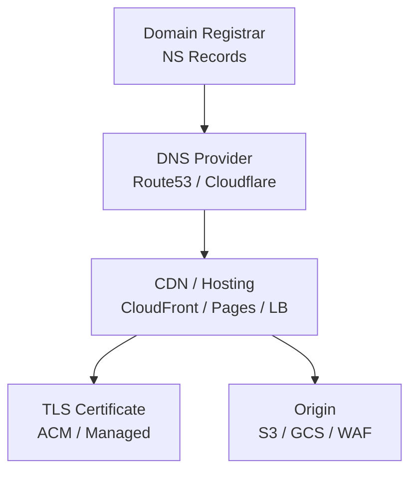

# How to Configure Custom Domains for Static Sites with OpenTofu

Author: [nawazdhandala](https://www.github.com/nawazdhandala)

Tags: OpenTofu, Custom Domain, DNS, Static Site, HTTPS, Route53, Cloudflare, Infrastructure as Code

Description: Learn how to configure custom domains for static sites hosted on S3, GCP Cloud Storage, or Cloudflare Pages using OpenTofu, including DNS records, HTTPS certificates, and apex domain configuration.

---

Custom domain configuration for static sites requires coordinating DNS records, TLS certificates, and CDN binding. OpenTofu manages all three layers as code, ensuring reproducible domain setup across environments.

## Domain Configuration Architecture



## Route 53 with CloudFront (AWS)

```hcl
# dns_aws.tf

# Apex domain alias to CloudFront

resource "aws_route53_record" "apex" {
  zone_id = aws_route53_zone.main.zone_id
  name    = var.domain_name
  type    = "A"

  alias {
    name                   = aws_cloudfront_distribution.site.domain_name
    zone_id                = aws_cloudfront_distribution.site.hosted_zone_id
    evaluate_target_health = false
  }
}

# IPv6 for apex domain
resource "aws_route53_record" "apex_ipv6" {
  zone_id = aws_route53_zone.main.zone_id
  name    = var.domain_name
  type    = "AAAA"

  alias {
    name                   = aws_cloudfront_distribution.site.domain_name
    zone_id                = aws_cloudfront_distribution.site.hosted_zone_id
    evaluate_target_health = false
  }
}

# www redirect via CloudFront alias
resource "aws_route53_record" "www" {
  zone_id = aws_route53_zone.main.zone_id
  name    = "www.${var.domain_name}"
  type    = "A"

  alias {
    name                   = aws_cloudfront_distribution.site.domain_name
    zone_id                = aws_cloudfront_distribution.site.hosted_zone_id
    evaluate_target_health = false
  }
}

# ACM certificate validation records
resource "aws_route53_record" "cert_validation" {
  for_each = {
    for dvo in aws_acm_certificate.site.domain_validation_options : dvo.domain_name => {
      name   = dvo.resource_record_name
      record = dvo.resource_record_value
      type   = dvo.resource_record_type
    }
  }

  allow_overwrite = true
  name            = each.value.name
  records         = [each.value.record]
  ttl             = 60
  type            = each.value.type
  zone_id         = aws_route53_zone.main.zone_id
}
```

## Cloudflare DNS for Any Static Host

```hcl
# dns_cloudflare.tf
data "cloudflare_zone" "main" {
  name = var.domain_name
}

# Apex domain - CNAME flattening handles this at Cloudflare
resource "cloudflare_record" "apex" {
  zone_id = data.cloudflare_zone.main.id
  name    = "@"
  type    = "CNAME"
  value   = var.cdn_hostname  # e.g., d1234.cloudfront.net or pages.dev
  proxied = var.enable_cloudflare_proxy
  ttl     = 1
}

resource "cloudflare_record" "www" {
  zone_id = data.cloudflare_zone.main.id
  name    = "www"
  type    = "CNAME"
  value   = var.domain_name
  proxied = var.enable_cloudflare_proxy
  ttl     = 1
}
```

## Apex Domain Handling

```hcl
# apex_redirect.tf - redirect www to apex or vice versa

# S3 bucket for www → apex redirect
resource "aws_s3_bucket" "www_redirect" {
  bucket = "www.${var.domain_name}"
}

resource "aws_s3_bucket_website_configuration" "www_redirect" {
  bucket = aws_s3_bucket.www_redirect.id

  redirect_all_requests_to {
    host_name = var.domain_name
    protocol  = "https"
  }
}

# CloudFront distribution for www redirect bucket
resource "aws_cloudfront_distribution" "www_redirect" {
  enabled = true
  aliases = ["www.${var.domain_name}"]

  origin {
    domain_name = aws_s3_bucket_website_configuration.www_redirect.website_endpoint
    origin_id   = "www-redirect"

    custom_origin_config {
      http_port              = 80
      https_port             = 443
      origin_protocol_policy = "http-only"
      origin_ssl_protocols   = ["TLSv1.2"]
    }
  }

  default_cache_behavior {
    allowed_methods        = ["GET", "HEAD"]
    cached_methods         = ["GET", "HEAD"]
    target_origin_id       = "www-redirect"
    viewer_protocol_policy = "redirect-to-https"
    cache_policy_id        = "4135ea2d-6df8-44a3-9df3-4b5a84be39ad"  # CachingDisabled
  }

  viewer_certificate {
    acm_certificate_arn      = aws_acm_certificate_validation.main.certificate_arn
    ssl_support_method       = "sni-only"
    minimum_protocol_version = "TLSv1.2_2021"
  }

  restrictions {
    geo_restriction { restriction_type = "none" }
  }
}
```

## Multi-Domain Configuration

```hcl
# Configure multiple custom domains for the same site
locals {
  custom_domains = toset([
    var.domain_name,
    "www.${var.domain_name}",
    var.alternate_domain,  # e.g., legacy domain redirect
  ])
}

resource "aws_route53_record" "all_domains" {
  for_each = local.custom_domains

  zone_id = aws_route53_zone.main.zone_id
  name    = each.value
  type    = "A"

  alias {
    name                   = aws_cloudfront_distribution.site.domain_name
    zone_id                = aws_cloudfront_distribution.site.hosted_zone_id
    evaluate_target_health = false
  }
}
```

## Best Practices

- Use DNS alias records (Route 53 alias, Cloudflare CNAME flattening) rather than IP addresses for CDN hostnames - CDN IP addresses change without notice.
- For apex domains (`example.com` without `www`), most DNS providers support CNAME-equivalent records (ALIAS, ANAME, or CNAME flattening) - verify your DNS provider supports this before choosing the domain structure.
- Configure both IPv4 (`A`) and IPv6 (`AAAA`) records for modern clients - CloudFront and major CDNs support dual-stack.
- Create separate CloudFront distributions for www redirect rather than handling it at the application level - this keeps the redirect fast (edge-level) and doesn't add origin load.
- Test custom domain configuration with `dig +trace example.com` to verify the full DNS chain from registrar NS records to CDN endpoints.
