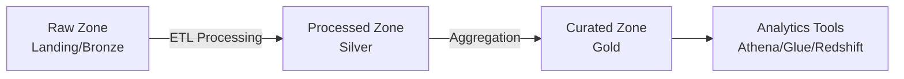

# How to Set Up Data Lake Storage with OpenTofu

Author: [nawazdhandala](https://www.github.com/nawazdhandala)

Tags: OpenTofu, Data Lake, AWS S3, Azure Data Lake, GCP, Infrastructure as Code, Data Engineering

Description: Learn how to build a structured data lake on AWS S3 using OpenTofu with proper zone separation, lifecycle policies, encryption, and access controls for analytics workloads.

---

A data lake stores raw, processed, and curated data in a structured format that analytics tools can query efficiently. Getting the architecture right from the start — zones, naming conventions, access control — prevents costly rework later. OpenTofu makes this architecture repeatable across environments.

## Data Lake Zone Architecture



## Creating the Bucket Structure

```hcl
# main.tf
terraform {
  required_providers {
    aws = {
      source  = "hashicorp/aws"
      version = "~> 5.30"
    }
  }
}

provider "aws" {
  region = var.aws_region
}

locals {
  zones = ["raw", "processed", "curated"]
}

# Create one bucket per zone
resource "aws_s3_bucket" "zones" {
  for_each = toset(local.zones)

  bucket = "${var.project_name}-datalake-${each.key}-${data.aws_caller_identity.current.account_id}"

  tags = merge(var.common_tags, {
    DataLakeZone = each.key
  })
}

data "aws_caller_identity" "current" {}

# Enable versioning on all zone buckets
resource "aws_s3_bucket_versioning" "zones" {
  for_each = toset(local.zones)

  bucket = aws_s3_bucket.zones[each.key].id
  versioning_configuration {
    status = "Enabled"
  }
}

# Encrypt all buckets with KMS
resource "aws_s3_bucket_server_side_encryption_configuration" "zones" {
  for_each = toset(local.zones)

  bucket = aws_s3_bucket.zones[each.key].id

  rule {
    apply_server_side_encryption_by_default {
      sse_algorithm     = "aws:kms"
      kms_master_key_id = aws_kms_key.datalake.arn
    }
    bucket_key_enabled = true
  }
}

# Block all public access
resource "aws_s3_bucket_public_access_block" "zones" {
  for_each = toset(local.zones)

  bucket                  = aws_s3_bucket.zones[each.key].id
  block_public_acls       = true
  block_public_policy     = true
  ignore_public_acls      = true
  restrict_public_buckets = true
}

resource "aws_kms_key" "datalake" {
  description             = "KMS key for data lake encryption"
  deletion_window_in_days = 7
  enable_key_rotation     = true
}
```

## Lifecycle Policies

```hcl
# lifecycle.tf
# Raw zone: transition to cheaper storage classes as data ages
resource "aws_s3_bucket_lifecycle_configuration" "raw" {
  bucket = aws_s3_bucket.zones["raw"].id

  rule {
    id     = "raw-data-lifecycle"
    status = "Enabled"

    transition {
      days          = 30
      storage_class = "STANDARD_IA"  # Move to Infrequent Access after 30 days
    }

    transition {
      days          = 90
      storage_class = "GLACIER"  # Archive after 90 days
    }

    expiration {
      days = 365  # Delete raw data after 1 year
    }
  }
}

# Curated zone: keep longer, transition later
resource "aws_s3_bucket_lifecycle_configuration" "curated" {
  bucket = aws_s3_bucket.zones["curated"].id

  rule {
    id     = "curated-data-lifecycle"
    status = "Enabled"

    transition {
      days          = 180
      storage_class = "STANDARD_IA"
    }
  }
}
```

## IAM Access Policies

```hcl
# iam.tf
# ETL role — read raw, write processed
resource "aws_iam_policy" "etl_role_policy" {
  name        = "DataLakeETLPolicy"
  description = "ETL access: read from raw, write to processed"

  policy = jsonencode({
    Version = "2012-10-17"
    Statement = [
      {
        Effect = "Allow"
        Action = ["s3:GetObject", "s3:ListBucket"]
        Resource = [
          aws_s3_bucket.zones["raw"].arn,
          "${aws_s3_bucket.zones["raw"].arn}/*"
        ]
      },
      {
        Effect = "Allow"
        Action = ["s3:PutObject", "s3:DeleteObject"]
        Resource = "${aws_s3_bucket.zones["processed"].arn}/*"
      },
      {
        Effect   = "Allow"
        Action   = ["kms:Decrypt", "kms:GenerateDataKey"]
        Resource = aws_kms_key.datalake.arn
      }
    ]
  })
}
```

## AWS Glue Data Catalog

```hcl
# glue.tf
# Create a Glue database for the curated zone
resource "aws_glue_catalog_database" "curated" {
  name        = "${var.project_name}_curated"
  description = "Curated data lake tables for analytics"
}
```

## Best Practices

- Use separate buckets (not prefixes) for each zone — different lifecycle policies and IAM permissions are easier to manage per bucket.
- Name objects with partitioned paths (e.g., `year=2026/month=03/day=20/`) to enable partition-based filtering in Athena and Glue.
- Use bucket key encryption (`bucket_key_enabled = true`) to reduce KMS API calls and costs at scale.
- Enable S3 Server Access Logging or CloudTrail Data Events for compliance and access auditing.
- Use AWS Lake Formation on top of S3 and Glue for fine-grained column and row-level access control.
