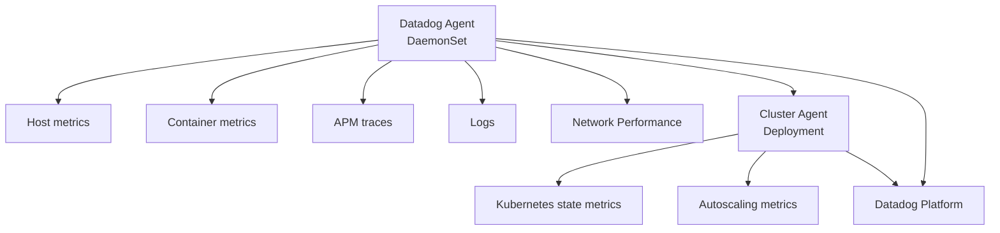

# How to Set Up Datadog Agent Deployment with OpenTofu

Author: [nawazdhandala](https://www.github.com/nawazdhandala)

Tags: OpenTofu, Datadog, Monitoring, Kubernetes, Helm, APM, Infrastructure as Code

Description: Learn how to deploy the Datadog Agent on Kubernetes using OpenTofu and the official Datadog Helm chart, including APM, log collection, process monitoring, and Kubernetes state metrics.

---

The Datadog Agent collects metrics, traces, and logs from infrastructure and applications. Deploying it with OpenTofu via Helm ensures consistent agent configuration and credentials management across all environments.

## Datadog Agent Architecture



## Datadog API Key in Kubernetes Secret

```hcl
# secrets.tf
resource "kubernetes_secret" "datadog" {
  metadata {
    name      = "datadog-agent"
    namespace = "monitoring"
  }

  data = {
    api-key = var.datadog_api_key
    app-key = var.datadog_app_key
  }
}
```

## Datadog Agent Helm Deployment

```hcl
resource "helm_release" "datadog_agent" {
  name             = "datadog"
  repository       = "https://helm.datadoghq.com"
  chart            = "datadog"
  version          = "3.50.2"
  namespace        = "monitoring"
  create_namespace = true

  values = [
    yamlencode({
      datadog = {
        apiKeyExistingSecret = kubernetes_secret.datadog.metadata[0].name
        appKeyExistingSecret = kubernetes_secret.datadog.metadata[0].name
        site = "datadoghq.com"

        tags = [
          "env:${var.environment}",
          "cluster:${var.cluster_name}",
          "region:${var.aws_region}",
        ]

        # Kubernetes state metrics
        kubeStateMetricsEnabled = true

        # Container log collection
        logs = {
          enabled             = true
          containerCollectAll = true
        }

        # APM tracing
        apm = {
          portEnabled = true
        }

        # Process monitoring
        processAgent = {
          enabled           = true
          processCollection = true
        }

        # Network performance monitoring
        networkMonitoring = {
          enabled = var.environment == "production"
        }

        # Kubelet TLS verification
        kubelet = {
          tlsVerify = false  # Set to true if using valid kubelet certs
        }

        # Cluster name for grouping
        clusterName = var.cluster_name
      }

      # Cluster Agent for Kubernetes metrics
      clusterAgent = {
        enabled  = true
        replicas = var.environment == "production" ? 2 : 1

        admissionController = {
          enabled = true
          # Auto-inject APM library
          mutateUnlabelled = false
        }
      }

      # Agent resource limits
      agents = {
        resources = {
          requests = { cpu = "200m", memory = "256Mi" }
          limits   = { cpu = "500m", memory = "512Mi" }
        }
      }
    })
  ]
}
```

## Datadog Monitor via OpenTofu

```hcl
# datadog_monitors.tf
resource "datadog_monitor" "high_cpu" {
  name    = "[${var.environment}] High CPU Usage"
  type    = "metric alert"
  message = "CPU usage is above 80%. Notify: @slack-alerts-${var.environment}"

  query = "avg(last_5m):avg:system.cpu.user{env:${var.environment}} by {host} > 80"

  thresholds = {
    critical = 80
    warning  = 70
  }

  notify_no_data    = true
  no_data_timeframe = 10
  renotify_interval = 0

  tags = ["env:${var.environment}", "managed-by:opentofu"]
}
```

## Best Practices

- Store the Datadog API key in a Kubernetes Secret and reference it via `apiKeyExistingSecret` — never put it in Helm values.
- Enable the Cluster Agent alongside the DaemonSet Agent for Kubernetes state metrics and autoscaling support.
- Set `containerCollectAll = true` to collect logs from all containers, then use Datadog pipelines to filter at the backend.
- Enable APM `portEnabled = true` and instrument services with the Datadog tracing library for end-to-end request tracing.
- Tag everything with `env:${var.environment}` — it enables Datadog's environment-scoped dashboards and alerts to work correctly.
