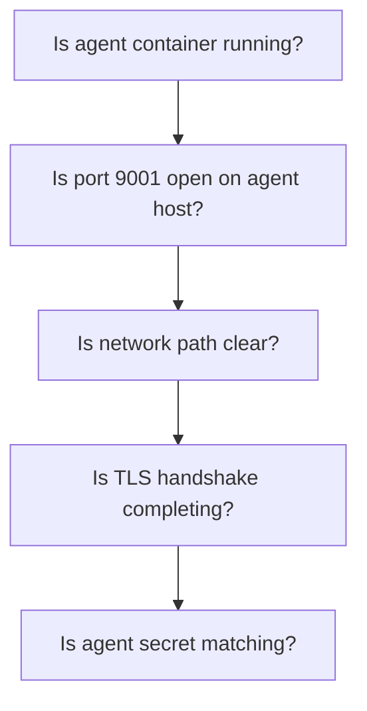

# How to Debug Agent Connectivity with Telnet and Curl

Author: [nawazdhandala](https://www.github.com/nawazdhandala)

Tags: Portainer, Troubleshooting, Debugging, Agent, Networking, curl, Telnet

Description: Learn how to systematically debug Portainer Agent connectivity issues using telnet, curl, and other network diagnostic tools to isolate the root cause.

---

When Portainer cannot reach an agent, systematic network debugging narrows down the cause quickly. This guide provides a step-by-step toolkit for diagnosing agent connectivity from the command line.

## Layer-by-Layer Debugging



## Step 1: Check If Agent Container is Running

```bash
# On the agent host

docker ps --filter "name=portainer_agent" --format "{{.Status}}"

# If not running, check why
docker ps -a --filter "name=portainer_agent"
docker logs portainer_agent --tail 30
```

## Step 2: Check If Port is Listening

```bash
# On the agent host, check what is listening on 9001
ss -tlnp | grep 9001
# Or
netstat -tlnp | grep 9001

# Expected: LISTEN  0  128  0.0.0.0:9001
```

## Step 3: Test Raw TCP Connectivity from Portainer Server

```bash
# Test TCP connection with telnet
telnet <agent-ip> 9001
# Ctrl+] then quit to exit
# "Connected to X.X.X.X" = port is open
# "Connection refused" = agent not listening
# Timeout = firewall blocking

# Alternative with nc (netcat)
nc -zv -w 5 <agent-ip> 9001
```

## Step 4: Test HTTPS Response with Curl

The Portainer Agent exposes an HTTPS API. Test it directly:

```bash
# Test agent API endpoint (-k skips TLS verification)
curl -k https://<agent-ip>:9001/ping

# Expected: {"status":"OK"}
# 000 (curl: (7) Failed to connect): TCP connection failed
# SSL error: TLS certificate mismatch
```

## Step 5: Inspect TLS Certificate

```bash
# Check what TLS certificate the agent is presenting
openssl s_client -connect <agent-ip>:9001 </dev/null 2>/dev/null | \
  openssl x509 -noout -dates -subject

# Verify the certificate is not expired
# "notAfter" date should be in the future
```

## Step 6: Test from Inside a Container (Same Network)

If the agent and Portainer are on the same Docker network, test from inside:

```bash
# Run a test container on the same Docker network
docker run --rm --network portainer_network \
  curlimages/curl \
  curl -k https://portainer_agent:9001/ping
```

## Step 7: Capture Traffic with tcpdump

For deep debugging, capture the actual packets:

```bash
# On the agent host, capture traffic on port 9001
sudo tcpdump -i eth0 -n port 9001 -w /tmp/agent-traffic.pcap

# Trigger the connection from Portainer, then stop capture
# Analyze with Wireshark or tcpdump -r
```
