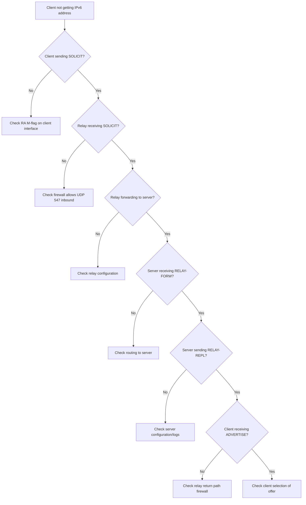

# How to Debug DHCPv6 Relay Issues

Author: [nawazdhandala](https://www.github.com/nawazdhandala)

Tags: DHCPv6, Relay, Debugging, Troubleshooting, tcpdump, Networking

Description: Systematically debug DHCPv6 relay problems including no response, message drops, wrong address assignment, and relay option issues.

## DHCPv6 Relay Debugging Checklist



## Step 1: Verify Client is Sending DHCPv6 Solicit

```bash
# On relay - capture client-facing interface

tcpdump -i eth0 -n 'udp port 546 or udp port 547'

# Expected to see:
# IP6 fe80::client > ff02::1:2: dhcp6 solicit

# If nothing: check RA flags on client interface
radvd -d5  # Debug radvd to see sent RAs

# Check if client received RA with M/O flags
ip netns exec client-ns ndp -a  # On macOS style
# On Linux client:
ip -6 neigh show
```

## Step 2: Verify Relay is Listening

```bash
# Check relay is listening on UDP 547
ss -6 -ulnp | grep ":547"
# Expected: udp  UNCONN  0  0  *:547  *:*

# Check relay joined multicast
ip -6 maddr show eth0 | grep ff02
# Expected: ff02::1:2 (all-relay-agents-and-servers multicast)

# If missing, restart relay daemon
systemctl restart isc-dhcp-relay6
```

## Step 3: Trace Relay-Forward Messages

```bash
# Capture RELAY-FORW messages leaving relay toward server
tcpdump -i eth1 -n -v 'udp port 547'

# Decode DHCPv6 message types:
# Type 12 = RELAY-FORW (relay to server)
# Type 13 = RELAY-REPL (server to relay)
# Type 1  = SOLICIT (client)
# Type 2  = ADVERTISE (server)
# Type 3  = REQUEST (client)
# Type 7  = REPLY (server)

# Filter only relay messages
tshark -i eth1 -f 'udp port 547' \
    -Y 'dhcpv6.msgtype == 12 or dhcpv6.msgtype == 13' \
    -T fields \
    -e ip.src -e ip.dst -e dhcpv6.msgtype
```

## Step 4: Check Server Receives Messages

```bash
# On DHCPv6 server - capture UDP 547
tcpdump -i eth0 -n -v 'udp port 547'

# Check ISC Kea server logs
journalctl -u kea-dhcp6 -f
tail -f /var/log/kea/kea-dhcp6.log

# Check wide-dhcpv6-server logs
journalctl -u wide-dhcpv6-server -f

# Enable debug in Kea
# kea-dhcp6.conf:
# "loggers": [{"name": "kea-dhcp6", "severity": "DEBUG"}]
```

## Step 5: Check Server Response Path

```bash
# Server sends RELAY-REPL back to relay agent unicast address
# Verify routing from server back to relay

# On server: check route to relay address
ip -6 route get 2001:db8:1::1  # Relay agent address

# Check no firewall blocking RELAY-REPL
ip6tables -L -n | grep 547

# If using nftables
nft list ruleset | grep -A 2 "547"
```

## Step 6: Enable Relay Debugging

```bash
# Debug dhcrelay
dhcrelay -6 -d -f \
    -l eth0 \
    -u eth1 \
    2001:db8::dhcp-server 2>&1 | grep -E "RELAY|recv|send"

# Debug Cisco relay (IOS)
debug ipv6 dhcp relay

# Debug Juniper relay
set system tracing file dhcp-debug
set system tracing file size 10m
set forwarding-options dhcp-relay v6 active-server-group PRIMARY
commit
show log dhcp-debug

# Clear and check statistics
# IOS:
clear ipv6 dhcp relay statistics
show ipv6 dhcp relay statistics
```

## Common Issues Table

| Problem | Cause | Fix |
|---|---|---|
| No SOLICIT seen | RA M-flag not set | Enable managed-config-flag |
| SOLICIT seen, no RELAY-FORW | Relay not running | Start/restart relay daemon |
| RELAY-FORW sent, no RELAY-REPL | Server unreachable | Fix routing/firewall to server |
| RELAY-REPL seen, client gets no address | Reply not forwarded to client | Check relay source address |
| Wrong pool assigned | Option 18 mismatch | Align relay ID with server config |

## Conclusion

DHCPv6 relay debugging follows the message flow: SOLICIT → RELAY-FORW → RELAY-REPL → ADVERTISE. Use `tcpdump` on both the client-facing and server-facing interfaces to isolate where messages stop. The relay must listen on UDP 547, join `ff02::1:2` on client interfaces, and have routing to the DHCPv6 server. Enable relay daemon debug logging for detailed trace output. Server-side logs are often the most informative when the relay is working but clients don't get addresses.
