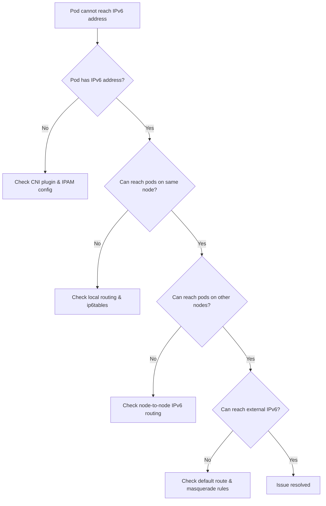

# How to Debug IPv6 Pod Networking Issues in Kubernetes

Author: [nawazdhandala](https://www.github.com/nawazdhandala)

Tags: Kubernetes, IPv6, Debugging, Networking, Pods, CNI

Description: A systematic troubleshooting guide for diagnosing and resolving IPv6 pod networking failures in Kubernetes clusters.

IPv6 pod networking issues in Kubernetes can stem from many sources: misconfigured CNI plugins, missing kernel parameters, incorrect CIDR allocation, or firewall rules blocking ICMPv6. This guide provides a structured approach to isolate and fix them.

## Diagnostic Flow



## Step 1: Check Pod IPv6 Address Assignment

```bash
# List all pods with their IP addresses (both IPv4 and IPv6 in dual-stack)
kubectl get pods -o wide -A

# Inspect a specific pod's IP addresses
kubectl get pod <pod-name> -o jsonpath='{.status.podIPs}'
```

If the pod has no IPv6 address, check the CNI configuration:

```bash
# View CNI config on the node
cat /etc/cni/net.d/*.conf
```

## Step 2: Test IPv6 Connectivity from a Pod

Run a debug container with networking tools:

```bash
# Exec into a running pod to test connectivity
kubectl exec -it <pod-name> -- sh

# Inside the pod: check assigned addresses
ip -6 addr show

# Test pod-to-pod IPv6
ping6 -c 3 <other-pod-ipv6-address>

# Test DNS resolution over IPv6
nslookup kubernetes.default
```

## Step 3: Check Node IPv6 Routes

```bash
# On a node: verify routes exist for pod CIDRs
ip -6 route show

# Check if a route exists for a specific pod CIDR
ip -6 route get <pod-ipv6-address>
```

## Step 4: Inspect ip6tables Rules

CNI plugins like Calico and Cilium install ip6tables rules. Missing rules often cause drops.

```bash
# List all ip6tables rules in the filter table
sudo ip6tables -L -n -v

# Check the nat table for masquerade rules
sudo ip6tables -t nat -L -n -v

# Check for any DROP rules that might be blocking pods
sudo ip6tables -L FORWARD -n -v | grep DROP
```

## Step 5: Check ICMPv6 Neighbor Discovery

IPv6 relies on ICMPv6 for neighbor discovery (replacing ARP). If ICMPv6 is blocked, nodes cannot resolve link-layer addresses.

```bash
# Verify ICMPv6 is not being blocked
sudo ip6tables -L -n | grep icmpv6

# Watch neighbor discovery traffic on the node
sudo tcpdump -i eth0 icmp6 -n
```

## Step 6: Verify CNI Plugin IPv6 Configuration

For Calico:

```bash
# Check Calico node status for IPv6
kubectl exec -it -n calico-system <calico-node-pod> -- calico-node -bird6-ready
kubectl get felixconfiguration default -o yaml | grep ipv6
```

For Cilium:

```bash
# Check Cilium status for IPv6
kubectl exec -it -n kube-system <cilium-pod> -- cilium status | grep IPv6
```

## Step 7: Review Node Events and Logs

```bash
# Check for CNI-related errors in kubelet logs
sudo journalctl -u kubelet -n 100 | grep -i "ipv6\|cni\|network"

# Check pod events for network setup failures
kubectl describe pod <pod-name> | grep -A 5 Events
```

## Common Issues and Fixes

| Symptom | Likely Cause | Fix |
|---|---|---|
| Pod has no IPv6 address | CNI IPAM not configured for IPv6 | Update CNI config with IPv6 CIDR |
| Pods on same node can't communicate | ip6tables FORWARD chain blocking | Add ACCEPT rule for pod interface |
| Cross-node traffic fails | Missing BGP/VXLAN route for remote CIDR | Check CNI routing daemon |
| External IPv6 unreachable | No IPv6 masquerade rule | Add ip6tables MASQUERADE for egress |

Systematic layer-by-layer debugging — from address assignment through routing to firewalling — resolves the vast majority of IPv6 pod networking issues.
