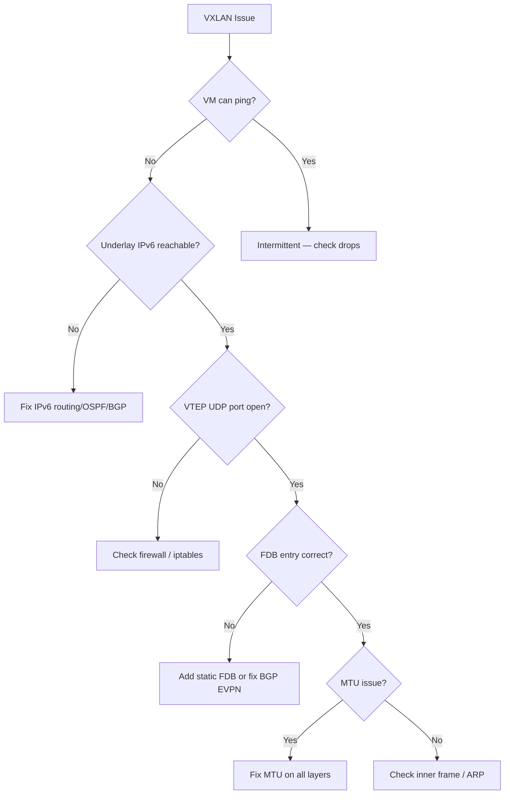

# How to Debug VXLAN over IPv6

Author: [nawazdhandala](https://www.github.com/nawazdhandala)

Tags: VXLAN, IPv6, Debugging, Troubleshooting, tcpdump, Linux

Description: Systematically debug VXLAN overlay issues over IPv6 including underlay connectivity, FDB problems, MTU issues, and packet capture analysis.

## Debugging Methodology



## Step 1: Verify Underlay IPv6 Connectivity

```bash
#!/bin/bash
# Check underlay connectivity between VTEPs

LOCAL_VTEP="2001:db8:1::1"
REMOTE_VTEPS=("2001:db8:2::1" "2001:db8:3::1" "2001:db8:4::1")

echo "=== Underlay Connectivity Check ==="
for VTEP in "${REMOTE_VTEPS[@]}"; do
    if ping6 -c 3 -W 2 -s 20 ${VTEP} &>/dev/null; then
        RTT=$(ping6 -c 3 ${VTEP} | tail -1 | awk '{print $4}' | cut -d'/' -f2)
        echo "OK  ${VTEP} (avg ${RTT}ms)"
    else
        echo "FAIL ${VTEP} — UNREACHABLE"
    fi
done

# Check routing path
echo ""
echo "=== Route to Remote VTEP ==="
ip -6 route get 2001:db8:2::1
```

## Step 2: Verify UDP Port Reachability

VXLAN uses UDP port 4789. Firewalls must allow this:

```bash
# Check if VXLAN UDP port is open on remote VTEP
nc -u -v -w3 2001:db8:2::1 4789 <<< "test" 2>&1

# Check local firewall rules
ip6tables -L -n | grep 4789
nft list chain ip6 filter INPUT | grep 4789

# Check if the kernel is listening on UDP 4789
ss -ulnp | grep 4789
# Expected: udp  UNCONN  0  0  *:4789  *:*  users:(("vxlan",pid=...))
```

## Step 3: Inspect FDB Table

```bash
# Show VXLAN FDB entries
bridge fdb show dev vxlan100

# Expected FDB entry for remote VTEP:
# 00:00:00:00:00:00 dev vxlan100 dst 2001:db8:2::1 self permanent

# If FDB is empty — no traffic will reach remote VMs
# Add manual entry
bridge fdb append 00:00:00:00:00:00 dev vxlan100 dst 2001:db8:2::1

# For specific MAC
bridge fdb add 52:54:00:ab:cd:ef dev vxlan100 dst 2001:db8:2::1

# Watch FDB learning in real-time
watch -n 1 "bridge fdb show dev vxlan100 | grep -v permanent"
```

## Step 4: Capture and Analyze VXLAN Traffic

```bash
# Capture VXLAN over IPv6 on underlay interface
tcpdump -i eth0 -n \
    'ip6 and udp port 4789' \
    -w /tmp/vxlan6.pcap

# Analyze with tshark (Wireshark CLI)
tshark -r /tmp/vxlan6.pcap -T fields \
    -e ip6.src -e ip6.dst \
    -e vxlan.vni \
    -e eth.src -e eth.dst \
    -Y 'vxlan'

# Decode first 5 VXLAN packets
tcpdump -r /tmp/vxlan6.pcap -v -n | head -50

# Count packets per VNI
tshark -r /tmp/vxlan6.pcap -T fields -e vxlan.vni | sort | uniq -c | sort -rn
```

## Step 5: MTU Diagnosis

```bash
# Test MTU through VXLAN tunnel
REMOTE_OVERLAY="10.0.0.2"

echo "=== MTU Test ==="
for SIZE in 1400 1430 1450 1500; do
    if ping -c 2 -M do -s ${SIZE} ${REMOTE_OVERLAY} &>/dev/null; then
        echo "SIZE ${SIZE}: OK"
    else
        echo "SIZE ${SIZE}: FAIL (fragmentation or drop)"
    fi
done

# Check VXLAN interface MTU
ip link show vxlan100 | grep mtu

# Check for fragmented packets (fragmentation shouldn't occur in normal VXLAN operation)
nstat -z | grep -i frag
```

## Step 6: Check EVPN BGP Routes

```bash
# On a system running FRR/gobgp
# Check BGP EVPN peer status
vtysh -c "show bgp summary"
vtysh -c "show bgp l2vpn evpn summary"

# Show EVPN MAC/IP routes
vtysh -c "show bgp l2vpn evpn"
vtysh -c "show bgp l2vpn evpn route"

# Check specific VNI
vtysh -c "show bgp l2vpn evpn vni 100"

# Show locally advertised routes
vtysh -c "show bgp l2vpn evpn route local"
```

## Common Issues and Fixes

| Symptom | Likely Cause | Fix |
|---|---|---|
| No VXLAN traffic captured | Underlay IPv6 routing issue | Check OSPFv3/BGP |
| Traffic captured but not decoded | Wrong VTEP IP in FDB | Update FDB/EVPN |
| Works for small pings, fails for large | MTU mismatch | Reduce overlay MTU |
| Intermittent drops | UDP checksum issue | Check checksum offload |
| ARP not working | ARP suppression misconfigured | Check neigh_suppress |

## Conclusion

VXLAN over IPv6 debugging follows a layered approach: verify underlay IPv6 routing first, then VTEP UDP reachability, then FDB/EVPN control plane, then MTU. `tcpdump` with `udp port 4789` on the physical interface captures the full encapsulated VXLAN frames. `bridge fdb show` reveals the control plane state. MTU issues are the most common production problem — test with progressively larger ping sizes using the `do` option to prohibit fragmentation.
