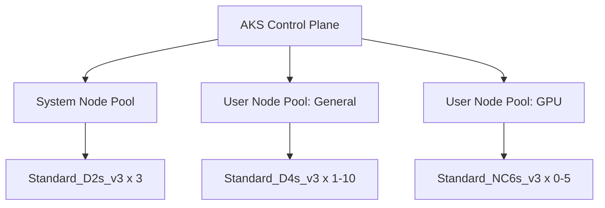

# How to Deploy AKS with Node Pools Using OpenTofu

Author: [nawazdhandala](https://www.github.com/nawazdhandala)

Tags: OpenTofu, Azure, AKS, Kubernetes, Node Pool, Infrastructure as Code

Description: Learn how to deploy an Azure Kubernetes Service cluster with multiple node pools using OpenTofu, including system and user node pools, autoscaling, and cluster configuration.

---

AKS node pools let you run different workloads on different VM sizes with independent scaling policies. Every AKS cluster requires a system node pool for running critical cluster services, and you can add multiple user node pools for application workloads.

## AKS Architecture



Resource Group and Identity

```hcl
# main.tf

resource "azurerm_resource_group" "aks" {
  name     = "rg-${var.cluster_name}-${var.environment}"
  location = var.location
}

resource "azurerm_user_assigned_identity" "aks" {
  name                = "id-${var.cluster_name}"
  resource_group_name = azurerm_resource_group.aks.name
  location            = azurerm_resource_group.aks.location
}

# Grant the cluster identity access to the node resource group
resource "azurerm_role_assignment" "aks_rg_contributor" {
  scope                = azurerm_resource_group.aks.id
  role_definition_name = "Contributor"
  principal_id         = azurerm_user_assigned_identity.aks.principal_id
}
```

## AKS Cluster with System Node Pool

```hcl
# cluster.tf
resource "azurerm_kubernetes_cluster" "main" {
  name                = var.cluster_name
  location            = azurerm_resource_group.aks.location
  resource_group_name = azurerm_resource_group.aks.name
  dns_prefix          = var.cluster_name
  kubernetes_version  = var.kubernetes_version

  # System node pool - required
  default_node_pool {
    name                 = "system"
    node_count           = 3
    vm_size              = "Standard_D2s_v3"
    os_disk_size_gb      = 50
    os_disk_type         = "Ephemeral"
    vnet_subnet_id       = var.node_subnet_id
    type                 = "VirtualMachineScaleSets"
    enable_auto_scaling  = true
    min_count            = 2
    max_count            = 5
    only_critical_addons_enabled = true  # Taint: CriticalAddonsOnly

    node_labels = {
      "nodepool-type" = "system"
      "environment"   = var.environment
    }

    upgrade_settings {
      max_surge = "33%"
    }
  }

  identity {
    type         = "UserAssigned"
    identity_ids = [azurerm_user_assigned_identity.aks.id]
  }

  network_profile {
    network_plugin     = "azure"
    network_policy     = "calico"
    load_balancer_sku  = "standard"
    outbound_type      = "loadBalancer"
    service_cidr       = "10.96.0.0/16"
    dns_service_ip     = "10.96.0.10"
  }

  azure_active_directory_role_based_access_control {
    managed                = true
    azure_rbac_enabled     = true
    admin_group_object_ids = [var.aks_admin_group_id]
  }

  oms_agent {
    log_analytics_workspace_id = var.log_analytics_workspace_id
  }

  tags = {
    Environment = var.environment
  }
}
```

## User Node Pools

```hcl
# node_pools.tf
resource "azurerm_kubernetes_cluster_node_pool" "general" {
  name                  = "general"
  kubernetes_cluster_id = azurerm_kubernetes_cluster.main.id
  vm_size               = "Standard_D4s_v3"
  vnet_subnet_id        = var.node_subnet_id

  enable_auto_scaling = true
  min_count           = var.environment == "production" ? 2 : 1
  max_count           = 10
  node_count          = var.environment == "production" ? 3 : 1

  os_disk_type = "Ephemeral"

  node_labels = {
    "nodepool-type" = "user"
    "workload-type" = "general"
  }

  upgrade_settings {
    max_surge = "33%"
  }
}

resource "azurerm_kubernetes_cluster_node_pool" "spot" {
  name                  = "spot"
  kubernetes_cluster_id = azurerm_kubernetes_cluster.main.id
  vm_size               = "Standard_D4s_v3"
  vnet_subnet_id        = var.node_subnet_id

  priority        = "Spot"
  eviction_policy = "Delete"
  spot_max_price  = -1  # Pay market price

  enable_auto_scaling = true
  min_count           = 0
  max_count           = 20
  node_count          = 1

  node_labels = {
    "kubernetes.azure.com/scalesetpriority" = "spot"
  }

  node_taints = ["kubernetes.azure.com/scalesetpriority=spot:NoSchedule"]
}

resource "azurerm_kubernetes_cluster_node_pool" "gpu" {
  name                  = "gpu"
  kubernetes_cluster_id = azurerm_kubernetes_cluster.main.id
  vm_size               = "Standard_NC6s_v3"
  vnet_subnet_id        = var.node_subnet_id

  enable_auto_scaling = true
  min_count           = 0
  max_count           = 5
  node_count          = 0

  node_labels = {
    "workload-type"           = "gpu"
    "accelerator"             = "nvidia"
  }

  node_taints = ["nvidia.com/gpu=present:NoSchedule"]
}
```

## Outputs

```hcl
# outputs.tf
output "cluster_name" {
  value = azurerm_kubernetes_cluster.main.name
}

output "kube_config" {
  value     = azurerm_kubernetes_cluster.main.kube_config_raw
  sensitive = true
}

output "oidc_issuer_url" {
  value = azurerm_kubernetes_cluster.main.oidc_issuer_url
}

output "kubelet_identity_object_id" {
  value = azurerm_kubernetes_cluster.main.kubelet_identity[0].object_id
}
```

## Best Practices

- Enable `only_critical_addons_enabled` on the system node pool so it stays free for core Kubernetes components.
- Use ephemeral OS disks for node pools - they're faster and cost less than managed disks for stateless nodes.
- Enable Azure RBAC (`azure_rbac_enabled = true`) for fine-grained Kubernetes access control integrated with Entra ID.
- Set `min_count = 0` for GPU and spot node pools to scale to zero when idle and reduce costs.
- Use separate subnet IDs per node pool if you need network isolation between workloads.
