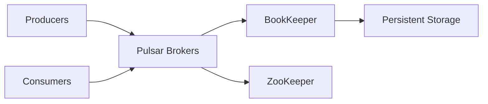

# How to Deploy Apache Pulsar on Rancher

Author: [nawazdhandala](https://www.github.com/nawazdhandala)

Tags: Rancher, Apache Pulsar, Kubernetes, Messaging, Helm, Multi-Tenancy

Description: Deploy Apache Pulsar on Rancher with BookKeeper storage, Zookeeper coordination, and broker configuration for multi-tenant messaging workloads.

## Introduction

Apache Pulsar is a distributed messaging and streaming platform that natively supports multi-tenancy, geo-replication, and tiered storage. Its architecture separates compute (brokers) from storage (BookKeeper), enabling independent scaling of each layer.

## Architecture Overview



## Prerequisites

- Rancher cluster with at least 4 worker nodes
- `helm` and `kubectl` available
- StorageClass for BookKeeper and ZooKeeper persistence

## Step 1: Add Pulsar Helm Repository

```bash
helm repo add apache https://pulsar.apache.org/charts
helm repo update
```

## Step 2: Prepare Certificates

Pulsar uses TLS for broker-to-broker and client-to-broker communication.

```bash
# Generate self-signed certificates for development
openssl req -x509 -newkey rsa:4096 -keyout key.pem \
  -out cert.pem -days 365 -nodes \
  -subj "/CN=pulsar.messaging.svc.cluster.local"

kubectl create secret tls pulsar-tls \
  --cert=cert.pem --key=key.pem \
  -n messaging
```

## Step 3: Create Values File

```yaml
# pulsar-values.yaml
initialize: true   # Run initialization job on first deploy

zookeeper:
  replicaCount: 3
  volumes:
    data:
      size: 10Gi
      storageClassName: longhorn

bookkeeper:
  replicaCount: 3
  volumes:
    journal:
      size: 20Gi
      storageClassName: longhorn
    ledgers:
      size: 50Gi
      storageClassName: longhorn

broker:
  replicaCount: 3
  resources:
    requests:
      memory: "1Gi"
      cpu: "500m"
    limits:
      memory: "4Gi"
      cpu: "2"

proxy:
  replicaCount: 2
  service:
    type: LoadBalancer
```

## Step 4: Deploy Pulsar

```bash
kubectl create namespace messaging

helm install pulsar apache/pulsar \
  --namespace messaging \
  --values pulsar-values.yaml \
  --timeout 10m
```

## Step 5: Verify Deployment

```bash
# Check all components are running
kubectl get pods -n messaging | grep pulsar

# Check broker health
kubectl exec -it pulsar-broker-0 -n messaging -- \
  bin/pulsar-admin brokers healthcheck
```

## Step 6: Create a Tenant and Topic

```bash
# Create a tenant
bin/pulsar-admin tenants create mycompany

# Create a namespace
bin/pulsar-admin namespaces create mycompany/production

# Create a persistent topic
bin/pulsar-admin topics create \
  persistent://mycompany/production/orders
```

## Conclusion

Apache Pulsar is running on Rancher with a fully separated storage and compute architecture. The BookKeeper storage layer ensures messages are persisted and replicated independently of the broker tier, making individual component scaling straightforward.
