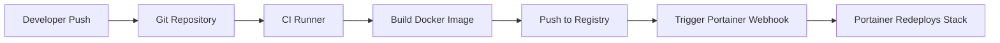

# How to Deploy a CI/CD Pipeline with Portainer

Author: [nawazdhandala](https://www.github.com/nawazdhandala)

Tags: Portainer, CI/CD, Continuous Deployment, Docker, Automation, Webhooks

Description: Learn how to set up a CI/CD pipeline that automatically deploys updated Docker images to Portainer stacks using webhooks and the Portainer API.

---

Portainer integrates with CI/CD pipelines through stack webhooks and the REST API. When a new image is pushed to a registry, your pipeline can trigger Portainer to redeploy the stack automatically.

## Pipeline Architecture



## Step 1: Enable Stack Auto-Update Webhook

In Portainer, navigate to your stack and enable the webhook:

1. Go to **Stacks > [your stack]**.
2. Scroll to **Auto update** and enable **Webhook**.
3. Copy the generated webhook URL.

The webhook triggers Portainer to pull the latest images and redeploy the stack.

## Step 2: Trigger the Webhook from CI

Call the webhook at the end of your CI pipeline:

```bash
# Generic CI step — trigger Portainer stack redeploy
curl -X POST "https://portainer.example.com/api/stacks/webhooks/YOUR-WEBHOOK-UUID"

# With a success check
if curl -fsS -X POST "https://portainer.example.com/api/stacks/webhooks/YOUR-WEBHOOK-UUID"; then
  echo "Deployment triggered successfully"
else
  echo "Deployment trigger failed" && exit 1
fi
```

## Step 3: Deploy via the Portainer API (Advanced)

For more control, use the Portainer API to update a specific stack:

```bash
# Authenticate and get a JWT token
TOKEN=$(curl -s -X POST https://portainer.example.com/api/auth \
  -H "Content-Type: application/json" \
  -d '{"Username":"admin","Password":"adminpassword"}' | jq -r .jwt)

# Get the stack ID
STACK_ID=$(curl -s -H "Authorization: Bearer $TOKEN" \
  https://portainer.example.com/api/stacks | \
  jq -r '.[] | select(.Name=="my-app") | .Id')

# Update the stack (pulls latest images and redeploys)
curl -s -X PUT \
  -H "Authorization: Bearer $TOKEN" \
  -H "Content-Type: application/json" \
  https://portainer.example.com/api/stacks/$STACK_ID/git/redeploy \
  -d '{"pullImage": true, "prune": false}'
```

## Step 4: Full Pipeline Example

A complete CI pipeline using shell commands:

```bash
#!/bin/bash
set -euo pipefail

IMAGE_NAME="myregistry.example.com/my-app"
IMAGE_TAG="${CI_COMMIT_SHA:-latest}"
PORTAINER_URL="https://portainer.example.com"
STACK_NAME="my-app"

# Build and push the image
docker build -t "$IMAGE_NAME:$IMAGE_TAG" .
docker push "$IMAGE_NAME:$IMAGE_TAG"
docker tag "$IMAGE_NAME:$IMAGE_TAG" "$IMAGE_NAME:latest"
docker push "$IMAGE_NAME:latest"

echo "Image pushed: $IMAGE_NAME:$IMAGE_TAG"

# Authenticate with Portainer
TOKEN=$(curl -s -X POST "$PORTAINER_URL/api/auth" \
  -H "Content-Type: application/json" \
  -d "{\"Username\":\"$PORTAINER_USER\",\"Password\":\"$PORTAINER_PASSWORD\"}" \
  | jq -r .jwt)

# Get stack ID
STACK_ID=$(curl -s -H "Authorization: Bearer $TOKEN" \
  "$PORTAINER_URL/api/stacks" | \
  jq -r --arg name "$STACK_NAME" '.[] | select(.Name==$name) | .Id')

# Trigger redeploy
curl -s -X POST \
  -H "Authorization: Bearer $TOKEN" \
  "$PORTAINER_URL/api/stacks/$STACK_ID/images/update?pullImage=true"

echo "Deployment complete"
```

## Environment-Specific Deployments

Use separate Portainer environments for staging and production:

```bash
# Deploy to staging first
curl -s -X POST "$PORTAINER_STAGING_WEBHOOK"

# Run smoke tests against staging
./scripts/smoke-test.sh https://staging.example.com

# Deploy to production only if tests pass
if [ $? -eq 0 ]; then
  curl -s -X POST "$PORTAINER_PROD_WEBHOOK"
else
  echo "Smoke tests failed, aborting production deploy"
  exit 1
fi
```

## Rollback on Failure

Keep the previous image tag and redeploy if the new version fails:

```bash
# Tag previous release before deploying new one
docker tag "$IMAGE_NAME:latest" "$IMAGE_NAME:rollback"

# If new deployment fails, trigger rollback
if ! ./scripts/health-check.sh; then
  # Update the stack compose file to use :rollback tag and redeploy
  curl -s -X PUT ... --data '{"stackFileContent": "..."}'
fi
```
