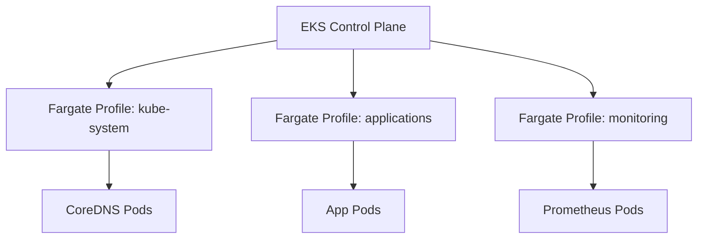

# How to Deploy EKS with Fargate Profiles Using OpenTofu

Author: [nawazdhandala](https://www.github.com/nawazdhandala)

Tags: OpenTofu, AWS, EKS, Fargate, Kubernetes, Serverless, Infrastructure as Code

Description: Learn how to deploy an Amazon EKS cluster with Fargate profiles using OpenTofu, enabling serverless Kubernetes workloads without managing EC2 node groups.

---

EKS Fargate eliminates the need to manage EC2 worker nodes - AWS provisions and scales the underlying compute automatically. You define which namespaces and pod labels run on Fargate using Fargate profiles.

## EKS Fargate Architecture



## Fargate Pod Execution Role

```hcl
# iam.tf

resource "aws_iam_role" "fargate_pod_execution" {
  name = "${var.cluster_name}-fargate-pod-execution"

  assume_role_policy = jsonencode({
    Version = "2012-10-17"
    Statement = [{
      Effect = "Allow"
      Principal = {
        Service = "eks-fargate-pods.amazonaws.com"
      }
      Action = "sts:AssumeRole"
      Condition = {
        ArnLike = {
          "aws:SourceArn" = "arn:aws:eks:${var.aws_region}:${data.aws_caller_identity.current.account_id}:fargateprofile/${var.cluster_name}/*"
        }
      }
    }]
  })
}

resource "aws_iam_role_policy_attachment" "fargate_pod_execution" {
  role       = aws_iam_role.fargate_pod_execution.name
  policy_arn = "arn:aws:iam::aws:policy/AmazonEKSFargatePodExecutionRolePolicy"
}

# Allow Fargate to pull from ECR
resource "aws_iam_role_policy_attachment" "fargate_ecr" {
  role       = aws_iam_role.fargate_pod_execution.name
  policy_arn = "arn:aws:iam::aws:policy/AmazonEC2ContainerRegistryReadOnly"
}
```

## EKS Cluster (Fargate-Only)

```hcl
# cluster.tf
resource "aws_eks_cluster" "main" {
  name     = var.cluster_name
  version  = var.kubernetes_version
  role_arn = aws_iam_role.eks_cluster.arn

  vpc_config {
    # Fargate requires private subnets
    subnet_ids              = var.private_subnet_ids
    endpoint_private_access = true
    endpoint_public_access  = false
  }

  depends_on = [aws_iam_role_policy_attachment.eks_cluster_policy]
}
```

## Fargate Profiles

```hcl
# fargate_profiles.tf

# Profile for kube-system (CoreDNS must run on Fargate in Fargate-only clusters)
resource "aws_eks_fargate_profile" "kube_system" {
  cluster_name           = aws_eks_cluster.main.name
  fargate_profile_name   = "kube-system"
  pod_execution_role_arn = aws_iam_role.fargate_pod_execution.arn
  subnet_ids             = var.private_subnet_ids

  selector {
    namespace = "kube-system"
  }
}

# Profile for application namespace
resource "aws_eks_fargate_profile" "applications" {
  cluster_name           = aws_eks_cluster.main.name
  fargate_profile_name   = "applications"
  pod_execution_role_arn = aws_iam_role.fargate_pod_execution.arn
  subnet_ids             = var.private_subnet_ids

  selector {
    namespace = "default"
  }

  # Match only specific pods by label
  selector {
    namespace = "apps"
    labels = {
      fargate = "true"
    }
  }
}

# Profile for monitoring namespace
resource "aws_eks_fargate_profile" "monitoring" {
  cluster_name           = aws_eks_cluster.main.name
  fargate_profile_name   = "monitoring"
  pod_execution_role_arn = aws_iam_role.fargate_pod_execution.arn
  subnet_ids             = var.private_subnet_ids

  selector {
    namespace = "monitoring"
  }
}
```

## CoreDNS Patch for Fargate

```hcl
# CoreDNS needs to be patched to remove the EC2 node annotation in Fargate-only clusters
resource "null_resource" "patch_coredns" {
  triggers = {
    cluster_name = aws_eks_cluster.main.name
  }

  provisioner "local-exec" {
    command = <<-EOT
      aws eks update-kubeconfig --name ${aws_eks_cluster.main.name} --region ${var.aws_region}
      kubectl patch deployment coredns -n kube-system \
        --type json \
        -p='[{"op": "remove", "path": "/spec/template/metadata/annotations/eks.amazonaws.com~1compute-type"}]'
    EOT
  }

  depends_on = [aws_eks_fargate_profile.kube_system]
}
```

## IRSA for Fargate Pods

```hcl
# irsa.tf - IAM Roles for Service Accounts works the same with Fargate
data "aws_iam_openid_connect_provider" "eks" {
  url = aws_eks_cluster.main.identity[0].oidc[0].issuer
}

resource "aws_iam_role" "app_service_account" {
  name = "${var.cluster_name}-app-sa"

  assume_role_policy = jsonencode({
    Version = "2012-10-17"
    Statement = [{
      Effect = "Allow"
      Principal = {
        Federated = data.aws_iam_openid_connect_provider.eks.arn
      }
      Action = "sts:AssumeRoleWithWebIdentity"
      Condition = {
        StringEquals = {
          "${data.aws_iam_openid_connect_provider.eks.url}:sub" = "system:serviceaccount:apps:my-app"
          "${data.aws_iam_openid_connect_provider.eks.url}:aud" = "sts.amazonaws.com"
        }
      }
    }]
  })
}
```

## Logging with FireLens on Fargate

```hcl
# Fargate logs go to CloudWatch via aws-for-fluent-bit sidecar
# Configure the Fargate profile logging
resource "aws_eks_fargate_profile" "apps_with_logging" {
  cluster_name           = aws_eks_cluster.main.name
  fargate_profile_name   = "apps-logging"
  pod_execution_role_arn = aws_iam_role.fargate_pod_execution.arn
  subnet_ids             = var.private_subnet_ids

  selector {
    namespace = "apps"
    labels = {
      "logging" = "enabled"
    }
  }
}

# Grant Fargate pods permission to write to CloudWatch
resource "aws_iam_role_policy" "fargate_cloudwatch_logs" {
  name = "fargate-cloudwatch-logs"
  role = aws_iam_role.fargate_pod_execution.id

  policy = jsonencode({
    Version = "2012-10-17"
    Statement = [{
      Effect = "Allow"
      Action = [
        "logs:CreateLogGroup",
        "logs:CreateLogStream",
        "logs:PutLogEvents",
        "logs:DescribeLogStreams"
      ]
      Resource = "arn:aws:logs:*:*:*"
    }]
  })
}
```

## Best Practices

- Create a Fargate profile for `kube-system` first - CoreDNS must run on Fargate in Fargate-only clusters and requires a patch to remove the EC2 annotation.
- Use private subnets only - Fargate pods don't support public subnets.
- Use IRSA instead of environment variables for AWS credentials - it's the secure, auditable approach.
- Fargate doesn't support DaemonSets - deploy logging agents as sidecars using FireLens or aws-for-fluent-bit.
- Right-size pod resource requests carefully - Fargate allocates vCPU and memory based on the highest request in the pod spec.
