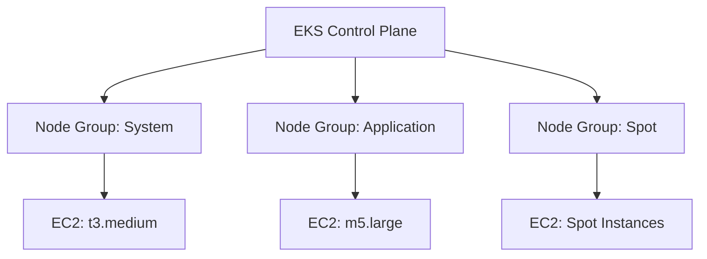

# How to Deploy EKS with Node Groups Using OpenTofu

Author: [nawazdhandala](https://www.github.com/nawazdhandala)

Tags: OpenTofu, AWS, EKS, Kubernetes, Node Groups, EC2, Infrastructure as Code

Description: Learn how to deploy an Amazon EKS cluster with managed node groups using OpenTofu, including VPC configuration, IAM roles, launch templates, and cluster add-ons.

---

Amazon EKS managed node groups automate the provisioning and lifecycle management of EC2 worker nodes. OpenTofu lets you define the cluster, node groups, IAM roles, and add-ons in code that deploys repeatably across environments.

## EKS Architecture



## IAM Roles

```hcl
# iam.tf

# Cluster role
resource "aws_iam_role" "eks_cluster" {
  name = "${var.cluster_name}-cluster-role"

  assume_role_policy = jsonencode({
    Version = "2012-10-17"
    Statement = [{
      Effect    = "Allow"
      Principal = { Service = "eks.amazonaws.com" }
      Action    = "sts:AssumeRole"
    }]
  })
}

resource "aws_iam_role_policy_attachment" "eks_cluster_policy" {
  role       = aws_iam_role.eks_cluster.name
  policy_arn = "arn:aws:iam::aws:policy/AmazonEKSClusterPolicy"
}

# Node group role
resource "aws_iam_role" "eks_node_group" {
  name = "${var.cluster_name}-node-group-role"

  assume_role_policy = jsonencode({
    Version = "2012-10-17"
    Statement = [{
      Effect    = "Allow"
      Principal = { Service = "ec2.amazonaws.com" }
      Action    = "sts:AssumeRole"
    }]
  })
}

resource "aws_iam_role_policy_attachment" "node_group_policies" {
  for_each = toset([
    "arn:aws:iam::aws:policy/AmazonEKSWorkerNodePolicy",
    "arn:aws:iam::aws:policy/AmazonEKS_CNI_Policy",
    "arn:aws:iam::aws:policy/AmazonEC2ContainerRegistryReadOnly",
  ])

  role       = aws_iam_role.eks_node_group.name
  policy_arn = each.value
}
```

## EKS Cluster

```hcl
# cluster.tf
resource "aws_eks_cluster" "main" {
  name     = var.cluster_name
  version  = var.kubernetes_version
  role_arn = aws_iam_role.eks_cluster.arn

  vpc_config {
    subnet_ids              = var.private_subnet_ids
    security_group_ids      = [aws_security_group.eks_cluster.id]
    endpoint_private_access = true
    endpoint_public_access  = var.enable_public_endpoint
  }

  enabled_cluster_log_types = ["api", "audit", "authenticator", "controllerManager", "scheduler"]

  depends_on = [aws_iam_role_policy_attachment.eks_cluster_policy]

  tags = {
    Environment = var.environment
  }
}
```

## Managed Node Groups

```hcl
# node_groups.tf
resource "aws_eks_node_group" "system" {
  cluster_name    = aws_eks_cluster.main.name
  node_group_name = "system"
  node_role_arn   = aws_iam_role.eks_node_group.arn
  subnet_ids      = var.private_subnet_ids

  instance_types = ["t3.medium"]
  capacity_type  = "ON_DEMAND"

  scaling_config {
    desired_size = 2
    min_size     = 2
    max_size     = 4
  }

  update_config {
    max_unavailable_percentage = 50
  }

  labels = {
    role = "system"
  }

  taint {
    key    = "CriticalAddonsOnly"
    value  = "true"
    effect = "NO_SCHEDULE"
  }

  depends_on = [aws_iam_role_policy_attachment.node_group_policies]
}

resource "aws_eks_node_group" "application" {
  cluster_name    = aws_eks_cluster.main.name
  node_group_name = "application"
  node_role_arn   = aws_iam_role.eks_node_group.arn
  subnet_ids      = var.private_subnet_ids

  instance_types = ["m5.large", "m5.xlarge"]
  capacity_type  = "ON_DEMAND"

  scaling_config {
    desired_size = var.environment == "production" ? 3 : 1
    min_size     = var.environment == "production" ? 2 : 1
    max_size     = 10
  }

  launch_template {
    id      = aws_launch_template.eks_node.id
    version = aws_launch_template.eks_node.latest_version
  }

  depends_on = [aws_iam_role_policy_attachment.node_group_policies]
}

# Spot node group for non-critical workloads
resource "aws_eks_node_group" "spot" {
  cluster_name    = aws_eks_cluster.main.name
  node_group_name = "spot"
  node_role_arn   = aws_iam_role.eks_node_group.arn
  subnet_ids      = var.private_subnet_ids

  # Multiple instance types for spot availability
  instance_types = ["m5.large", "m5a.large", "m4.large", "m5d.large"]
  capacity_type  = "SPOT"

  scaling_config {
    desired_size = 2
    min_size     = 0
    max_size     = 20
  }

  labels = {
    "node.kubernetes.io/lifecycle" = "spot"
  }

  taint {
    key    = "spot"
    value  = "true"
    effect = "NO_SCHEDULE"
  }

  depends_on = [aws_iam_role_policy_attachment.node_group_policies]
}
```

## Launch Template with Custom Configuration

```hcl
resource "aws_launch_template" "eks_node" {
  name_prefix = "${var.cluster_name}-node-"

  block_device_mappings {
    device_name = "/dev/xvda"
    ebs {
      volume_size           = 50
      volume_type           = "gp3"
      encrypted             = true
      delete_on_termination = true
    }
  }

  metadata_options {
    http_endpoint               = "enabled"
    http_tokens                 = "required"   # Enforce IMDSv2
    http_put_response_hop_limit = 1
  }

  tag_specifications {
    resource_type = "instance"
    tags = {
      Environment = var.environment
      Cluster     = var.cluster_name
    }
  }
}
```

## Core Add-ons

```hcl
# addons.tf
resource "aws_eks_addon" "coredns" {
  cluster_name             = aws_eks_cluster.main.name
  addon_name               = "coredns"
  addon_version            = data.aws_eks_addon_version.coredns.version
  resolve_conflicts_on_update = "OVERWRITE"
}

resource "aws_eks_addon" "kube_proxy" {
  cluster_name  = aws_eks_cluster.main.name
  addon_name    = "kube-proxy"
  addon_version = data.aws_eks_addon_version.kube_proxy.version
}

resource "aws_eks_addon" "vpc_cni" {
  cluster_name             = aws_eks_cluster.main.name
  addon_name               = "vpc-cni"
  addon_version            = data.aws_eks_addon_version.vpc_cni.version
  resolve_conflicts_on_update = "OVERWRITE"
}

resource "aws_eks_addon" "ebs_csi" {
  cluster_name             = aws_eks_cluster.main.name
  addon_name               = "aws-ebs-csi-driver"
  addon_version            = data.aws_eks_addon_version.ebs_csi.version
  service_account_role_arn = aws_iam_role.ebs_csi.arn
}

data "aws_eks_addon_version" "coredns" {
  addon_name         = "coredns"
  kubernetes_version = aws_eks_cluster.main.version
  most_recent        = true
}
```

## Best Practices

- Use managed node groups over self-managed nodes - AWS handles patching and replacement automatically.
- Enforce IMDSv2 via launch templates (`http_tokens = "required"`) to prevent SSRF attacks on metadata endpoints.
- Create a dedicated system node group with taints for critical add-ons (CoreDNS, kube-proxy) to prevent eviction.
- Use multiple instance types in spot node groups to improve availability and reduce interruptions.
- Pin add-on versions explicitly and update them separately from cluster version upgrades.
