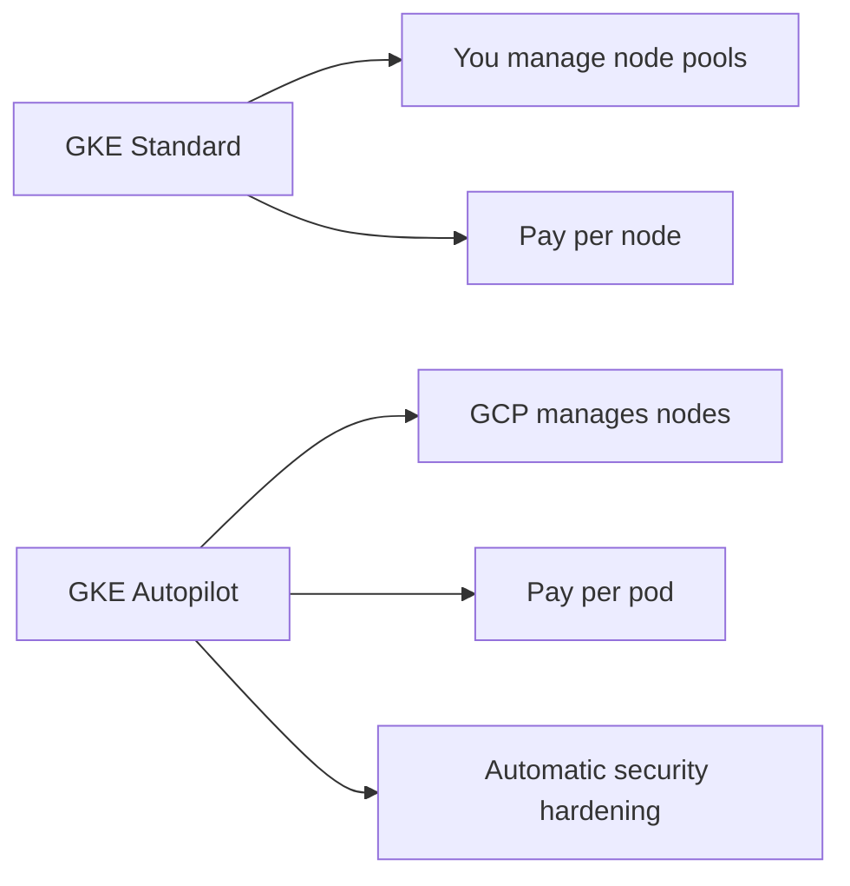

# How to Deploy GKE with Autopilot Using OpenTofu

Author: [nawazdhandala](https://www.github.com/nawazdhandala)

Tags: OpenTofu, GCP, GKE, Kubernetes, Autopilot, Infrastructure as Code

Description: Learn how to deploy a Google Kubernetes Engine Autopilot cluster using OpenTofu, where GCP manages the node infrastructure and you only pay for the pods you run.

---

GKE Autopilot manages the entire underlying node infrastructure — no node pools to configure, patch, or scale. You pay per pod rather than per node, making it cost-effective for variable workloads. OpenTofu provisions the cluster with minimal configuration.

## GKE Autopilot vs Standard



## VPC and Subnet Setup

```hcl
# network.tf
resource "google_compute_network" "gke" {
  name                    = "${var.project_id}-gke-vpc"
  auto_create_subnetworks = false
}

resource "google_compute_subnetwork" "gke_nodes" {
  name          = "${var.project_id}-gke-nodes"
  ip_cidr_range = "10.0.0.0/20"
  region        = var.region
  network       = google_compute_network.gke.id

  # Required secondary ranges for GKE pods and services
  secondary_ip_range {
    range_name    = "pod-cidr"
    ip_cidr_range = "10.1.0.0/16"
  }

  secondary_ip_range {
    range_name    = "service-cidr"
    ip_cidr_range = "10.2.0.0/20"
  }

  private_ip_google_access = true
}
```

## GKE Autopilot Cluster

```hcl
# cluster.tf
resource "google_container_cluster" "autopilot" {
  name     = var.cluster_name
  location = var.region  # Regional cluster for HA
  project  = var.project_id

  # Enable Autopilot mode
  enable_autopilot = true

  network    = google_compute_network.gke.id
  subnetwork = google_compute_subnetwork.gke_nodes.id

  ip_allocation_policy {
    cluster_secondary_range_name  = "pod-cidr"
    services_secondary_range_name = "service-cidr"
  }

  # Private cluster — nodes have no public IPs
  private_cluster_config {
    enable_private_nodes    = true
    enable_private_endpoint = false  # Public control plane endpoint
    master_ipv4_cidr_block  = "172.16.0.0/28"
  }

  master_authorized_networks_config {
    cidr_blocks {
      cidr_block   = var.allowed_cidr
      display_name = "Corporate network"
    }
  }

  # Workload Identity — no service account keys in pods
  workload_identity_config {
    workload_pool = "${var.project_id}.svc.id.goog"
  }

  # Autopilot manages node versions automatically
  release_channel {
    channel = "REGULAR"
  }

  # Binary Authorization for image verification
  binary_authorization {
    evaluation_mode = "PROJECT_SINGLETON_POLICY_ENFORCE"
  }

  # Autopilot enables Shielded Nodes by default
  # No node_config block needed

  maintenance_policy {
    recurring_window {
      start_time = "2024-01-01T02:00:00Z"
      end_time   = "2024-01-01T06:00:00Z"
      recurrence = "FREQ=WEEKLY;BYDAY=SA,SU"
    }
  }

  deletion_protection = var.environment == "production"
}
```

## Workload Identity Setup

```hcl
# workload_identity.tf
# Google Service Account for your application
resource "google_service_account" "app" {
  account_id   = "${var.cluster_name}-app"
  display_name = "Application service account for GKE workloads"
  project      = var.project_id
}

# Grant the GSA permissions it needs (e.g., GCS access)
resource "google_project_iam_member" "app_gcs" {
  project = var.project_id
  role    = "roles/storage.objectViewer"
  member  = "serviceAccount:${google_service_account.app.email}"
}

# Allow the Kubernetes service account to impersonate the GSA
resource "google_service_account_iam_member" "workload_identity_binding" {
  service_account_id = google_service_account.app.name
  role               = "roles/iam.workloadIdentityUser"
  member             = "serviceAccount:${var.project_id}.svc.id.goog[${var.k8s_namespace}/${var.k8s_service_account}]"
}
```

## Autopilot-Compatible Workload Annotations

```hcl
# k8s_manifests.tf — Kubernetes resources for Autopilot
resource "kubernetes_deployment" "app" {
  metadata {
    name      = "my-app"
    namespace = var.k8s_namespace
  }

  spec {
    replicas = 3

    selector {
      match_labels = { app = "my-app" }
    }

    template {
      metadata {
        labels = { app = "my-app" }
        annotations = {
          # Request Autopilot Spot pods for cost savings
          "autopilot.gke.io/spot" = "true"
        }
      }

      spec {
        service_account_name = var.k8s_service_account

        container {
          name  = "app"
          image = var.app_image

          resources {
            requests = {
              cpu    = "250m"
              memory = "512Mi"
            }
            limits = {
              cpu    = "500m"
              memory = "1Gi"
            }
          }
        }
      }
    }
  }
}
```

## Outputs

```hcl
output "cluster_name" {
  value = google_container_cluster.autopilot.name
}

output "cluster_endpoint" {
  value     = google_container_cluster.autopilot.endpoint
  sensitive = true
}

output "workload_identity_pool" {
  value = "${var.project_id}.svc.id.goog"
}
```

## Best Practices

- Use Workload Identity instead of service account keys — Autopilot enforces this by default.
- Set explicit resource requests on all containers — Autopilot uses these to provision the right node size and to bill correctly.
- Use `autopilot.gke.io/spot = "true"` annotations on non-critical workloads to reduce costs by up to 70%.
- Enable Binary Authorization for production clusters to ensure only verified container images run.
- Choose a regional cluster (specify region, not zone) for automatic multi-zone distribution without extra configuration.
