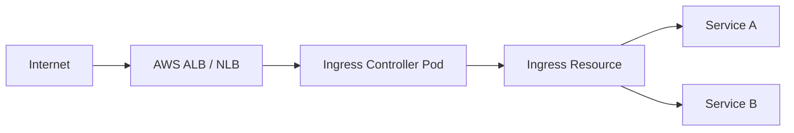

# How to Deploy Ingress Controllers with OpenTofu

Author: [nawazdhandala](https://www.github.com/nawazdhandala)

Tags: OpenTofu, Kubernetes, Ingress, Nginx, Aws load balancer controller, Helm, Infrastructure as Code

Description: Learn how to deploy Kubernetes ingress controllers with OpenTofu using Helm, including NGINX Ingress Controller and the AWS Load Balancer Controller with proper IAM configuration.

---

Ingress controllers are the gateway between external traffic and Kubernetes services. Deploying them with OpenTofu alongside the rest of your cluster configuration ensures they're consistently provisioned with the right IAM roles, namespace, and Helm values across environments.

## Ingress Architecture



## NGINX Ingress Controller via Helm

```hcl
# nginx_ingress.tf

resource "helm_release" "nginx_ingress" {
  name             = "ingress-nginx"
  repository       = "https://kubernetes.github.io/ingress-nginx"
  chart            = "ingress-nginx"
  version          = "4.9.1"
  namespace        = "ingress-nginx"
  create_namespace = true

  values = [
    yamlencode({
      controller = {
        replicaCount = var.environment == "production" ? 3 : 2

        service = {
          type = "LoadBalancer"
          annotations = {
            "service.beta.kubernetes.io/aws-load-balancer-type"                    = "nlb"
            "service.beta.kubernetes.io/aws-load-balancer-cross-zone-load-balancing-enabled" = "true"
            "service.beta.kubernetes.io/aws-load-balancer-scheme"                  = "internet-facing"
          }
        }

        config = {
          use-real-ip       = "true"
          proxy-real-ip-cidr = "0.0.0.0/0"
          use-forwarded-headers = "true"
        }

        metrics = {
          enabled = true
          serviceMonitor = {
            enabled = true
          }
        }

        resources = {
          requests = { cpu = "100m", memory = "90Mi" }
          limits   = { cpu = "500m", memory = "300Mi" }
        }

        podDisruptionBudget = {
          enabled      = true
          minAvailable = 1
        }
      }
    })
  ]
}
```

## AWS Load Balancer Controller with IRSA

```hcl
# alb_controller.tf

# IRSA for AWS Load Balancer Controller
data "aws_iam_policy_document" "alb_controller_assume" {
  statement {
    effect  = "Allow"
    actions = ["sts:AssumeRoleWithWebIdentity"]

    principals {
      type        = "Federated"
      identifiers = [var.oidc_provider_arn]
    }

    condition {
      test     = "StringEquals"
      variable = "${var.oidc_provider_url}:sub"
      values   = ["system:serviceaccount:kube-system:aws-load-balancer-controller"]
    }

    condition {
      test     = "StringEquals"
      variable = "${var.oidc_provider_url}:aud"
      values   = ["sts.amazonaws.com"]
    }
  }
}

resource "aws_iam_role" "alb_controller" {
  name               = "${var.cluster_name}-alb-controller"
  assume_role_policy = data.aws_iam_policy_document.alb_controller_assume.json
}

# Download the official IAM policy from AWS
data "http" "alb_iam_policy" {
  url = "https://raw.githubusercontent.com/kubernetes-sigs/aws-load-balancer-controller/v2.7.1/docs/install/iam_policy.json"
}

resource "aws_iam_policy" "alb_controller" {
  name   = "${var.cluster_name}-alb-controller"
  policy = data.http.alb_iam_policy.response_body
}

resource "aws_iam_role_policy_attachment" "alb_controller" {
  role       = aws_iam_role.alb_controller.name
  policy_arn = aws_iam_policy.alb_controller.arn
}

resource "helm_release" "alb_controller" {
  name             = "aws-load-balancer-controller"
  repository       = "https://aws.github.io/eks-charts"
  chart            = "aws-load-balancer-controller"
  version          = "1.7.1"
  namespace        = "kube-system"

  set {
    name  = "clusterName"
    value = var.cluster_name
  }

  set {
    name  = "serviceAccount.annotations.eks\\.amazonaws\\.com/role-arn"
    value = aws_iam_role.alb_controller.arn
  }

  set {
    name  = "replicaCount"
    value = var.environment == "production" ? 2 : 1
  }
}
```

## Sample Ingress Resource

```hcl
# ingress.tf
resource "kubernetes_ingress_v1" "app" {
  metadata {
    name      = "app-ingress"
    namespace = var.app_namespace
    annotations = {
      "kubernetes.io/ingress.class"                = "nginx"
      "nginx.ingress.kubernetes.io/ssl-redirect"   = "true"
      "cert-manager.io/cluster-issuer"             = "letsencrypt-prod"
    }
  }

  spec {
    tls {
      hosts       = [var.app_domain]
      secret_name = "${var.app_name}-tls"
    }

    rule {
      host = var.app_domain
      http {
        path {
          path      = "/"
          path_type = "Prefix"
          backend {
            service {
              name = var.app_service_name
              port { number = 80 }
            }
          }
        }
      }
    }
  }

  depends_on = [helm_release.nginx_ingress]
}
```

## Best Practices

- Deploy the ingress controller before application Ingress resources - use `depends_on` to enforce ordering.
- Use the AWS Load Balancer Controller for ALB-based ingress on EKS instead of the classic in-tree cloud provider.
- Set `podDisruptionBudget` on the ingress controller to prevent all replicas from being evicted during node maintenance.
- Use IRSA for the AWS Load Balancer Controller rather than node-level IAM permissions.
- Pin Helm chart versions and review changes when upgrading - ingress controller upgrades can affect routing behavior.
