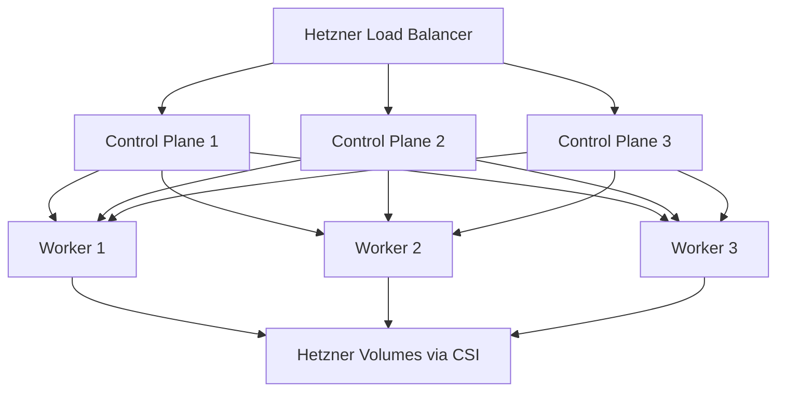

# How to Deploy Kubernetes on Hetzner Cloud with OpenTofu

Author: [nawazdhandala](https://www.github.com/nawazdhandala)

Tags: OpenTofu, Hetzner Cloud, Kubernetes, k3s, Infrastructure as Code

Description: Learn how to deploy a Kubernetes cluster on Hetzner Cloud with OpenTofu using k3s for a lightweight, cost-effective managed-like experience.

Hetzner Cloud does not offer a native managed Kubernetes service, but you can deploy a production-grade cluster using k3s — a lightweight Kubernetes distribution — with OpenTofu managing the underlying server infrastructure. This guide uses the `hcloud` provider plus Hetzner's Cloud Controller Manager (CCM) and CSI driver.

## Architecture Overview



## Provider Setup

```hcl
terraform {
  required_providers {
    hcloud = { source = "hetznercloud/hcloud"; version = "~> 1.49" }
  }
}
provider "hcloud" { token = var.hcloud_token }
```

## Network and Placement Groups

```hcl
resource "hcloud_network" "k8s" {
  name     = "k8s-network"
  ip_range = "10.0.0.0/8"
}

resource "hcloud_network_subnet" "k8s" {
  network_id   = hcloud_network.k8s.id
  type         = "cloud"
  network_zone = "eu-central"
  ip_range     = "10.0.1.0/24"
}

resource "hcloud_placement_group" "control_plane" {
  name = "cp-spread"
  type = "spread"
}

resource "hcloud_placement_group" "workers" {
  name = "worker-spread"
  type = "spread"
}
```

## SSH Key

```hcl
resource "hcloud_ssh_key" "k8s" {
  name       = "k8s-admin"
  public_key = var.ssh_public_key
}
```

## Control Plane Servers

```hcl
resource "hcloud_server" "control_plane" {
  count               = 3
  name                = "k8s-cp-${count.index + 1}"
  image               = "ubuntu-24.04"
  server_type         = "cx32"
  location            = "nbg1"
  ssh_keys            = [hcloud_ssh_key.k8s.id]
  placement_group_id  = hcloud_placement_group.control_plane.id

  network {
    network_id = hcloud_network.k8s.id
    ip         = "10.0.1.${count.index + 10}"
  }

  # Install k3s server on the first node; join the others to it
  user_data = count.index == 0 ? templatefile("k3s-init.yaml", {
    k3s_token = var.k3s_token
  }) : templatefile("k3s-join.yaml", {
    k3s_token = var.k3s_token
    server_ip = "10.0.1.10"
  })

  depends_on = [hcloud_network_subnet.k8s]
}
```

## Worker Servers

```hcl
resource "hcloud_server" "worker" {
  count              = 3
  name               = "k8s-worker-${count.index + 1}"
  image              = "ubuntu-24.04"
  server_type        = "cx32"
  location           = "nbg1"
  ssh_keys           = [hcloud_ssh_key.k8s.id]
  placement_group_id = hcloud_placement_group.workers.id

  network {
    network_id = hcloud_network.k8s.id
    ip         = "10.0.1.${count.index + 20}"
  }

  user_data = templatefile("k3s-agent.yaml", {
    k3s_token = var.k3s_token
    server_ip = "10.0.1.10"
  })

  depends_on = [hcloud_server.control_plane]
}
```

## Load Balancer for API Server

```hcl
resource "hcloud_load_balancer" "k8s_api" {
  name               = "k8s-api-lb"
  load_balancer_type = "lb11"
  location           = "nbg1"
}

resource "hcloud_load_balancer_service" "k8s_api" {
  load_balancer_id = hcloud_load_balancer.k8s_api.id
  protocol         = "tcp"
  listen_port      = 6443
  destination_port = 6443
}

resource "hcloud_load_balancer_target" "cp" {
  count            = 3
  load_balancer_id = hcloud_load_balancer.k8s_api.id
  type             = "server"
  server_id        = hcloud_server.control_plane[count.index].id
  use_private_ip   = true
}
```

## Conclusion

Deploying Kubernetes on Hetzner Cloud with OpenTofu gives you a cost-effective, production-grade cluster. Use k3s for lightweight control planes, spread placement groups for HA, private networking for secure node communication, and a load balancer for the API server. Install the Hetzner CCM and CSI drivers post-provisioning to enable native load balancer and volume integration.
