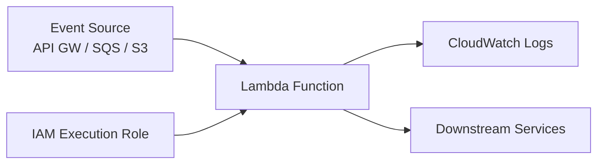

# How to Deploy AWS Lambda Functions with OpenTofu

Author: [nawazdhandala](https://www.github.com/nawazdhandala)

Tags: OpenTofu, AWS, Lambda, Serverless, IAM, CloudWatch, Infrastructure as Code

Description: Learn how to deploy AWS Lambda functions with OpenTofu, including IAM execution roles, environment variables, CloudWatch log groups, and packaging from source.

---

Lambda is the foundational AWS serverless compute service. OpenTofu manages the function code, IAM role, environment variables, and associated infrastructure as a single deployable unit.

## Lambda Architecture



## IAM Execution Role

```hcl
# iam.tf
resource "aws_iam_role" "lambda_execution" {
  name = "${var.function_name}-execution-role"

  assume_role_policy = jsonencode({
    Version = "2012-10-17"
    Statement = [{
      Effect    = "Allow"
      Principal = { Service = "lambda.amazonaws.com" }
      Action    = "sts:AssumeRole"
    }]
  })
}

# Basic execution — CloudWatch Logs
resource "aws_iam_role_policy_attachment" "basic_execution" {
  role       = aws_iam_role.lambda_execution.name
  policy_arn = "arn:aws:iam::aws:policy/service-role/AWSLambdaBasicExecutionRole"
}

# Add VPC access if the function runs in a VPC
resource "aws_iam_role_policy_attachment" "vpc_access" {
  count      = var.vpc_enabled ? 1 : 0
  role       = aws_iam_role.lambda_execution.name
  policy_arn = "arn:aws:iam::aws:policy/service-role/AWSLambdaVPCAccessExecutionRole"
}

# Custom permissions
resource "aws_iam_role_policy" "lambda_custom" {
  name = "lambda-custom-permissions"
  role = aws_iam_role.lambda_execution.id

  policy = jsonencode({
    Version = "2012-10-17"
    Statement = [
      {
        Effect   = "Allow"
        Action   = ["s3:GetObject", "s3:PutObject"]
        Resource = "${var.s3_bucket_arn}/*"
      },
      {
        Effect   = "Allow"
        Action   = ["secretsmanager:GetSecretValue"]
        Resource = var.secret_arns
      }
    ]
  })
}
```

## Package and Deploy Lambda

```hcl
# lambda.tf

# Package the function code
data "archive_file" "lambda" {
  type        = "zip"
  source_dir  = "${path.module}/src"
  output_path = "${path.module}/.build/${var.function_name}.zip"
  excludes    = ["**/__pycache__/**", "**/*.pyc", "tests/**"]
}

resource "aws_lambda_function" "main" {
  function_name    = var.function_name
  description      = var.description
  role             = aws_iam_role.lambda_execution.arn
  filename         = data.archive_file.lambda.output_path
  source_code_hash = data.archive_file.lambda.output_base64sha256

  runtime = var.runtime  # "python3.12", "nodejs20.x", "java21"
  handler = var.handler  # "index.handler", "main.lambda_handler"

  memory_size = var.memory_size  # 128–10240 MB
  timeout     = var.timeout      # 1–900 seconds

  environment {
    variables = merge(
      {
        ENVIRONMENT = var.environment
        LOG_LEVEL   = var.environment == "production" ? "INFO" : "DEBUG"
      },
      var.environment_variables
    )
  }

  dynamic "vpc_config" {
    for_each = var.vpc_enabled ? [1] : []
    content {
      subnet_ids         = var.private_subnet_ids
      security_group_ids = [aws_security_group.lambda.id]
    }
  }

  tracing_config {
    mode = "Active"  # X-Ray tracing
  }

  tags = {
    Environment = var.environment
    Function    = var.function_name
  }
}
```

## CloudWatch Log Group

```hcl
# logs.tf

# Pre-create the log group to control retention
resource "aws_cloudwatch_log_group" "lambda" {
  name              = "/aws/lambda/${var.function_name}"
  retention_in_days = var.environment == "production" ? 90 : 14
  kms_key_id        = var.kms_key_arn

  tags = {
    Function    = var.function_name
    Environment = var.environment
  }
}
```

## Lambda Alias and Versions

```hcl
# versioning.tf
resource "aws_lambda_function" "main" {
  # ... same as above
  publish = true  # Create a numbered version on each deploy
}

resource "aws_lambda_alias" "live" {
  name             = "live"
  function_name    = aws_lambda_function.main.function_name
  function_version = aws_lambda_function.main.version

  # Gradual canary traffic shifting
  routing_config {
    additional_version_weights = {
      (aws_lambda_function.main.version) = var.canary_weight  # e.g. 0.1 for 10%
    }
  }
}
```

## Scheduled Lambda with EventBridge

```hcl
resource "aws_cloudwatch_event_rule" "scheduled" {
  name                = "${var.function_name}-schedule"
  description         = "Trigger ${var.function_name} on a schedule"
  schedule_expression = var.schedule_expression  # "rate(5 minutes)" or cron
}

resource "aws_cloudwatch_event_target" "lambda" {
  rule      = aws_cloudwatch_event_rule.scheduled.name
  target_id = "lambda"
  arn       = aws_lambda_function.main.arn
}

resource "aws_lambda_permission" "eventbridge" {
  statement_id  = "AllowEventBridgeInvoke"
  action        = "lambda:InvokeFunction"
  function_name = aws_lambda_function.main.function_name
  principal     = "events.amazonaws.com"
  source_arn    = aws_cloudwatch_event_rule.scheduled.arn
}
```

## Best Practices

- Pre-create the CloudWatch log group with explicit retention — otherwise Lambda creates it without a retention policy and logs accumulate indefinitely.
- Use `source_code_hash` to trigger redeployments only when function code actually changes.
- Enable X-Ray tracing (`mode = "Active"`) for production functions to trace latency across services.
- Use Lambda aliases (`live`, `staging`) with weighted routing for canary deployments.
- Grant least-privilege permissions — start with `AWSLambdaBasicExecutionRole` and add specific permissions rather than broad policies.
