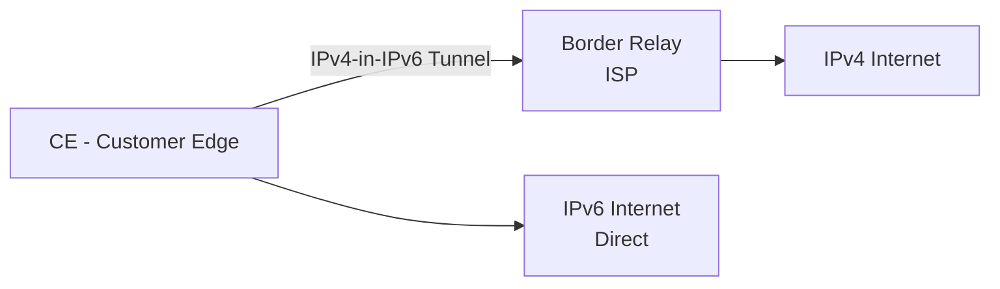

# How to Deploy MAP-E at ISP Scale

Author: [nawazdhandala](https://www.github.com/nawazdhandala)

Tags: IPv6, MAP-E, ISP, IPv4 Transition, Encapsulation, Softwire

Description: Deploy MAP-E (Mapping of Address and Port - Encapsulation) at ISP scale for stateless IPv4-over-IPv6 softwire encapsulation.

## What is MAP-E?

MAP-E (RFC 7597) is similar to MAP-T but uses encapsulation (IPv4-in-IPv6) rather than translation. IPv4 packets are encapsulated in IPv6 and sent to a Border Relay (BR), which decapsulates and forwards them to the IPv4 internet.

Like MAP-T, MAP-E is stateless — the CE derives its IPv4 address and port range algorithmically from its IPv6 prefix.

## MAP-E vs MAP-T

| Aspect | MAP-E | MAP-T |
|--------|-------|-------|
| Mechanism | IPv4-in-IPv6 encapsulation | IPv6/IPv4 translation |
| Overhead | Higher (IPv6 tunnel header) | Lower (translation only) |
| CPE compatibility | Broader | Growing |
| BR complexity | Simple decapsulation | Translation required |

## MAP-E Architecture



## Border Relay (BR) Deployment

The BR decapsulates IPv4-in-IPv6 and performs NAPT from the shared pool:

```bash
# Configure MAP-E BR as an IPv6 tunnel endpoint on Linux
# Create a tunnel interface for MAP-E decapsulation
ip -6 tunnel add map-e-br mode ip4ip6 \
    local 2001:db8:br::1 \
    remote any \
    encaplimit 0

ip link set map-e-br up

# Add IP masquerade for the public IPv4 pool
iptables -t nat -A POSTROUTING -o eth0 \
    -s 203.0.113.0/24 -j MASQUERADE
```

## Customer Edge (CE) Configuration

On OpenWRT with the `map` package installed:

```
# /etc/config/network

config interface 'wan6'
    option proto    'dhcpv6'
    option reqprefix '56'

config interface 'map'
    option proto    'map'
    option maptype  'map-e'
    option peeraddr '2001:db8:br::1'          # BR IPv6 address
    option ipaddr   '203.0.113.0'             # Shared IPv4 prefix
    option ip4prefixlen '24'
    option ip6prefix '2001:db8:map::'         # ISP's MAP domain prefix
    option ip6prefixlen '48'
    option ealen    '8'                       # EA-bits length
    option offset   '6'
    option legacymap '0'
```

## Provisioning MAP-E Parameters via DHCPv6

ISPs can push MAP-E rules to CPEs via DHCPv6 options (S46 options, RFC 7598):

```json
{
  "Dhcp6": {
    "option-data": [
      {
        "name": "s46-cont-mape",
        "code": 94,
        "data": "rule-type=MAP-E,br=2001:db8:br::1,ip6prefix=2001:db8:map::/48,ip4prefix=203.0.113.0/24,ea-len=8,offset=6"
      }
    ]
  }
}
```

## Verifying MAP-E Operation

```bash
# On CE: verify tunnel is up and routing IPv4 through it
ip route show | grep map

# Check encapsulated traffic
tcpdump -i eth0 'ip6 proto 4' -c 10

# Verify assigned port range
# (Use MAP-E port calculator to verify PSID)
python3 -c "
psid = 3
psid_len = 8
offset = 6
for a in range(2**(16 - offset - psid_len)):
    port_start = (a << (psid_len + offset)) | (psid << offset)
    print(f'{port_start}-{port_start + (2**offset) - 1}')
" | head -5
```

## Scale and Performance

For ISP-scale MAP-E deployment:
- Each BR node can handle millions of flows (no per-session state)
- Use ECMP to distribute CE tunnels across multiple BR nodes
- Plan MTU carefully: IPv4-in-IPv6 adds 40 bytes of overhead; set CPE LAN MTU to 1460 or less

## Conclusion

MAP-E provides stateless IPv4 connectivity over an IPv6-only access network. The encapsulation approach is compatible with more existing equipment than MAP-T's translation model. DHCPv6 S46 options allow automatic MAP-E rule provisioning to CPEs, simplifying large-scale ISP deployments.
