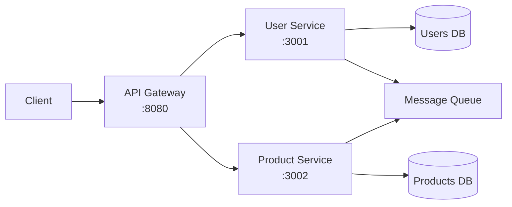

# How to Deploy a Microservice Architecture with Portainer

Author: [nawazdhandala](https://www.github.com/nawazdhandala)

Tags: Portainer, Microservice, Docker Compose, Architecture, API Gateway, Service Mesh

Description: Learn how to deploy a microservice architecture via Portainer using Docker Compose stacks with separate services, shared networks, and an API gateway.

---

Portainer simplifies managing microservice deployments by providing a visual dashboard for all services, stacks, and networks. This guide deploys a sample microservices setup with an API gateway, user service, product service, and shared infrastructure.

## Architecture Overview



## Compose Stack

```yaml
version: "3.8"

networks:
  # All services communicate on this internal network
  microservices:
    driver: bridge

services:
  # API Gateway - routes requests to appropriate services
  api-gateway:
    image: nginx:alpine
    restart: unless-stopped
    ports:
      - "8080:80"
    volumes:
      - ./gateway/nginx.conf:/etc/nginx/conf.d/default.conf:ro
    networks:
      - microservices

  # User Service
  user-service:
    image: node:20-alpine
    restart: unless-stopped
    networks:
      - microservices
    environment:
      PORT: 3001
      DB_HOST: users-db
      RABBITMQ_URL: amqp://rabbitmq:5672
    volumes:
      - ./services/user:/app
    working_dir: /app
    command: sh -c "npm install && node server.js"

  # Product Service
  product-service:
    image: node:20-alpine
    restart: unless-stopped
    networks:
      - microservices
    environment:
      PORT: 3002
      DB_HOST: products-db
    volumes:
      - ./services/product:/app
    working_dir: /app
    command: sh -c "npm install && node server.js"

  users-db:
    image: postgres:16-alpine
    restart: unless-stopped
    networks:
      - microservices
    environment:
      POSTGRES_DB: users
      POSTGRES_PASSWORD: userspass
    volumes:
      - users_db:/var/lib/postgresql/data

  products-db:
    image: postgres:16-alpine
    restart: unless-stopped
    networks:
      - microservices
    environment:
      POSTGRES_DB: products
      POSTGRES_PASSWORD: productspass
    volumes:
      - products_db:/var/lib/postgresql/data

  rabbitmq:
    image: rabbitmq:3-management-alpine
    restart: unless-stopped
    networks:
      - microservices
    ports:
      - "15672:15672"    # Management UI

volumes:
  users_db:
  products_db:
```

## API Gateway Configuration

```nginx
# gateway/nginx.conf

server {
    listen 80;

    location /api/users {
        proxy_pass http://user-service:3001;
    }

    location /api/products {
        proxy_pass http://product-service:3002;
    }
}
```

## Monitoring

Use OneUptime to monitor `http://<host>:8080/api/users/health` and `http://<host>:8080/api/products/health` through the gateway. This verifies the entire request path - gateway, service, and database.
