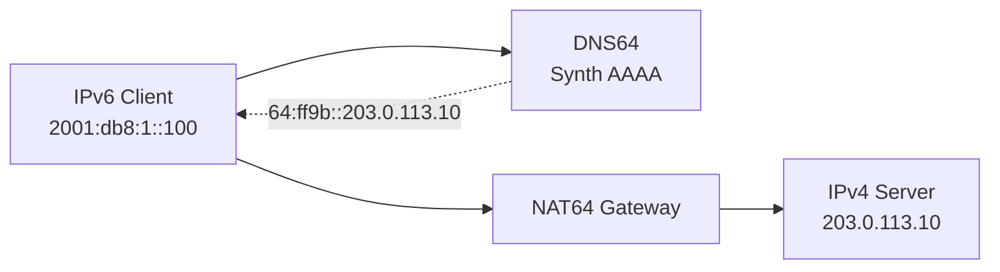

# How to Deploy NAT64/DNS64 at ISP Scale

Author: [nawazdhandala](https://www.github.com/nawazdhandala)

Tags: IPv6, NAT64, DNS64, ISP, IPv4 Transition, Jool

Description: Deploy NAT64 and DNS64 at ISP scale to enable IPv6-only subscribers to access IPv4-only services using Jool and BIND.

## What is NAT64/DNS64?

NAT64 translates IPv6 packets to IPv4, enabling IPv6-only clients to reach IPv4-only servers. DNS64 synthesizes AAAA records for hosts that only have A records, pointing to the NAT64 gateway's IPv6 prefix.



## Well-Known NAT64 Prefix

The standard NAT64 prefix is `64:ff9b::/96`. IPv4 addresses are embedded in the last 32 bits:
- IPv4 `203.0.113.10` → IPv6 `64:ff9b::203.0.113.10` = `64:ff9b::cb00:710a`

## Deploying Jool (NAT64)

Jool is the most widely used open-source NAT64 implementation for Linux:

```bash
# Install Jool on Ubuntu/Debian
apt install jool-dkms jool-tools

# Load the Jool kernel module
modprobe jool

# Create a NAT64 instance
jool instance add "nat64-main" --netfilter --pool6 64:ff9b::/96

# Add IPv4 pool addresses (public IPv4 pool for NAT)
jool -i nat64-main pool4 add --tcp 203.0.113.0/24
jool -i nat64-main pool4 add --udp 203.0.113.0/24
jool -i nat64-main pool4 add --icmp 203.0.113.0/24

# Verify the instance is running
jool instance display
jool -i nat64-main session display
```

## Enable IP Forwarding

```bash
# Enable IPv4 and IPv6 forwarding on the NAT64 server
sysctl -w net.ipv4.ip_forward=1
sysctl -w net.ipv6.conf.all.forwarding=1

# Make persistent
echo "net.ipv4.ip_forward=1" >> /etc/sysctl.conf
echo "net.ipv6.conf.all.forwarding=1" >> /etc/sysctl.conf
```

## Deploying DNS64 with BIND

Configure BIND to synthesize AAAA records for IPv4-only hosts:

```
// /etc/bind/named.conf.options
options {
    // DNS64 - synthesize AAAA for IPv4-only hosts
    dns64 64:ff9b::/96 {
        clients { any; };
        mapped { !rfc1918; any; };  // Don't synthesize for RFC1918 IPv4
        exclude { 64:ff9b::/96; };  // Don't re-synthesize existing nat64 addresses
    };

    // Resolver address
    listen-on-v6 { 2001:db8:dns::1; };
};
```

Restart BIND:

```bash
systemctl restart named

# Test DNS64 synthesis
dig AAAA google.com @2001:db8:dns::1
# Expected: 64:ff9b::<google's IPv4> in AAAA response
```

## Routing NAT64 Traffic

Ensure the `64:ff9b::/96` prefix is routed to the NAT64 server:

```
# Announce NAT64 prefix from NAT64 servers via BGP
router bgp 65001
 address-family ipv6
  network 64:ff9b::/96
```

## Scaling NAT64

For ISP scale, run multiple NAT64 instances with anycast:

- Deploy NAT64 servers in each PoP
- Announce `64:ff9b::/96` from all PoPs via BGP anycast
- Each server uses a subset of the IPv4 pool

## Monitoring NAT64

```bash
# Monitor active NAT64 sessions
jool -i nat64-main session display --numeric | wc -l

# Check pool4 utilization
jool -i nat64-main pool4 display
```

## Conclusion

NAT64/DNS64 enables IPv6-only subscribers to reach IPv4 services. Jool provides a production-ready NAT64 implementation for Linux, and BIND's DNS64 support handles automatic AAAA synthesis. For ISP scale, deploy both in anycast configuration across multiple PoPs.
