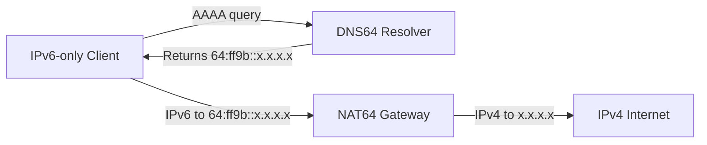

# How to Deploy NAT64 and DNS64 Together

Author: [nawazdhandala](https://www.github.com/nawazdhandala)

Tags: IPv6, NAT64, DNS64, IPv6 Transition, Network Architecture

Description: A complete guide to deploying NAT64 and DNS64 as a coordinated pair to provide IPv6-only clients seamless access to the IPv4 internet.

## Overview

NAT64 and DNS64 work together as a pair. DNS64 gives IPv6-only clients a synthesized IPv6 address to connect to, and NAT64 translates the resulting connection to the real IPv4 destination. Neither works well in isolation for IPv6-only clients.



## Architecture Options

**Option 1: Combined node** — DNS64 and NAT64 run on the same Linux host. Simplest for small deployments.

**Option 2: Separate nodes** — DNS64 runs on dedicated resolver infrastructure; NAT64 runs on a router/gateway. Better for production scale.

## Step 1: Deploy the NAT64 Gateway with Jool

On the NAT64 gateway host:

```bash
# Install Jool
apt install jool-dkms jool-tools

# Load the kernel module
modprobe jool

# Create a NAT64 instance
jool instance add --iptables

# Set the NAT64 prefix (well-known: 64:ff9b::/96)
jool pool6 add 64:ff9b::/96

# Add IPv4 pool - replace with your public IPv4 range
jool pool4 add --tcp 203.0.113.0/28
jool pool4 add --udp 203.0.113.0/28
jool pool4 add --icmp 203.0.113.0/28

# Configure iptables to route traffic through Jool
ip6tables -t mangle -A PREROUTING -d 64:ff9b::/96 -j JOOL --instance default
iptables -t mangle -A PREROUTING -d 203.0.113.0/28 -j JOOL --instance default

# Enable forwarding
sysctl -w net.ipv6.conf.all.forwarding=1
sysctl -w net.ipv4.ip_forward=1
```

## Step 2: Deploy the DNS64 Resolver with BIND

On the DNS64 resolver host (or the same host):

```bash
# Install BIND
apt install bind9

# Add DNS64 configuration to named.conf.options
cat >> /etc/bind/named.conf.options << 'EOF'
    dns64 64:ff9b::/96 {
        clients { any; };
        mapped { any; };
        exclude { 10.0.0.0/8; 172.16.0.0/12; 192.168.0.0/16; };
    };
EOF

# Restart BIND
systemctl restart bind9
```

## Step 3: Configure IPv6-Only Clients

Configure IPv6-only clients to use the DNS64 resolver. The simplest approach is via DHCPv6 or Router Advertisements:

```bash
# radvd configuration to advertise DNS64 resolver via RDNSS (RFC 6106)
# /etc/radvd.conf
cat > /etc/radvd.conf << 'EOF'
interface eth0 {
    AdvSendAdvert on;
    MinRtrAdvInterval 3;
    MaxRtrAdvInterval 10;

    RDNSS 2001:db8::dns64server {
        AdvRDNSSLifetime 300;
    };

    prefix 2001:db8:clients::/64 {
        AdvOnLink on;
        AdvAutonomous on;
    };
};
EOF

systemctl restart radvd
```

## Step 4: Verify End-to-End Connectivity

From an IPv6-only client:

```bash
# Step 1: Verify DNS64 resolves IPv4-only domains to 64:ff9b:: addresses
dig AAAA example.com @2001:db8::dns64server

# Step 2: Verify NAT64 translates traffic
# Ping an IPv4-only address via the NAT64 prefix
ping6 64:ff9b::8.8.8.8

# Step 3: Test a real domain name resolution and connection
curl -6 http://example.com
```

## Step 5: Monitor the Deployment

```bash
# Check NAT64 session table to confirm active translations
jool session display --tcp | head -20

# Check DNS64 query statistics
rndc stats && grep dns64 /var/named/data/named_stats.txt

# Test from multiple clients
for CLIENT in 2001:db8:clients::1 2001:db8:clients::2; do
    ping6 -c 3 -I $CLIENT 64:ff9b::8.8.8.8
done
```

## Troubleshooting the Combined Deployment

| Symptom | Likely Cause | Fix |
|---|---|---|
| DNS64 returns synthesized AAAA but ping fails | NAT64 gateway not reachable | Check route to NAT64 gateway from client |
| DNS64 returns native AAAA for IPv4-only domain | Wrong DNS server used | Verify client is using DNS64 resolver |
| NAT64 translates but no response | IPv4 pool exhausted or blocked | Check pool4, check upstream IPv4 firewall |
| Connection hangs after TCP handshake | MTU issue | Set tunnel MTU to 1480, enable TCP MSS clamping |

## Ensuring the Prefix Is Consistent

The single most important requirement is that DNS64 and NAT64 use **identical prefixes**. A mismatch means DNS64 synthesizes addresses the NAT64 gateway doesn't translate:

```bash
# Verify NAT64 prefix
jool pool6 display
# Output: 64:ff9b::/96

# Verify DNS64 prefix in BIND
grep dns64 /etc/bind/named.conf.options
# Output: dns64 64:ff9b::/96 { ... }
```

## Summary

Deploying NAT64+DNS64 together requires: a NAT64 gateway (Jool recommended), a DNS64 resolver (BIND, Unbound, or CoreDNS), consistent prefix configuration between both, and clients configured to use the DNS64 resolver. Test end-to-end with `dig AAAA` followed by a `ping6` or `curl` to confirm full connectivity.
