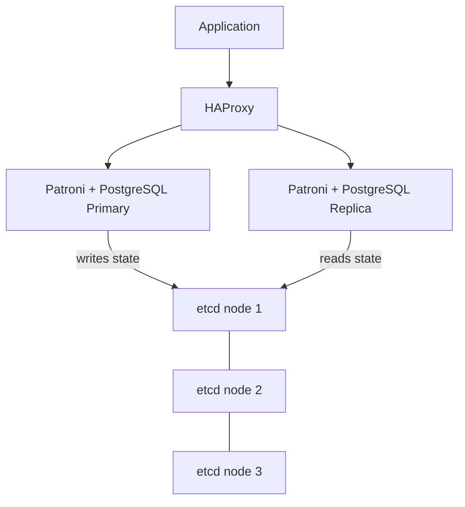

# How to Deploy a PostgreSQL Cluster with Patroni via Portainer

Author: [nawazdhandala](https://www.github.com/nawazdhandala)

Tags: Portainer, PostgreSQL, Patroni, High Availability, Database Cluster, etcd

Description: Learn how to deploy a highly available PostgreSQL cluster using Patroni for automatic failover, managed through Portainer stacks.

---

Patroni is a Python-based HA template for PostgreSQL that uses a distributed configuration store (etcd, ZooKeeper, or Consul) to manage primary election and automatic failover. Running it in Docker via Portainer requires an etcd cluster alongside PostgreSQL nodes.

## Architecture



## etcd Cluster

Deploy a three-node etcd cluster as a prerequisite:

```yaml
version: "3.8"

services:
  etcd1:
    image: bitnami/etcd:3.5
    environment:
      ETCD_NAME: etcd1
      ETCD_INITIAL_CLUSTER: "etcd1=http://etcd1:2380,etcd2=http://etcd2:2380,etcd3=http://etcd3:2380"
      ETCD_INITIAL_CLUSTER_STATE: new
      ETCD_INITIAL_ADVERTISE_PEER_URLS: http://etcd1:2380
      ETCD_ADVERTISE_CLIENT_URLS: http://etcd1:2379
      ETCD_LISTEN_CLIENT_URLS: http://0.0.0.0:2379
      ETCD_LISTEN_PEER_URLS: http://0.0.0.0:2380
      ALLOW_NONE_AUTHENTICATION: "yes"
    networks:
      - patroni_net

  etcd2:
    image: bitnami/etcd:3.5
    environment:
      ETCD_NAME: etcd2
      ETCD_INITIAL_CLUSTER: "etcd1=http://etcd1:2380,etcd2=http://etcd2:2380,etcd3=http://etcd3:2380"
      ETCD_INITIAL_CLUSTER_STATE: new
      ETCD_INITIAL_ADVERTISE_PEER_URLS: http://etcd2:2380
      ETCD_ADVERTISE_CLIENT_URLS: http://etcd2:2379
      ETCD_LISTEN_CLIENT_URLS: http://0.0.0.0:2379
      ETCD_LISTEN_PEER_URLS: http://0.0.0.0:2380
      ALLOW_NONE_AUTHENTICATION: "yes"
    networks:
      - patroni_net

  etcd3:
    image: bitnami/etcd:3.5
    environment:
      ETCD_NAME: etcd3
      ETCD_INITIAL_CLUSTER: "etcd1=http://etcd1:2380,etcd2=http://etcd2:2380,etcd3=http://etcd3:2380"
      ETCD_INITIAL_CLUSTER_STATE: new
      ETCD_INITIAL_ADVERTISE_PEER_URLS: http://etcd3:2380
      ETCD_ADVERTISE_CLIENT_URLS: http://etcd3:2379
      ETCD_LISTEN_CLIENT_URLS: http://0.0.0.0:2379
      ETCD_LISTEN_PEER_URLS: http://0.0.0.0:2380
      ALLOW_NONE_AUTHENTICATION: "yes"
    networks:
      - patroni_net
```

## Patroni PostgreSQL Nodes

Add two PostgreSQL nodes managed by Patroni:

```yaml
  pg1:
    image: patroni/patroni:latest
    hostname: pg1
    environment:
      PATRONI_NAME: pg1
      PATRONI_POSTGRESQL_DATA_DIR: /data/pg1
      PATRONI_POSTGRESQL_CONNECT_ADDRESS: pg1:5432
      PATRONI_RESTAPI_CONNECT_ADDRESS: pg1:8008
      PATRONI_ETCD3_HOSTS: "etcd1:2379,etcd2:2379,etcd3:2379"
      PATRONI_SUPERUSER_USERNAME: postgres
      PATRONI_SUPERUSER_PASSWORD: supersecret
      PATRONI_REPLICATION_USERNAME: replicator
      PATRONI_REPLICATION_PASSWORD: replsecret
    volumes:
      - pg1_data:/data
    networks:
      - patroni_net

  pg2:
    image: patroni/patroni:latest
    hostname: pg2
    environment:
      PATRONI_NAME: pg2
      PATRONI_POSTGRESQL_DATA_DIR: /data/pg2
      PATRONI_POSTGRESQL_CONNECT_ADDRESS: pg2:5432
      PATRONI_RESTAPI_CONNECT_ADDRESS: pg2:8008
      PATRONI_ETCD3_HOSTS: "etcd1:2379,etcd2:2379,etcd3:2379"
      PATRONI_SUPERUSER_USERNAME: postgres
      PATRONI_SUPERUSER_PASSWORD: supersecret
      PATRONI_REPLICATION_USERNAME: replicator
      PATRONI_REPLICATION_PASSWORD: replsecret
    volumes:
      - pg2_data:/data
    networks:
      - patroni_net

volumes:
  pg1_data:
  pg2_data:

networks:
  patroni_net:
    driver: bridge
```

## Checking Cluster State

Use the Patroni REST API to inspect cluster health:

```bash
# Check which node is primary

curl -s http://localhost:8008/cluster | jq '.members[] | {name, role, state}'

# Trigger a manual switchover
curl -s -XPOST http://localhost:8008/switchover \
  -H "Content-Type: application/json" \
  -d '{"leader":"pg1","candidate":"pg2"}'
```

## HAProxy for Transparent Failover

Route client connections through HAProxy using Patroni's health endpoints:

```bash
# haproxy.cfg snippet
backend postgresql_primary
  option httpchk GET /primary
  server pg1 pg1:5432 check port 8008
  server pg2 pg2:5432 check port 8008

backend postgresql_replicas
  option httpchk GET /replica
  server pg1 pg1:5432 check port 8008
  server pg2 pg2:5432 check port 8008
```

HAProxy queries `/primary` on port 8008: Patroni returns HTTP 200 only on the current primary, so write connections always land on the right node.

## Automatic Failover

Patroni automatically promotes a replica when the primary fails:

1. etcd TTL expires for the primary's leader key.
2. A replica with the highest WAL position wins the election.
3. Patroni promotes it to primary within seconds.
4. HAProxy health checks detect the change and reroute traffic.

The entire failover typically completes in 10–30 seconds with default settings.
