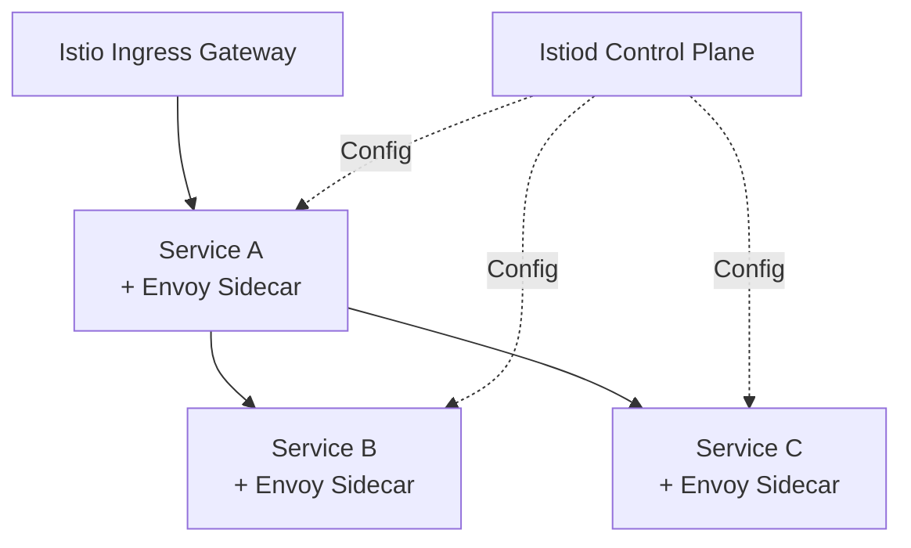

# How to Deploy Service Mesh (Istio) with OpenTofu

Author: [nawazdhandala](https://www.github.com/nawazdhandala)

Tags: OpenTofu, Kubernetes, Istio, Service Mesh, mTLS, Traffic Management, Infrastructure as Code

Description: Learn how to deploy Istio service mesh on Kubernetes with OpenTofu using Helm, including installation of the control plane, ingress gateway, and enabling sidecar injection per namespace.

---

Istio provides mTLS between services, traffic management, and observability without code changes. Deploying Istio with OpenTofu ensures the control plane, gateways, and namespace configurations are reproducible and version-controlled.

## Istio Architecture



## Install Istio via Helm

```hcl
# istio.tf

# Step 1: Install Istio base (CRDs)

resource "helm_release" "istio_base" {
  name             = "istio-base"
  repository       = "https://istio-release.storage.googleapis.com/charts"
  chart            = "base"
  version          = "1.20.2"
  namespace        = "istio-system"
  create_namespace = true

  set {
    name  = "defaultRevision"
    value = "default"
  }
}

# Step 2: Install Istiod control plane
resource "helm_release" "istiod" {
  name       = "istiod"
  repository = "https://istio-release.storage.googleapis.com/charts"
  chart      = "istiod"
  version    = "1.20.2"
  namespace  = "istio-system"

  values = [
    yamlencode({
      pilot = {
        resources = {
          requests = { cpu = "200m", memory = "200Mi" }
        }
        autoscaleEnabled = true
        autoscaleMin     = 1
        autoscaleMax     = 5
      }

      meshConfig = {
        # Enable access logging
        accessLogFile = "/dev/stdout"

        # Set default mTLS mode
        defaultConfig = {
          tracing = {
            sampling = 1.0
          }
        }
      }

      global = {
        proxy = {
          resources = {
            requests = { cpu = "10m", memory = "40Mi" }
            limits   = { cpu = "200m", memory = "256Mi" }
          }
        }
      }
    })
  ]

  depends_on = [helm_release.istio_base]
}

# Step 3: Install Ingress Gateway
resource "helm_release" "istio_ingress" {
  name       = "istio-ingressgateway"
  repository = "https://istio-release.storage.googleapis.com/charts"
  chart      = "gateway"
  version    = "1.20.2"
  namespace  = "istio-ingress"

  create_namespace = true

  values = [
    yamlencode({
      service = {
        type = "LoadBalancer"
        annotations = {
          "service.beta.kubernetes.io/aws-load-balancer-type" = "nlb"
          "service.beta.kubernetes.io/aws-load-balancer-scheme" = "internet-facing"
        }
      }
      replicaCount = var.environment == "production" ? 3 : 2
    })
  ]

  depends_on = [helm_release.istiod]
}
```

## Enable Sidecar Injection per Namespace

```hcl
# namespaces.tf
resource "kubernetes_namespace" "apps" {
  metadata {
    name = "apps"
    labels = {
      # Enable automatic sidecar injection
      "istio-injection" = "enabled"
    }
  }
}

resource "kubernetes_namespace" "monitoring" {
  metadata {
    name = "monitoring"
    labels = {
      "istio-injection" = "enabled"
    }
  }
}
```

## PeerAuthentication for mTLS

```hcl
# mtls.tf
resource "kubernetes_manifest" "peer_authentication_strict" {
  manifest = {
    apiVersion = "security.istio.io/v1beta1"
    kind       = "PeerAuthentication"
    metadata = {
      name      = "default"
      namespace = "istio-system"
    }
    spec = {
      mtls = {
        mode = "STRICT"  # Enforce mTLS cluster-wide
      }
    }
  }

  depends_on = [helm_release.istiod]
}
```

## Gateway and VirtualService

```hcl
# gateway.tf
resource "kubernetes_manifest" "gateway" {
  manifest = {
    apiVersion = "networking.istio.io/v1beta1"
    kind       = "Gateway"
    metadata = {
      name      = "app-gateway"
      namespace = "apps"
    }
    spec = {
      selector = {
        istio = "ingressgateway"
      }
      servers = [{
        port = {
          number   = 443
          name     = "https"
          protocol = "HTTPS"
        }
        tls = {
          mode           = "SIMPLE"
          credentialName = "app-tls-cert"
        }
        hosts = [var.app_domain]
      }]
    }
  }
}

resource "kubernetes_manifest" "virtual_service" {
  manifest = {
    apiVersion = "networking.istio.io/v1beta1"
    kind       = "VirtualService"
    metadata = {
      name      = "app"
      namespace = "apps"
    }
    spec = {
      hosts    = [var.app_domain]
      gateways = ["app-gateway"]
      http = [{
        route = [{
          destination = {
            host = "app-service"
            port = { number = 80 }
          }
        }]
      }]
    }
  }
}
```

## Best Practices

- Install Istio in the order: base (CRDs) → istiod → gateways - use `depends_on` to enforce this.
- Enable `STRICT` mTLS mode at the mesh level and use `PERMISSIVE` temporarily during migration to avoid breaking existing traffic.
- Set sidecar proxy resource limits - without them, proxies consume unbounded memory on high-traffic services.
- Use `kubernetes_manifest` for Istio CRD resources (Gateway, VirtualService, PeerAuthentication) - these aren't covered by standard Kubernetes providers.
- Pin Helm chart versions and test Istio upgrades in staging first - Istio upgrades can break traffic routing if versions are mismatched.
