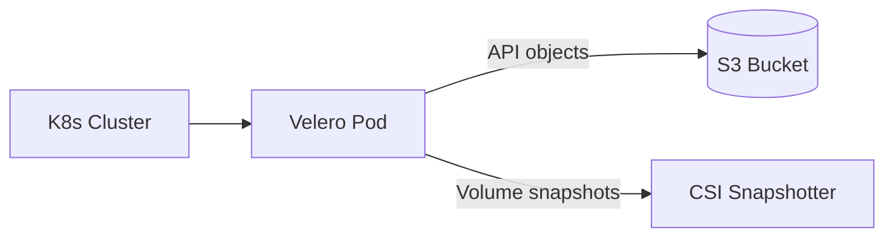

# How to Deploy Velero for Kubernetes Backup via Portainer

Author: [nawazdhandala](https://www.github.com/nawazdhandala)

Tags: Portainer, Velero, Kubernetes, Backup, Storage, Disaster Recovery

Description: Install Velero on a Kubernetes cluster managed by Portainer to enable namespace-level backups, scheduled snapshots, and cross-cluster migration of workloads.

---

Velero is the standard tool for Kubernetes cluster backup and restore. It backs up Kubernetes API objects (Deployments, Services, ConfigMaps, Secrets) alongside persistent volume data. With Portainer managing your cluster, you can deploy Velero's supporting components and manage backup schedules through a combination of Portainer's manifest interface and the Velero CLI.

## Architecture



## Prerequisites

- Portainer connected to a Kubernetes cluster
- `kubectl` and `velero` CLI installed on your workstation
- An S3-compatible bucket for backup storage

## Step 1: Install Velero CLI

```bash
# macOS

brew install velero

# Linux
curl -LO https://github.com/vmware-tanzu/velero/releases/latest/download/velero-linux-amd64.tar.gz
tar xzf velero-linux-amd64.tar.gz && mv velero /usr/local/bin/
```

## Step 2: Create S3 Credentials File

```bash
# credentials-velero
cat > /tmp/credentials-velero << 'EOF'
[default]
aws_access_key_id=<your-access-key>
aws_secret_access_key=<your-secret-key>
EOF
```

## Step 3: Install Velero on the Cluster

```bash
# Install Velero with the AWS plugin for S3 storage
velero install \
  --provider aws \
  --plugins velero/velero-plugin-for-aws:v1.9.0 \
  --bucket velero-backups-bucket \
  --backup-location-config region=us-east-1 \
  --snapshot-location-config region=us-east-1 \
  --secret-file /tmp/credentials-velero
```

After installation, verify the Velero pods are running via Portainer's **Kubernetes > Namespaces > velero** view.

## Step 4: Create a Manual Backup via Portainer Manifest

Apply the following manifest through Portainer's **Kubernetes > Advanced Deployment** interface:

```yaml
# velero-backup.yaml
apiVersion: velero.io/v1
kind: Backup
metadata:
  name: full-cluster-backup
  namespace: velero
spec:
  # Back up all namespaces
  includedNamespaces:
    - "*"
  # Exclude Velero's own namespace
  excludedNamespaces:
    - velero
  storageLocation: default
  ttl: 720h   # Retain for 30 days
```

## Step 5: Schedule Regular Backups

```yaml
# velero-schedule.yaml
apiVersion: velero.io/v1
kind: Schedule
metadata:
  name: daily-backup
  namespace: velero
spec:
  schedule: "0 2 * * *"   # Every day at 02:00
  template:
    includedNamespaces:
      - production
    ttl: 720h
```

## Step 6: Restore from a Backup

```bash
# List available backups
velero backup get

# Restore a specific backup
velero restore create --from-backup full-cluster-backup

# Monitor restore progress
velero restore describe full-cluster-backup-restore
```

## Monitoring Backup Status

Check backup status through Portainer by viewing the Velero namespace's Backup custom resources, or use the CLI:

```bash
# Check all backup statuses
velero backup get --all-namespaces

# View detailed backup description
velero backup describe full-cluster-backup
```

## Summary

Velero on Portainer-managed Kubernetes provides namespace-level backup, scheduled snapshots, and point-in-time restore capabilities. By combining Velero's Schedule CRDs with Portainer's manifest management, you establish a reliable disaster recovery workflow for production Kubernetes workloads.
