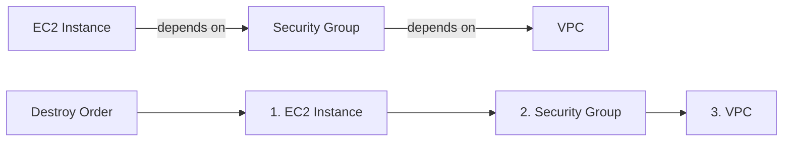

# How to Destroy Infrastructure with tofu destroy - A Practical Guide

Author: [nawazdhandala](https://www.github.com/nawazdhandala)

Tags: OpenTofu, Tofu destroy, Infrastructure as Code, DevOps, Lifecycle Management

Description: Learn how to use tofu destroy to safely tear down infrastructure, understand the destroy plan, and target specific resources for deletion.

---

`tofu destroy` removes all infrastructure managed by your OpenTofu configuration. It generates a destroy plan, shows you exactly what will be deleted, and waits for your confirmation. Understanding how destroy works - including its options and safeguards - is essential before running it on production environments.

---

## Basic Destroy Workflow

```bash
# First, preview what will be destroyed

tofu plan -destroy

# Then destroy all managed infrastructure
tofu destroy

# OpenTofu will show a destroy plan and prompt:
# Do you really want to destroy all resources?
# Only 'yes' will be accepted to confirm.
#
# Enter a value: yes
```

---

## Understanding the Destroy Plan Output

```hcl
OpenTofu will perform the following actions:

  # aws_instance.web will be destroyed
  - resource "aws_instance" "web" {
      - ami           = "ami-0c55b159cbfafe1f0" -> null
      - instance_type = "t3.micro" -> null
      - id            = "i-0123456789abcdef0" -> null
        ...
    }

Plan: 0 to add, 0 to change, 2 to destroy.
```

Every attribute shown with a `-` prefix will be removed.

---

## Auto-Approve Destroy (for CI/CD)

```bash
# Skip the confirmation prompt (use with extreme caution in production)
tofu destroy -auto-approve

# Recommended: Only use -auto-approve in CI/CD for ephemeral environments
# such as test environments spun up per PR
```

---

## Destroy a Specific Resource (Targeted Destroy)

```bash
# Destroy only one specific resource without affecting others
tofu destroy -target=aws_instance.web

# Destroy a specific resource in a module
tofu destroy -target=module.networking.aws_vpc.main

# Destroy multiple specific resources
tofu destroy \
  -target=aws_instance.web \
  -target=aws_security_group.web_sg
```

---

## Destroy with Variable Overrides

```bash
# Pass variables during destroy (useful for different environments)
tofu destroy \
  -var="environment=staging" \
  -var-file="staging.tfvars"
```

---

## Preventing Accidental Destroy

Use `prevent_destroy` lifecycle to protect critical resources.

```hcl
# Protect a production database from accidental destruction
resource "aws_rds_instance" "main" {
  identifier = "prod-database"
  # ...

  lifecycle {
    prevent_destroy = true
  }
}
```

```bash
# Attempting to destroy a protected resource will fail safely
tofu destroy

# Error:
# │ Error: Instance cannot be destroyed
# │
# │ Resource aws_rds_instance.main has lifecycle.prevent_destroy set,
# │ but the plan calls for this resource to be destroyed.
```

---

## Destroy Order (Dependencies)

OpenTofu respects the dependency graph when destroying. Resources are destroyed in reverse dependency order - dependents are removed before their dependencies.



---

## Summary

`tofu destroy` is a powerful command that requires care in production. Always run `tofu plan -destroy` first to see exactly what will be removed. Use `-target` to destroy specific resources while preserving others. For critical resources, add `lifecycle { prevent_destroy = true }` to make accidental destruction impossible.
