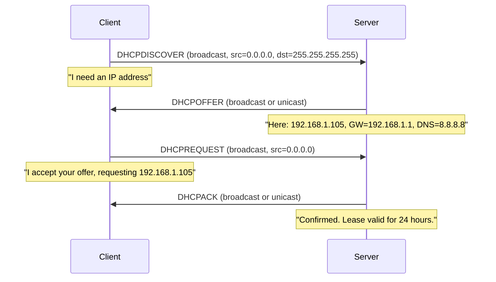

# How to Understand the DHCP DORA Process (Discover, Offer, Request, Acknowledge)

Author: [nawazdhandala](https://www.github.com/nawazdhandala)

Tags: DHCP, Networking, DORA, IP Addressing, Protocol

Description: The DHCP DORA process is the four-message exchange (Discover, Offer, Request, Acknowledge) by which a client obtains an IP address, subnet mask, gateway, and other configuration from a DHCP server.

## The Four DORA Messages



## Message Details

### 1. DHCPDISCOVER
- **Source**: 0.0.0.0 (client has no IP yet)
- **Destination**: 255.255.255.255 (broadcast)
- **Contents**: Client MAC, requested lease time, parameter request list

### 2. DHCPOFFER
- **Source**: DHCP server IP
- **Destination**: 255.255.255.255 or client IP (if broadcast flag = 0)
- **Contents**: Offered IP, lease time, gateway, DNS, subnet mask

### 3. DHCPREQUEST
- **Source**: 0.0.0.0 (still no IP — may have multiple offers)
- **Destination**: 255.255.255.255 (informs all servers which offer was accepted)
- **Contents**: Server identifier, requested IP

### 4. DHCPACK
- **Source**: DHCP server IP
- **Destination**: Client IP or broadcast
- **Contents**: Confirmed IP, final lease time, all options

## Capturing DORA with tcpdump

```bash
# Capture DHCP traffic (UDP ports 67 and 68)
sudo tcpdump -i eth0 -n 'port 67 or port 68' -w /tmp/dhcp.pcap

# Trigger a DORA exchange (Linux)
sudo dhclient -v eth0

# Read and display the capture
tcpdump -r /tmp/dhcp.pcap -v
```

## Viewing DORA in Wireshark

Display filter for DHCP:
```
bootp
```

You'll see each message type (DHCPDISCOVER, DHCPOFFER, DHCPREQUEST, DHCPACK) with the offered/requested IP and all options.

## Renewal vs DORA

At 50% of lease time, the client sends a **DHCPREQUEST** directly to the server (unicast) to renew. No new DORA cycle needed unless the server rejects the renewal:

```
T1 (50%): DHCPREQUEST (unicast to server) → DHCPACK
T2 (87.5%): DHCPREQUEST (broadcast) → DHCPACK or rebind with any server
T=expiry: Full DORA cycle restarts
```

## Key Takeaways

- DORA = Discover → Offer → Request → Acknowledge — four UDP messages.
- Client uses 0.0.0.0 as source until the DHCPACK is received and applied.
- All messages are broadcast (except unicast renewal at T1/T2).
- `dhclient -v eth0` on Linux shows the full DORA exchange in real-time.
