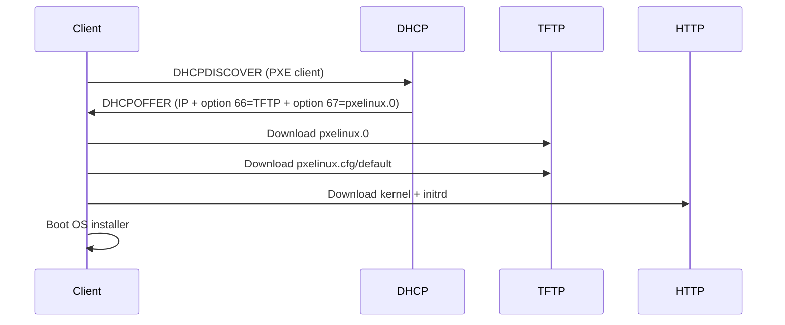

# How to Use DHCP with PXE Boot for Network Installation

Author: [nawazdhandala](https://www.github.com/nawazdhandala)

Tags: DHCP, PXE Boot, Network Installation, sysadmin, Linux

Description: PXE (Pre-boot Execution Environment) uses DHCP options 66 and 67 to deliver TFTP server address and boot filename to network-booting clients, enabling automated OS installation without physical media.

## How PXE Boot Works



## ISC dhcpd Configuration for PXE

```
# /etc/dhcp/dhcpd.conf

# TFTP server and boot file for PXE clients
next-server 10.0.0.10;              # TFTP server IP (option 66)
filename "pxelinux.0";              # Boot filename (option 67)

subnet 10.0.0.0 netmask 255.255.255.0 {
    range 10.0.0.100 10.0.0.150;
    option routers 10.0.0.1;

    # Override for UEFI clients (class-based)
    class "UEFI-systems" {
        match if substring(option vendor-class-identifier, 0, 9) = "PXEClient";
        filename "shimx64.efi";     # UEFI bootloader
    }
}

# BIOS PXE clients
class "BIOS-systems" {
    match if option vendor-class-identifier = "PXEClient:Arch:00000";
    filename "pxelinux.0";
}
```

## Setting Up the TFTP Server

```bash
# Install TFTP server
sudo apt install tftpd-hpa

# Configure
sudo tee /etc/default/tftpd-hpa << 'EOF'
TFTP_USERNAME="tftp"
TFTP_DIRECTORY="/var/lib/tftpboot"
TFTP_ADDRESS="0.0.0.0:69"
TFTP_OPTIONS="--secure"
EOF

# Install PXE bootloader files
sudo apt install pxelinux syslinux-common
sudo cp /usr/lib/PXELINUX/pxelinux.0 /var/lib/tftpboot/
sudo cp /usr/lib/syslinux/modules/bios/{ldlinux,menu,vesamenu}.c32 /var/lib/tftpboot/

sudo systemctl enable --now tftpd-hpa
```

## PXE Menu Configuration

```bash
mkdir -p /var/lib/tftpboot/pxelinux.cfg
cat > /var/lib/tftpboot/pxelinux.cfg/default << 'EOF'
DEFAULT menu.c32
PROMPT 0
TIMEOUT 300

MENU TITLE PXE Boot Menu

LABEL ubuntu-22.04
    MENU LABEL Ubuntu 22.04 Server Install
    KERNEL ubuntu-22.04/vmlinuz
    APPEND initrd=ubuntu-22.04/initrd auto url=http://10.0.0.10/preseed/ubuntu.cfg

LABEL local
    MENU LABEL Boot from local disk
    LOCALBOOT 0
EOF
```

## Downloading and Staging Ubuntu Netboot

```bash
# Download Ubuntu netboot files
mkdir -p /var/lib/tftpboot/ubuntu-22.04
wget -O /tmp/ubuntu-netboot.tar.gz \
  http://archive.ubuntu.com/ubuntu/dists/jammy/main/installer-amd64/current/legacy-images/netboot/netboot.tar.gz
sudo tar xzf /tmp/ubuntu-netboot.tar.gz -C /var/lib/tftpboot/ubuntu-22.04
```

## Key Takeaways

- DHCP option 66 (next-server) provides the TFTP server IP; option 67 (filename) provides the boot file path.
- UEFI clients need different boot files (`shimx64.efi`) than BIOS clients (`pxelinux.0`).
- Use DHCP classes to serve the right boot file based on the client's vendor class identifier.
- PXE boot enables automated unattended OS deployment with preseed/kickstart configuration files.
