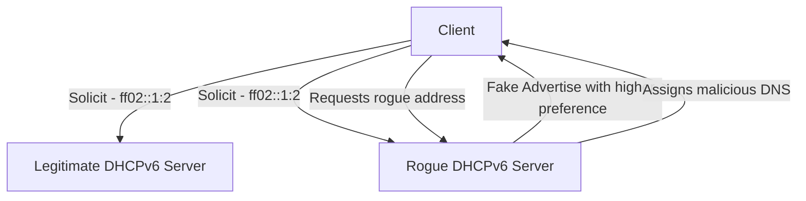

# How to Secure DHCPv6 with Authentication

Author: [nawazdhandala](https://www.github.com/nawazdhandala)

Tags: DHCPv6, IPv6, Security, Authentication, DHCP

Description: Learn how to protect DHCPv6 infrastructure using authentication options to prevent rogue server attacks and unauthorized address assignment.

## Overview

DHCPv6 authentication (defined in RFC 3315, updated by RFC 8415) allows clients and servers to verify the authenticity of DHCPv6 messages. Without authentication, a rogue DHCPv6 server can poison clients with malicious DNS servers or incorrect prefixes.

## Threat Model



## DHCPv6 Authentication Option (Option 11)

The Authentication option uses a shared secret and HMAC-MD5 or HMAC-SHA to sign DHCPv6 messages. Both client and server must share the same secret.

## ISC DHCP Server Authentication Configuration

```bash
# /etc/dhcp/dhcpd6.conf

# Define an authentication key
key "dhcpv6-auth-key" {
    algorithm hmac-md5;
    secret "c2VjcmV0a2V5MTIzNDU2Nzg=";  # Base64-encoded shared secret
}

# Apply authentication to the subnet
subnet6 2001:db8::/32 {
    range6 2001:db8::100 2001:db8::200;
    send dhcp6.authentication 11 1 1 1 "dhcpv6-auth-key";
}
```

## ISC DHCP Client Authentication Configuration

```bash
# /etc/dhcp/dhclient6.conf

# Require authentication from the server
send dhcp6.authentication 11 1 1 1 "dhcpv6-auth-key";
require authentication;

key "dhcpv6-auth-key" {
    algorithm hmac-md5;
    secret "c2VjcmV0a2V5MTIzNDU2Nzg=";
}
```

## Alternative: RA-Guard and DHCPv6-Shield

For environments where implementing cryptographic authentication is complex, use network-layer protections:

**DHCPv6-Shield (RFC 7610)** — Implemented on managed switches to drop DHCPv6 server messages arriving on untrusted ports.

```
! Cisco IOS — Enable DHCPv6 Guard on access ports
ipv6 dhcp guard policy CLIENT_PORTS
 device-role client

interface GigabitEthernet0/1
 ipv6 dhcp guard attach-policy CLIENT_PORTS
```

This ensures only designated uplink ports can carry DHCPv6 server messages.

## Rogue Server Detection with Monitoring

Even without authentication, monitoring tools can detect rogue DHCPv6 servers:

```bash
# Listen for unexpected DHCPv6 Advertise messages on the network
sudo tcpdump -i eth0 -n "udp port 547" | grep "dhcp6 advertise"

# Alert if Advertise comes from unexpected source addresses
# Legitimate server: fe80::1
# Unexpected: fe80::aaaa:bbbb:cccc:dddd
```

## Best Practices

1. **Deploy DHCPv6 Guard on all switches** — This is the most practical protection in most environments.
2. **Use authentication in high-security environments** — HMAC authentication prevents message tampering.
3. **Monitor for rogue Advertise messages** — Set up IDS rules to alert on unknown DHCPv6 sources.
4. **Limit DHCPv6 multicast to known VLANs** — Use VLAN segmentation to reduce exposure.
5. **Log all DHCPv6 assignments** — Correlate IP assignments with switch port data to detect anomalies.

## Checking for Rogue Servers with nmap

```bash
# Scan for active DHCPv6 servers on the local link
sudo nmap -6 --script=broadcast-dhcp6-discover -e eth0

# Or use dhcpv6-tester
sudo dhcptest --solicit --interface eth0
```

## Summary

DHCPv6 authentication using HMAC protects against rogue server attacks, but in practice, DHCPv6-Guard on managed switches is the most deployable defense. Combine both approaches with active monitoring for a layered security posture.
