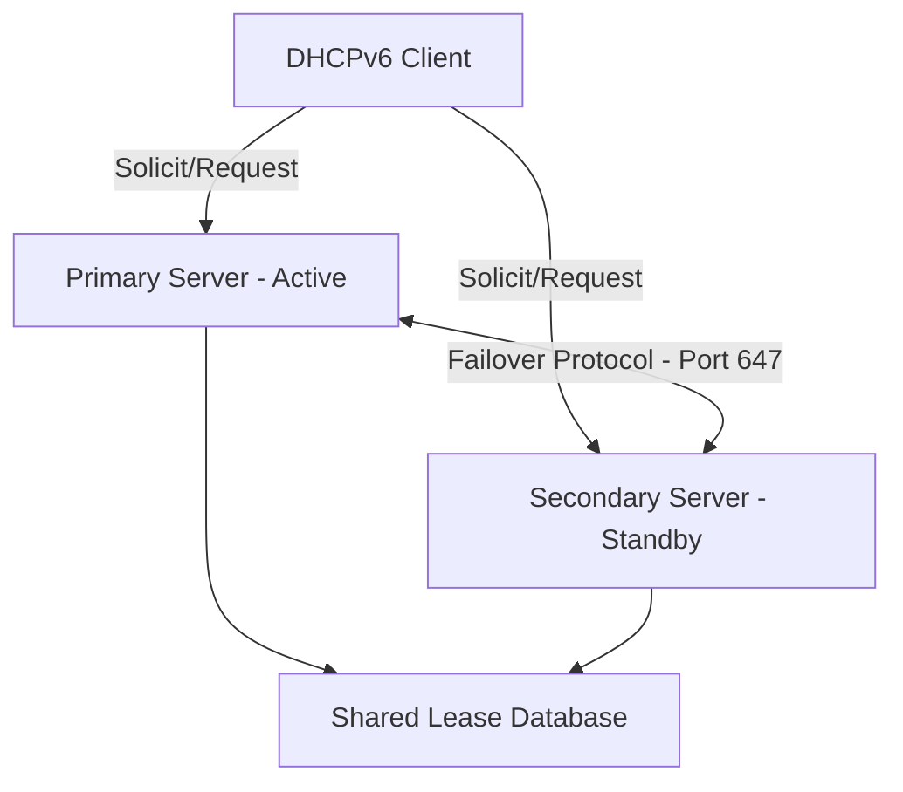

# How to Configure DHCPv6 Failover for High Availability - High Availability

Author: [nawazdhandala](https://www.github.com/nawazdhandala)

Tags: DHCPv6, IPv6, High Availability, Failover, Networking

Description: Learn how to configure DHCPv6 failover between two servers to ensure uninterrupted IPv6 address assignment in your network.

## Overview

DHCPv6 failover ensures that if your primary DHCP server goes down, a secondary server can continue assigning IPv6 addresses. Unlike DHCPv4, the DHCPv6 failover protocol is defined in RFC 8156 and uses a different architecture.

## Failover Architecture



## ISC Kea DHCPv6 Failover (High Availability Hook)

Kea DHCP supports HA via its `libdhcp_ha` hook library. Below is a working configuration for a two-node active-standby setup.

### Primary Server Configuration

```json
// /etc/kea/kea-dhcp6.conf (Primary)
{
  "Dhcp6": {
    "hooks-libraries": [
      {
        "library": "/usr/lib/kea/hooks/libdhcp_ha.so",
        "parameters": {
          "high-availability": [{
            "this-server-name": "server1",
            "mode": "hot-standby",
            "heartbeat-delay": 10000,
            "max-response-delay": 60000,
            "max-ack-delay": 5000,
            "max-unacked-clients": 5,
            "peers": [
              {
                "name": "server1",
                "url": "http://192.0.2.1:8000/",
                "role": "primary",
                "auto-failover": true
              },
              {
                "name": "server2",
                "url": "http://192.0.2.2:8000/",
                "role": "standby",
                "auto-failover": true
              }
            ]
          }]
        }
      }
    ],
    "subnet6": [
      {
        "subnet": "2001:db8::/32",
        "pools": [{ "pool": "2001:db8::100 - 2001:db8::200" }]
      }
    ]
  }
}
```

### Secondary Server Configuration

The secondary server uses an identical configuration but with `this-server-name` set to `server2`.

```json
// /etc/kea/kea-dhcp6.conf (Secondary) - only the changed field shown
{
  "Dhcp6": {
    "hooks-libraries": [
      {
        "library": "/usr/lib/kea/hooks/libdhcp_ha.so",
        "parameters": {
          "high-availability": [{
            "this-server-name": "server2"
          }]
        }
      }
    ]
  }
}
```

## Enabling the Kea Control Agent

The HA hook requires the Kea Control Agent (REST API) to be running on both servers:

```bash
# Start the Kea Control Agent on both nodes

systemctl enable --now kea-ctrl-agent

# Verify it's listening
ss -tlnp | grep 8000
```

## Checking HA Status

```bash
# Query the HA state via the REST API
curl -s -X POST http://localhost:8000/ \
  -H "Content-Type: application/json" \
  -d '{"command": "ha-heartbeat", "service": ["dhcp6"]}' | jq .

# Expected output when healthy:
# { "result": 0, "text": "HA peer status returned.", "arguments": { "state": "hot-standby" } }
```

## Failover Modes

| Mode | Description |
|------|-------------|
| `hot-standby` | Primary handles all traffic; secondary takes over if primary fails |
| `load-balancing` | Both servers handle requests; each owns a portion of the address pool |
| `passive-backup` | Primary sends all leases to backup; backup never serves clients directly |

## Best Practices

- Use `load-balancing` mode for large deployments to distribute server load.
- Ensure both servers share a synchronized lease database (e.g., via Kea's MySQL or PostgreSQL backend).
- Monitor heartbeat delay - if it exceeds `max-response-delay`, the standby will assume the primary is down.
- Test failover quarterly by intentionally stopping the primary and verifying client renewals succeed.

## Summary

DHCPv6 HA with Kea provides robust address assignment continuity. By configuring the `libdhcp_ha` hook with hot-standby or load-balancing mode, you ensure that no DHCPv6 clients lose connectivity when a server goes offline.
