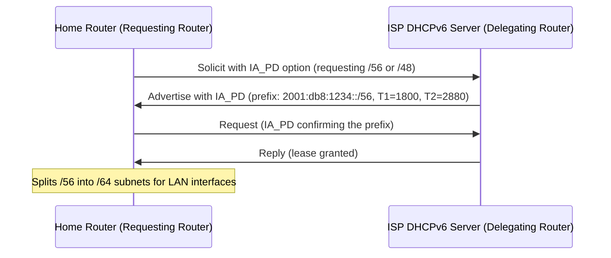

# How to Configure DHCPv6 Prefix Delegation for Home Networks

Author: [nawazdhandala](https://www.github.com/nawazdhandala)

Tags: DHCPv6, IPv6, Prefix Delegation, Home Networking, IA_PD

Description: Learn how to configure DHCPv6 Prefix Delegation (PD) on a home router to receive an IPv6 prefix from your ISP and distribute it to your LAN.

## Overview

DHCPv6 Prefix Delegation (PD), defined in RFC 8415, allows a home router (the "requesting router") to receive an IPv6 prefix from the ISP's DHCPv6 server (the "delegating router") and then sub-delegate smaller prefixes to devices on the LAN.

## How Prefix Delegation Works



## Linux Router: Requesting a Prefix with dhclient

On a home Linux router connected to the ISP via `eth0`:

```bash
# /etc/dhcp/dhclient6.conf

# Request a prefix delegation on the WAN interface

interface "eth0" {
    send dhcp6.ia-pd 1;         # IA_PD with IAID=1
    request dhcp6.sip-servers,
            dhcp6.domain-search,
            dhcp6.dns-servers;
}
```

Start dhclient in prefix delegation mode:

```bash
# Request prefix delegation on the WAN interface
sudo dhclient -6 -P eth0 -v

# Check the assigned prefix in the lease file
grep "iaprefix" /var/lib/dhclient/dhclient6.leases
```

## Distributing the Prefix to the LAN

Once the router receives a `/56` prefix (e.g., `2001:db8:1234::/56`), it can assign `/64` subnets to each LAN interface:

```bash
# Assuming the ISP delegated 2001:db8:1234::/56
# Assign 2001:db8:1234:0001::/64 to the LAN interface
sudo ip -6 addr add 2001:db8:1234:0001::1/64 dev eth1

# Enable IPv6 forwarding
sudo sysctl -w net.ipv6.conf.all.forwarding=1
```

## ISC Kea DHCP: Acting as a Delegating Router

To act as the ISP-side delegating server in a lab:

```json
// /etc/kea/kea-dhcp6.conf
{
  "Dhcp6": {
    "subnet6": [
      {
        "subnet": "2001:db8::/32",
        "pd-pools": [
          {
            // Delegate /56 prefixes from this /32 pool
            "prefix": "2001:db8:1000::",
            "prefix-len": 32,
            "delegated-len": 56
          }
        ]
      }
    ]
  }
}
```

## OpenWrt Configuration

For OpenWrt home routers, prefix delegation is configured in `/etc/config/network`:

```text
# /etc/config/network

config interface 'wan6'
    option ifname   'eth0.2'
    option proto    'dhcpv6'
    option reqprefix 'auto'   # Request any available prefix
    option reqaddress 'try'   # Also try to get a global address

config interface 'lan'
    option ifname   'br-lan'
    option proto    'static'
    option ip6assign '60'     # Assign a /60 from the delegated prefix to LAN
```

## Verifying Prefix Delegation

```bash
# Check the delegated prefix is listed
ip -6 route show | grep "from"

# Verify LAN devices are receiving /64 addresses via RA
radvd --configtest && systemctl status radvd

# Check the delegation in Kea's lease database
curl -s -X POST http://localhost:8000/ \
  -d '{"command": "lease6-get-all", "service": ["dhcp6"]}' | jq .
```

## Summary

DHCPv6 Prefix Delegation enables a home router to receive a block of IPv6 addresses from the ISP and distribute /64 subnets to each LAN segment. On Linux, `dhclient -P` handles this, while OpenWrt simplifies the process with `reqprefix auto`. The key is that IA_PD requests a prefix, not an individual address.
