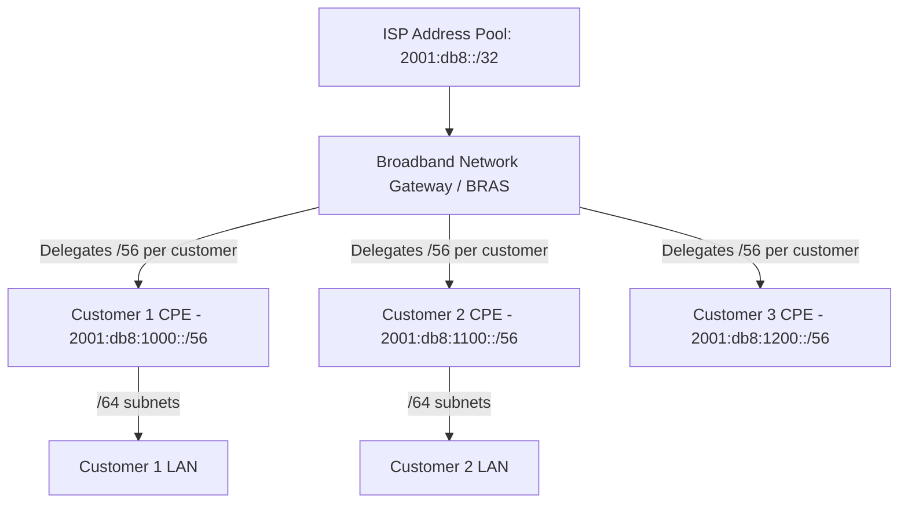

# How to Configure DHCPv6 Prefix Delegation for ISPs

Author: [nawazdhandala](https://www.github.com/nawazdhandala)

Tags: DHCPv6, IPv6, Prefix Delegation, ISP, IA_PD

Description: Learn how ISPs configure DHCPv6 Prefix Delegation to automatically assign IPv6 address blocks to customer edge routers at scale.

## Overview

ISPs use DHCPv6 Prefix Delegation (PD) to automatically assign IPv6 prefixes to Customer Premises Equipment (CPE) routers. Rather than manually assigning subnets, the ISP's delegating router hands out blocks (typically /48, /56, or /60) from a large pool.

## ISP Prefix Delegation Architecture



## Kea DHCPv6 Delegating Router Configuration

Kea is widely used in ISP environments for its performance and scalability:

```json
// /etc/kea/kea-dhcp6.conf — ISP Delegating Router
{
  "Dhcp6": {
    "interfaces-config": {
      "interfaces": ["eth0"]
    },
    "lease-database": {
      "type": "mysql",
      "host": "db.isp.example",
      "name": "kea_leases",
      "user": "kea",
      "password": "securepassword"
    },
    "subnet6": [
      {
        "subnet": "2001:db8::/32",
        // PD pool: delegate /56 prefixes from the /32 block
        "pd-pools": [
          {
            "prefix": "2001:db8:1000::",
            "prefix-len": 36,
            "delegated-len": 56
          }
        ],
        // Also offer a WAN /128 address to each CPE
        "pools": [
          { "pool": "2001:db8::1000 - 2001:db8::2000" }
        ]
      }
    ]
  }
}
```

## Cisco BNG Configuration

Cisco Broadband Network Gateways use RADIUS-integrated DHCPv6 PD:

```
! Define the local DHCPv6 prefix pool
ipv6 local pool ISP-PD-POOL 2001:db8:1000::/36 56

! Define DHCPv6 server with prefix delegation pool
ipv6 dhcp pool CUSTOMER-PD
 prefix-delegation pool ISP-PD-POOL lifetime 604800 86400
 dns-server 2001:db8::53

! Apply the DHCPv6 pool to the subscriber-facing interface
interface GigabitEthernet0/0/0
 ipv6 address 2001:db8::1/32
 ipv6 dhcp server CUSTOMER-PD
 ipv6 nd managed-config-flag
```

## Juniper MX Delegating Router

```
# Juniper MX — DHCPv6 prefix delegation configuration
set access address-assignment pool CUSTOMER_PD family inet6
set access address-assignment pool CUSTOMER_PD family inet6 prefix 2001:db8:1000::/36
set access address-assignment pool CUSTOMER_PD family inet6 prefix-length 56

set system services dhcp-local-server dhcpv6 group SUBSCRIBERS
set system services dhcp-local-server dhcpv6 group SUBSCRIBERS interface ge-0/0/0.0
```

## Prefix Length Recommendations for ISPs

| Allocation Size | Use Case |
|-----------------|----------|
| **/48** | Business customers — allows 65,536 /64 subnets |
| **/56** | Residential with multiple segments — 256 /64 subnets |
| **/60** | Minimal residential — 16 /64 subnets |
| **/64** | Single-segment residential (not recommended) |

ARIN and RIPE both recommend at minimum /56 for residential customers.

## Adding a Route for the Delegated Prefix

After delegation, the ISP's BNG must install a route for the delegated prefix pointing to the CPE:

```bash
# On a Linux BNG, add a host route for the delegated prefix
# This is typically automated by the DHCPv6 server hooks
ip -6 route add 2001:db8:1000::/56 via fe80::cpemac dev eth0

# Kea can automate this with the radius or run-script hooks
```

## Monitoring Prefix Utilization

```bash
# Query Kea for all active PD leases
curl -s -X POST http://localhost:8000/ \
  -H "Content-Type: application/json" \
  -d '{"command": "lease6-get-all", "service": ["dhcp6"]}' | \
  jq '[.[] | select(.type == "IA_PD")] | length'
```

## Summary

ISP-scale DHCPv6 prefix delegation uses PD pools to automatically assign /48 or /56 blocks from a large address range. Tools like Kea, Cisco BNG, and Juniper MX all support this. Proper pool sizing, route injection, and RADIUS integration are key to a production ISP PD deployment.
