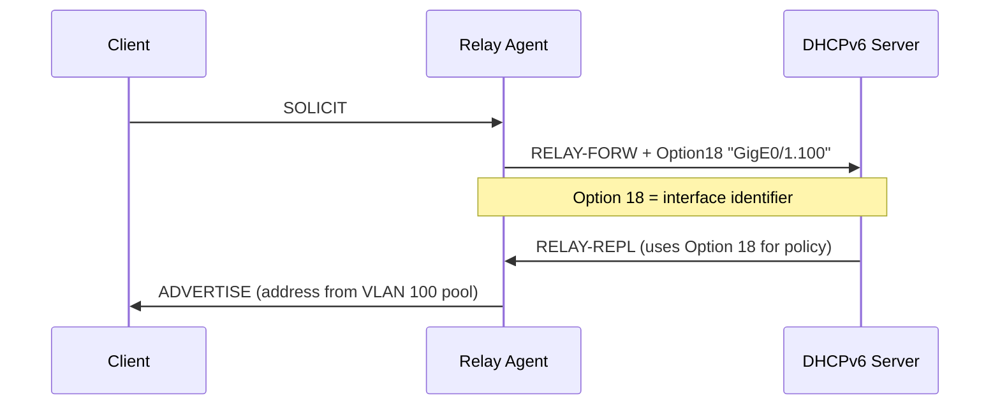

# How to Use DHCPv6 Relay Interface ID (Option 18)

Author: [nawazdhandala](https://www.github.com/nawazdhandala)

Tags: DHCPv6, Relay, Option 18, Interface ID, Subscriber Management, Networking

Description: Configure and use DHCPv6 Relay Option 18 (Interface ID) to identify relay interfaces at the DHCPv6 server for per-interface or per-subscriber policy application.

## What is Option 18 (Interface ID)?

DHCPv6 Relay Option 18 (Interface-ID) carries an opaque value inserted by relay agents to identify the interface on which a client's message was received. The DHCPv6 server uses this to:
- Apply per-interface address pools
- Implement subscriber-specific policies
- Track which port/VLAN a client is connected to
- Apply QoS or access control per-subscriber

## Option 18 in RELAY-FORW Messages



## Configuring Option 18 on Cisco IOS

```
! Cisco IOS — Interface ID is automatically added (interface name)
interface GigabitEthernet0/1.100
 encapsulation dot1q 100
 ipv6 address 2001:db8:100::1/64
 ipv6 dhcp relay destination 2001:db8::dhcp-server
 ! Relay automatically adds interface name as Option 18

! To use custom Interface ID:
ipv6 dhcp relay option interface-id ifname
! Uses interface name (e.g., "GigabitEthernet0/1.100")
```

## Configuring Option 18 on Juniper

```
# Juniper — include Interface ID in relay messages
set forwarding-options dhcp-relay v6 group CLIENTS interface-id-option include
set forwarding-options dhcp-relay v6 group CLIENTS interface ge-0/0/1.100

# Custom Interface ID format
set forwarding-options dhcp-relay v6 group CLIENTS interface-id-option ascii-string
```

## Linux dhcrelay with Interface ID

```bash
# dhcrelay automatically adds interface name as Option 18
dhcrelay -6 \
    -l eth0.100 \
    -u eth1 \
    2001:db8::dhcp-server

# The Interface ID will be "eth0.100" (the interface name)
```

## ISC Kea Server Using Interface ID

```json
// kea-dhcp6.conf — Classify clients by Option 18
{
    "Dhcp6": {
        "client-classes": [
            {
                "name": "vlan100-clients",
                "test": "relay6[0].option[18].hex == 0x47696745302f312e313030"
                // Hex encoding of "GigE0/1.100"
            },
            {
                "name": "vlan200-clients",
                "test": "relay6[0].option[18].hex == 0x47696745302f312e323030"
            }
        ],
        "subnet6": [
            {
                "subnet": "2001:db8:100::/64",
                "client-class": "vlan100-clients",
                "pools": [{"pool": "2001:db8:100::100-2001:db8:100::200"}]
            },
            {
                "subnet": "2001:db8:200::/64",
                "client-class": "vlan200-clients",
                "pools": [{"pool": "2001:db8:200::100-2001:db8:200::200"}]
            }
        ]
    }
}
```

## Decoding Option 18 Values

```python
#!/usr/bin/env python3
# Decode DHCPv6 Option 18 from packet capture

def decode_option18(hex_value: str) -> str:
    """Decode DHCPv6 Option 18 hex value to string"""
    try:
        return bytes.fromhex(hex_value).decode('ascii')
    except (ValueError, UnicodeDecodeError):
        return f"<binary: {hex_value}>"

# Examples from packet captures
option18_values = [
    "47696745302f312e313030",    # "GigE0/1.100"
    "65746830",                   # "eth0"
    "65746830 2e313030",          # "eth0.100"
    "4c454146312d657468312d313030", # "LEAF1-eth1-100"
]

for val in option18_values:
    clean = val.replace(" ", "")
    print(f"{clean} → '{decode_option18(clean)}'")
```

## Verifying Option 18 with tcpdump

```bash
# Capture DHCPv6 and decode Option 18
tcpdump -i eth1 -n -v 'udp port 547' 2>/dev/null | grep -A 5 "relay"

# Use tshark for structured output
tshark -i eth1 -f 'udp port 547' \
    -T fields \
    -e dhcpv6.msgtype \
    -e dhcpv6.option.value \
    -Y 'dhcpv6.option.type == 18'

# More readable format
tshark -i eth1 -f 'udp port 547' \
    -Y 'dhcpv6' \
    -V 2>/dev/null | grep -A 2 "Interface ID"
```

## Conclusion

DHCPv6 Option 18 is automatically inserted by relay agents with the relay interface name or a configured identifier. DHCPv6 servers use it to apply per-interface address pools and policies — essential for ISP subscriber management. ISC Kea's client-class expressions `relay6[0].option[18].hex` enable classification by Interface ID. Pair Option 18 with Option 37 (Remote ID) for comprehensive subscriber identification when the relay is behind another relay agent.
