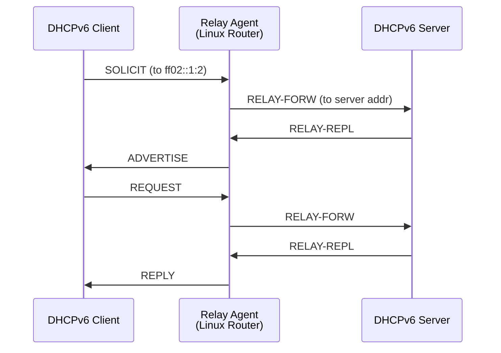

# How to Configure DHCPv6 Relay on Linux

Author: [nawazdhandala](https://www.github.com/nawazdhandala)

Tags: DHCPv6, Relay, Linux, ISC Kea, Dibbler, Networking

Description: Configure DHCPv6 relay agents on Linux using ISC Kea, dibbler, and wide-dhcpv6 to forward DHCPv6 messages between clients and servers on different subnets.

## DHCPv6 Relay Architecture



## ISC Kea DHCPv6 Relay (kea-dhcp-ddns)

```bash
# Install ISC Kea on Ubuntu

apt-get install -y kea

# Kea does not have a built-in relay - use kea-dhcp6 on the server
# For relay functionality, use wide-dhcpv6 or dibbler-relay
```

## wide-dhcpv6-relay Configuration

```bash
# Install wide-dhcpv6
apt-get install -y wide-dhcpv6-relay

# /etc/wide-dhcpv6/dhcp6relay.conf
cat > /etc/wide-dhcpv6/dhcp6relay.conf << 'EOF'
# Listen for clients on eth0 (client-facing interface)
# Forward to DHCPv6 server at 2001:db8::dhcp-server
interface eth0 {
    server-address 2001:db8::dhcp-server;
};
EOF

# Start the relay
systemctl enable wide-dhcpv6-relay
systemctl start wide-dhcpv6-relay
systemctl status wide-dhcpv6-relay
```

## dibbler-relay Configuration

```bash
# Install dibbler
apt-get install -y dibbler-relay

# /etc/dibbler/relay.conf
cat > /etc/dibbler/relay.conf << 'EOF'
# Interface facing clients
iface "eth0" {
    # Address of DHCPv6 server
    server-unicast 2001:db8::dhcp-server;
}
EOF

# Interface facing server
# dibbler-relay automatically uses the server-facing interface

# Start dibbler relay
dibbler-relay start

# Check status
dibbler-relay status
```

## dhcrelay for DHCPv6 (ISC DHCP)

```bash
# Install ISC DHCP relay
apt-get install -y isc-dhcp-relay

# /etc/default/isc-dhcp-relay
cat > /etc/default/isc-dhcp-relay << 'EOF'
# DHCPv6 server address
SERVERS="2001:db8::dhcp-server"

# Lower interface (client-facing)
INTERFACES="eth0"

# For DHCPv6 relay, add -6 flag
OPTIONS="-6 -l eth0 -u eth1 -U 2001:db8::dhcp-server"
EOF

systemctl restart isc-dhcp-relay6
```

## Manual DHCPv6 Relay with dhcrelay

```bash
# Run dhcrelay6 directly (useful for testing)
dhcrelay -6 \
    -l eth0 \              # Lower (client-facing) interface
    -u eth1 \              # Upper (server-facing) interface
    2001:db8::dhcp-server  # Server address

# With debug output
dhcrelay -6 -d -f \
    -l eth0 \
    -u eth1 \
    2001:db8::dhcp-server &

# Verify relay is working
ss -6 -ulnp | grep 547  # DHCPv6 port
```

## Firewall Rules for DHCPv6 Relay

```bash
# Allow DHCPv6 relay traffic

# Allow incoming DHCPv6 from clients (port 547)
ip6tables -A INPUT -i eth0 -p udp --dport 547 -j ACCEPT

# Allow outgoing RELAY-FORW to server
ip6tables -A OUTPUT -o eth1 -p udp --dport 547 -j ACCEPT

# Allow RELAY-REPL from server
ip6tables -A INPUT -i eth1 -p udp --sport 547 -j ACCEPT

# Forward relay traffic
ip6tables -A FORWARD -p udp --dport 547 -j ACCEPT
ip6tables -A FORWARD -p udp --sport 547 -j ACCEPT

# Save rules
ip6tables-save > /etc/iptables/rules.v6
```

## Verifying Relay Operation

```bash
# Capture DHCPv6 relay messages
tcpdump -i eth0 -n 'udp port 547 or udp port 546'

# Decode relay messages
tcpdump -i eth0 -n -v 'udp port 547' | head -30

# Check relay is listening
ss -6 -ulnp | grep ":547"

# Verify multicast group joined
ip -6 maddr show eth0 | grep ff02::1:2

# Test with DHCPv6 client
ip netns add test-client
ip netns exec test-client dhclient -6 -v -d eth0 2>&1 | head -20
```

## Conclusion

DHCPv6 relay agents on Linux forward SOLICIT/REQUEST messages from clients on one subnet to a DHCPv6 server on another. ISC's `dhcrelay -6` is the simplest option with command-line configuration. wide-dhcpv6-relay and dibbler-relay provide file-based configuration. All relay implementations join the `ff02::1:2` all-relay-agents multicast group on client-facing interfaces. Firewall rules must allow UDP port 547 both inbound (from clients) and outbound (to server). Always test with `tcpdump` on the relay to confirm RELAY-FORW/RELAY-REPL message exchange.
