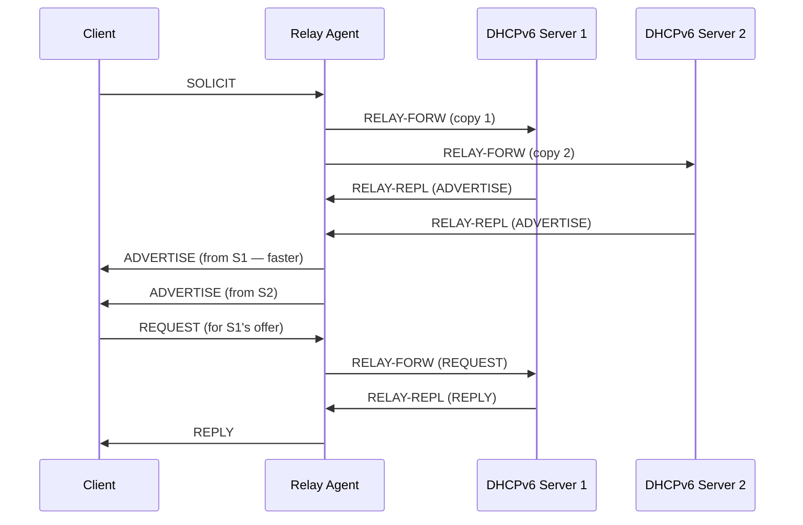

# How to Configure DHCPv6 Relay to Multiple Servers

Author: [nawazdhandala](https://www.github.com/nawazdhandala)

Tags: DHCPv6, Relay, Redundancy, High Availability, Failover, Networking

Description: Configure DHCPv6 relay agents to forward to multiple servers for redundancy and load distribution, with failover behavior on various platforms.

## DHCPv6 Multi-Server Relay Behavior

When a relay is configured with multiple servers, it copies each client message and sends it to all configured servers simultaneously. The client uses the first ADVERTISE received:



## Linux (dhcrelay) — Multiple Servers

```bash
# dhcrelay: specify multiple server addresses
dhcrelay -6 \
    -l eth0 \
    -u eth1 \
    2001:db8::dhcp1 \
    2001:db8::dhcp2

# ISC Kea relay (kea-dhcp-ddns proxy mode)
# kea-dhcp6.conf — server-side; relay is typically dhcrelay
```

## Cisco IOS — Multiple Servers

```
! Forward to two DHCPv6 servers
interface GigabitEthernet0/1
 ipv6 dhcp relay destination 2001:db8::dhcp1
 ipv6 dhcp relay destination 2001:db8::dhcp2
```

## Juniper — Server Groups with Redundancy

```
# Junos: server group with multiple servers
set forwarding-options dhcp-relay v6 server-group PRIMARY-SERVERS 2001:db8::dhcp1
set forwarding-options dhcp-relay v6 server-group PRIMARY-SERVERS 2001:db8::dhcp2

set forwarding-options dhcp-relay v6 group CLIENTS active-server-group PRIMARY-SERVERS

# Active/backup server group
set forwarding-options dhcp-relay v6 server-group BACKUP-SERVERS 2001:db8::dhcp3
set forwarding-options dhcp-relay v6 group CLIENTS backup-server-group BACKUP-SERVERS
```

## ISC Kea with HA (High Availability)

```json
// kea-dhcp6.conf — Primary server with HA
{
    "Dhcp6": {
        "hooks-libraries": [
            {
                "library": "/usr/lib/kea/hooks/libdhcp_ha.so",
                "parameters": {
                    "high-availability": [{
                        "this-server-name": "server1",
                        "mode": "hot-standby",
                        "peers": [
                            {
                                "name": "server1",
                                "url": "http://[2001:db8::dhcp1]:8000/",
                                "role": "primary"
                            },
                            {
                                "name": "server2",
                                "url": "http://[2001:db8::dhcp2]:8000/",
                                "role": "standby"
                            }
                        ]
                    }]
                }
            }
        ],
        "subnet6": [{
            "subnet": "2001:db8:1::/64",
            "pools": [{"pool": "2001:db8:1::100-2001:db8:1::200"}]
        }]
    }
}
```

## MikroTik — Multiple Relay Targets

```
# MikroTik does not support forwarding to multiple servers natively
# Workaround: use primary and backup with scripting

/ipv6 dhcp-relay
add name=primary-relay interface=ether2 dhcp-server=2001:db8::dhcp1 local-address=2001:db8:1::1

# Script to switch to backup on failure
/system scheduler
add name=dhcp-health-check interval=30s on-event={
    :if ([/ping address=2001:db8::dhcp1 count=3 as-value]->"packet-loss"=100) do={
        /ipv6 dhcp-relay set primary-relay dhcp-server=2001:db8::dhcp2
        :log warning "DHCPv6 primary server down, switched to backup"
    }
}
```

## Testing Multi-Server Relay Failover

```bash
#!/bin/bash
# Test DHCPv6 relay failover

PRIMARY="2001:db8::dhcp1"
BACKUP="2001:db8::dhcp2"

echo "=== DHCPv6 Multi-Server Relay Test ==="

# Check both servers reachable
for SERVER in ${PRIMARY} ${BACKUP}; do
    if ping6 -c 2 -W 2 ${SERVER} &>/dev/null; then
        echo "Server ${SERVER}: UP"
    else
        echo "Server ${SERVER}: DOWN"
    fi
done

# Simulate primary failure
echo "Simulating primary server failure..."
# ip6tables -A INPUT -s ${PRIMARY} -p udp --sport 547 -j DROP  # Block replies

# Test client gets address (should fall back to secondary)
dhclient -6 -v eth1 2>&1 | grep -E "bound|no DHCP"

# Restore
# ip6tables -D INPUT -s ${PRIMARY} -p udp --sport 547 -j DROP
```

## Conclusion

DHCPv6 relay agents forward client messages to all configured servers simultaneously. Clients use the first ADVERTISE response that arrives. For true high availability, use ISC Kea HA mode (hot-standby) which synchronizes lease databases between two servers. When both servers are healthy, the primary handles all requests; on failure, the standby takes over automatically. The relay itself doesn't need changes — it continues forwarding to both addresses.
