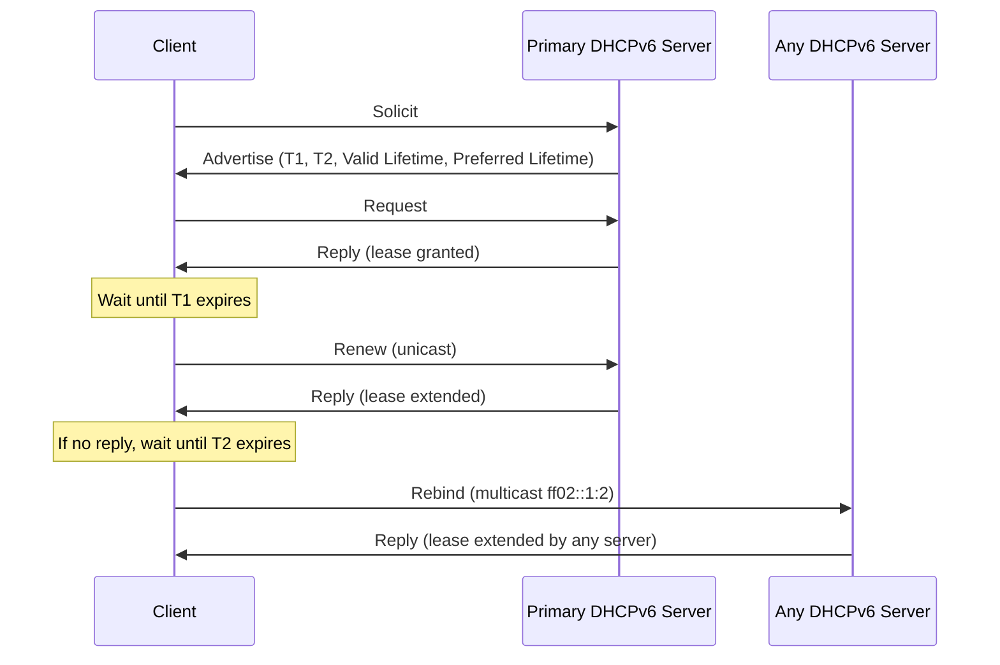

# How to Understand DHCPv6 Renew and Rebind Timers

Author: [nawazdhandala](https://www.github.com/nawazdhandala)

Tags: DHCPv6, IPv6, Networking, DHCP, Address Management

Description: A practical guide to understanding how DHCPv6 T1 and T2 timers control the address renewal and rebind lifecycle for IPv6 clients.

## Overview

DHCPv6 uses two timers — **T1 (Renew)** and **T2 (Rebind)** — to manage the lifecycle of leased addresses and prefixes. Understanding these timers is critical for maintaining stable IPv6 connectivity and avoiding address expiration.

## The DHCPv6 Lease Lifecycle

When a DHCPv6 client receives an address or prefix, the server includes timing information inside an **IA (Identity Association)**. The lifecycle follows this flow:



## Timer Definitions

| Timer | Default | Purpose |
|-------|---------|---------|
| **T1** | 0.5 × valid lifetime | Time after which client sends Renew to the original server via unicast |
| **T2** | 0.8 × valid lifetime | Time after which client sends Rebind to any server via multicast |
| **Preferred Lifetime** | — | After this, address becomes deprecated (still usable but new connections avoided) |
| **Valid Lifetime** | — | After this, address is fully expired and removed |

## Viewing Timer Values on Linux

The `ip` command shows the current state of DHCPv6-assigned addresses, including their lifetimes.

```bash
# Show IPv6 address details including preferred and valid lifetimes
ip -6 addr show dev eth0

# Example output:
# inet6 2001:db8::1/64 scope global dynamic
#    valid_lft 3600sec preferred_lft 1800sec
```

To inspect DHCPv6 lease files managed by `dhclient`:

```bash
# View the current DHCPv6 lease file
cat /var/lib/dhclient/dhclient6.leases

# Fields of interest:
# renew <date>;   -> When the client will send Renew
# rebind <date>;  -> When the client will send Rebind
# expire <date>;  -> When the lease fully expires
```

## Configuring T1 and T2 on ISC DHCP Server

On the server side, you can explicitly set T1 and T2 per subnet or globally:

```bash
# /etc/dhcp/dhcpd6.conf

# Global defaults
default-lease-time 3600;       # Valid lifetime = 3600s
preferred-lifetime 2700;       # Preferred lifetime = 2700s

subnet6 2001:db8::/32 {
    range6 2001:db8::100 2001:db8::200;

    # T1: client renews at 1800s (50% of valid lifetime)
    # T2: client rebinds at 2880s (80% of valid lifetime)
    option dhcp-renewal-time 1800;
    option dhcp-rebinding-time 2880;
}
```

## What Happens When T2 Expires Without Reply

If neither the original server nor any other server responds before the valid lifetime expires, the client must stop using the address. It will then start a new SARR (Solicit-Advertise-Request-Reply) exchange to obtain fresh addresses.

## Best Practices

- **Set T1 to 50% of valid lifetime** — This is the RFC 8415 recommendation and provides ample time for renewal before expiry.
- **Set T2 to 80% of valid lifetime** — Gives the client a window to try any available server before the lease expires.
- **Keep valid lifetime longer than preferred lifetime** — This allows for graceful deprecation without abrupt disconnection.
- **Monitor renewal failures** — If clients are consistently hitting T2 before renewing, your primary DHCPv6 server may be unreachable or overloaded.

## Summary

DHCPv6 T1 and T2 timers provide a two-stage safety net for lease renewal. T1 initiates a unicast renewal with the original server, and T2 triggers a multicast rebind to any available server. Proper timer configuration ensures address stability and smooth failover behavior in production IPv6 networks.
