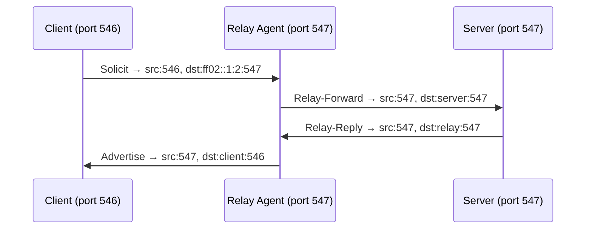

# How to Understand DHCPv6 UDP Ports (546 and 547)

Author: [nawazdhandala](https://www.github.com/nawazdhandala)

Tags: DHCPv6, IPv6, UDP, Networking, Ports

Description: Understand the roles of UDP ports 546 and 547 in DHCPv6 communication between clients, relay agents, and servers.

## Overview

DHCPv6 uses two specific UDP ports for communication - port **547** for servers and relay agents, and port **546** for clients. This is different from DHCPv4 which uses ports 67 and 68.

## Port Assignments

| Port | Role | Direction |
|------|------|-----------|
| **UDP 546** | DHCPv6 Client | Receives messages from servers and relay agents |
| **UDP 547** | DHCPv6 Server / Relay Agent | Receives messages from clients and other relay agents |

## Communication Flow



In a direct (no relay) exchange, the client sends from port **546** to port **547** on the multicast group, and the server responds from port **547** back to the client's port **546**.

## Verifying Port Usage

```bash
# Check if a DHCPv6 server is listening on port 547

ss -ulnp | grep 547

# Example output:
# UNCONN  0  0  :::547  :::*  users:(("kea-dhcp6",pid=1234,fd=7))

# Check if a DHCPv6 client is listening on port 546
ss -ulnp | grep 546
# UNCONN  0  0  :::546  :::*  users:(("dhclient",pid=5678,fd=5))
```

## Firewall Rules for DHCPv6

Firewall rules must explicitly allow DHCPv6 traffic on these ports. Forgetting this is a very common reason DHCPv6 fails silently.

```bash
# ip6tables: Allow outgoing DHCPv6 client messages (to server port 547)
ip6tables -A OUTPUT -p udp --sport 546 --dport 547 -j ACCEPT

# ip6tables: Allow incoming DHCPv6 server replies (from server port 547)
ip6tables -A INPUT -p udp --sport 547 --dport 546 -j ACCEPT

# ip6tables: Allow DHCPv6 server to receive client messages
ip6tables -A INPUT -p udp --sport 546 --dport 547 -j ACCEPT

# ip6tables: Allow DHCPv6 server to send replies
ip6tables -A OUTPUT -p udp --sport 547 --dport 546 -j ACCEPT
```

## nftables Equivalent

```bash
# nftables ruleset allowing DHCPv6 client and server traffic
table ip6 dhcpv6_rules {
    chain input {
        type filter hook input priority 0;
        # Allow incoming replies to DHCPv6 client
        udp sport 547 udp dport 546 accept
        # Allow incoming requests to DHCPv6 server
        udp sport 546 udp dport 547 accept
    }
    chain output {
        type filter hook output priority 0;
        # Allow outgoing DHCPv6 client requests
        udp sport 546 udp dport 547 accept
        # Allow outgoing DHCPv6 server replies
        udp sport 547 udp dport 546 accept
    }
}
```

## Difference from DHCPv4

| Feature | DHCPv4 | DHCPv6 |
|---------|--------|--------|
| Server port | 67 | 547 |
| Client port | 68 | 546 |
| Transport | UDP/IPv4 | UDP/IPv6 |
| Broadcast | Yes (255.255.255.255) | No - uses multicast (ff02::1:2) |

## Troubleshooting Port Issues

```bash
# Test if the DHCPv6 server port is reachable from a relay agent
# (using nc with IPv6 support)
nc -6 -u -z 2001:db8::1 547
echo $?
# 0 = port reachable, non-zero = blocked

# Use tcpdump to confirm traffic is arriving on port 547
sudo tcpdump -i eth0 -n "udp port 547"
```

## Summary

DHCPv6 client-server communication is strictly partitioned: clients listen on port **546** and servers listen on port **547**. Proper firewall rules must allow traffic in both directions on these ports. Relay agents use port 547 for both receiving from clients and forwarding to servers.
