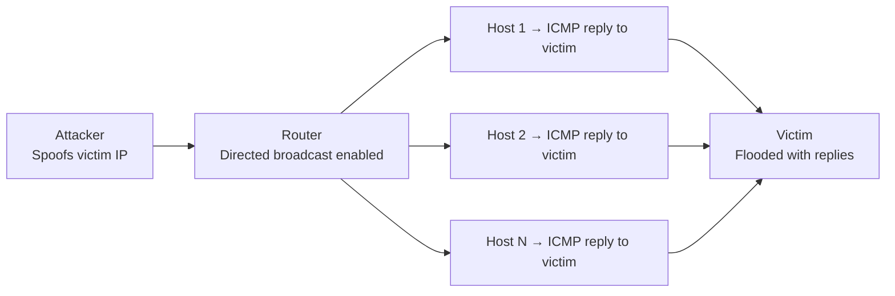

# How to Disable IP Directed Broadcast on Cisco Routers

Author: [nawazdhandala](https://www.github.com/nawazdhandala)

Tags: Networking, Cisco, Broadcast, Security, IPv4, Smurf Attack

Description: Disable IP directed broadcast on Cisco router interfaces to prevent Smurf amplification attacks and eliminate unnecessary broadcast forwarding across subnets.

## Introduction

IP directed broadcast allows a router to forward broadcast packets destined for a remote subnet's broadcast address. While occasionally useful for Wake-on-LAN, it is primarily a security liability used in **Smurf DDoS attacks**. Cisco disabled it by default starting with IOS 12.0, but older devices or intentional re-enables may leave this vulnerability open.

## What Is a Smurf Attack?

An attacker sends ICMP echo requests to a directed broadcast address with a spoofed source IP (the victim's address). Every host on the target subnet replies to the victim, creating a bandwidth amplification attack.



## Checking Current Configuration

```
! Check whether directed broadcast is enabled on an interface
show running-config interface GigabitEthernet0/1 | include directed-broadcast
```

If the command returns no output, directed broadcast is **disabled** (default since IOS 12.0). If you see `ip directed-broadcast`, it is enabled.

## Disabling Directed Broadcast on an Interface

```
! Disable directed broadcast on each interface
interface GigabitEthernet0/0
 no ip directed-broadcast

interface GigabitEthernet0/1
 no ip directed-broadcast

interface GigabitEthernet0/2
 no ip directed-broadcast
```

## Applying Globally with a Script

For large deployments, apply to all interfaces using a TCL script or EEM applet:

```
! IOS TCL script to disable directed broadcast on all interfaces
tclsh
foreach iface [exec "show interfaces | include ^[A-Z]"] {
    ios_config "interface $iface" "no ip directed-broadcast"
}
```

## Verifying the Change

```
! Confirm no interfaces have directed broadcast enabled
show running-config | include directed-broadcast
```

If the output is empty, no interfaces are exposing this vulnerability.

## When Directed Broadcast Is Intentionally Needed

The most legitimate use case is **Wake-on-LAN** across subnets. If you need it, enable it only on the specific interface facing the target subnet, and consider an ACL to limit which source addresses can send directed broadcasts:

```
! Create an ACL allowing WoL broadcasts only from management VLAN
ip access-list extended DIRECTED-BCAST-ACL
 permit udp 10.0.0.0 0.0.0.255 255.255.255.255 0.0.0.0 eq 9
 deny   ip any any

! Apply to specific interface — enable directed broadcast with ACL filter
interface GigabitEthernet0/2
 ip directed-broadcast DIRECTED-BCAST-ACL
```

## Additional Hardening: Block Smurf at the Border

Even with directed broadcasts disabled internally, block ICMP echo to broadcast addresses at the perimeter:

```
! Block ICMP echo requests to broadcast at the upstream interface
ip access-list extended ANTI-SMURF
 deny   icmp any 192.168.0.0 0.0.255.255 echo
 permit ip any any

interface GigabitEthernet0/0
 ip access-group ANTI-SMURF in
```

## Conclusion

`no ip directed-broadcast` is a one-line hardening step that should be applied to every router interface. Modern Cisco IOS does this by default, but verify older devices and any interfaces that were explicitly configured. Combine with an anti-smurf ACL at border interfaces for defense in depth.
