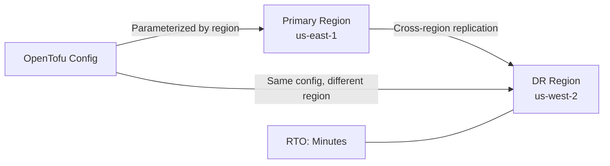

# How to Use OpenTofu for Disaster Recovery Automation

Author: [nawazdhandala](https://www.github.com/nawazdhandala)

Tags: OpenTofu, Disaster Recovery, RTO, RPO, AWS, Multi-Region, Infrastructure as Code

Description: Learn how to use OpenTofu to automate disaster recovery by defining infrastructure as code that can rapidly rebuild production environments in secondary regions.

---

Disaster recovery (DR) is about recreating your infrastructure after a catastrophic failure. OpenTofu's declarative approach means your entire production environment is captured as code - enabling you to rebuild in a secondary region in minutes rather than days.

## DR Architecture Patterns



## Multi-Region Configuration

```hcl
# main.tf

terraform {
  required_providers {
    aws = {
      source  = "hashicorp/aws"
      version = "~> 5.30"
    }
  }
}

# Primary region provider
provider "aws" {
  alias  = "primary"
  region = var.primary_region
}

# DR region provider
provider "aws" {
  alias  = "dr"
  region = var.dr_region
}

variable "primary_region" {
  type    = string
  default = "us-east-1"
}

variable "dr_region" {
  type    = string
  default = "us-west-2"
}

variable "deploy_to_dr" {
  type        = bool
  description = "Set to true to activate DR environment"
  default     = false
}
```

## Database Cross-Region Replication

```hcl
# database_dr.tf
# Primary RDS instance
resource "aws_db_instance" "primary" {
  provider = aws.primary

  identifier        = "app-primary-db"
  engine            = "postgres"
  engine_version    = "15.4"
  instance_class    = "db.r5.large"
  allocated_storage = 100
  db_name           = "appdb"
  username          = var.db_username
  password          = var.db_password
  multi_az          = true

  # Enable automated backups for cross-region replication
  backup_retention_period = 7
  backup_window           = "03:00-04:00"
}

# Cross-region read replica in the DR region
resource "aws_db_instance" "dr_replica" {
  provider = aws.dr

  identifier          = "app-dr-replica"
  replicate_source_db = aws_db_instance.primary.arn

  # DR replica runs on smaller instance to save cost
  instance_class = "db.t3.large"

  # During failover, this will be promoted to a standalone instance
  skip_final_snapshot = false

  lifecycle {
    # Prevent accidental deletion of the DR replica
    prevent_destroy = true
  }
}
```

## S3 Cross-Region Replication

```hcl
# s3_dr.tf
resource "aws_s3_bucket" "primary" {
  provider = aws.primary
  bucket   = "${var.project_name}-data-primary"
}

resource "aws_s3_bucket_versioning" "primary" {
  provider = aws.primary
  bucket   = aws_s3_bucket.primary.id
  versioning_configuration {
    status = "Enabled"  # Required for cross-region replication
  }
}

resource "aws_s3_bucket" "dr" {
  provider = aws.dr
  bucket   = "${var.project_name}-data-dr"
}

resource "aws_s3_bucket_versioning" "dr" {
  provider = aws.dr
  bucket   = aws_s3_bucket.dr.id
  versioning_configuration {
    status = "Enabled"
  }
}

# Replication configuration
resource "aws_s3_bucket_replication_configuration" "primary_to_dr" {
  provider = aws.primary
  role     = aws_iam_role.s3_replication.arn
  bucket   = aws_s3_bucket.primary.id

  rule {
    id     = "replicate-all"
    status = "Enabled"

    destination {
      bucket = aws_s3_bucket.dr.arn
    }
  }
}
```

## Activating the DR Environment

```hcl
# dr_activation.tf
# DR compute - only active when deploy_to_dr = true
resource "aws_ecs_service" "app_dr" {
  provider = aws.dr
  count    = var.deploy_to_dr ? 1 : 0

  name            = "app-dr"
  cluster         = aws_ecs_cluster.dr[0].arn
  task_definition = aws_ecs_task_definition.app_dr[0].arn
  desired_count   = var.desired_count
}

# DNS failover - Route53 health check based routing
resource "aws_route53_health_check" "primary" {
  fqdn              = var.primary_endpoint
  port              = 443
  type              = "HTTPS"
  resource_path     = "/health"
  failure_threshold = 3
  request_interval  = 30
}

resource "aws_route53_record" "primary" {
  zone_id = var.hosted_zone_id
  name    = var.domain_name
  type    = "A"

  alias {
    name                   = aws_lb.primary.dns_name
    zone_id                = aws_lb.primary.zone_id
    evaluate_target_health = true
  }

  set_identifier = "primary"

  failover_routing_policy {
    type = "PRIMARY"
  }

  health_check_id = aws_route53_health_check.primary.id
}

resource "aws_route53_record" "dr" {
  provider = aws.dr
  zone_id  = var.hosted_zone_id
  name     = var.domain_name
  type     = "A"

  alias {
    name                   = aws_lb.dr[0].dns_name
    zone_id                = aws_lb.dr[0].zone_id
    evaluate_target_health = true
  }

  set_identifier = "dr"

  failover_routing_policy {
    type = "SECONDARY"
  }
}
```

## Best Practices

- Define your Recovery Time Objective (RTO) and Recovery Point Objective (RPO) before designing the DR strategy - they determine which components need replication.
- Test DR activation quarterly with a real failover drill - untested DR plans fail when needed most.
- Use Route53 health check-based failover for automatic DNS-level failover without manual intervention.
- Keep DR infrastructure warm (replicas running) for critical systems to meet aggressive RTOs.
- Document the exact steps to fail over and fail back, including database promotion commands and DNS verification.
