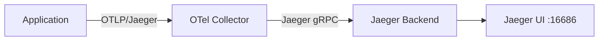

# How to Set Up Distributed Tracing with Jaeger via Portainer

Author: [nawazdhandala](https://www.github.com/nawazdhandala)

Tags: Jaeger, Distributed Tracing, Portainer, OpenTelemetry, Observability, Docker

Description: Deploy Jaeger all-in-one for distributed tracing using a Portainer stack, then connect your instrumented services to collect and visualize trace data.

---

Distributed tracing helps you understand request flows across microservices. Jaeger is an open-source tracing system originally developed at Uber and now a CNCF graduated project. This guide shows how to run Jaeger via Portainer and start collecting traces from your services.

## Architecture Overview



## Prerequisites

- Portainer with a connected Docker environment
- Applications instrumented with OpenTelemetry or Jaeger client libraries

## Step 1: Deploy Jaeger via Portainer Stack

Navigate to **Stacks > Add Stack** in Portainer. Use the following Compose definition for a development/staging setup using Jaeger all-in-one:

```yaml
# Jaeger all-in-one stack — suitable for dev and small production setups
# For large-scale production, use separate collector/query/ingester components
version: "3.8"

services:
  jaeger:
    image: jaegertracing/all-in-one:1.55
    environment:
      # Use memory storage for dev; switch to Cassandra/Elasticsearch for production
      - COLLECTOR_OTLP_ENABLED=true
      - SPAN_STORAGE_TYPE=memory
    ports:
      - "6831:6831/udp"   # Jaeger compact thrift (UDP)
      - "6832:6832/udp"   # Jaeger binary thrift (UDP)
      - "5778:5778"        # Agent config server
      - "16686:16686"      # Jaeger UI
      - "4317:4317"        # OTLP gRPC
      - "4318:4318"        # OTLP HTTP
      - "14250:14250"      # gRPC for collector
      - "14268:14268"      # HTTP for collector
      - "9411:9411"        # Zipkin-compatible endpoint
    restart: unless-stopped
    networks:
      - tracing

networks:
  tracing:
    driver: bridge
```

## Step 2: Configure Your Application

Set the following environment variables in your application containers (add them via Portainer's environment variable editor):

```bash
# OTLP HTTP exporter — simplest option for most languages
OTEL_EXPORTER_OTLP_ENDPOINT=http://jaeger:4318
OTEL_SERVICE_NAME=order-service
OTEL_TRACES_EXPORTER=otlp
```

For a Node.js application using the OTel SDK:

```javascript
// tracing.js — initialize before importing your app code
const { NodeSDK } = require("@opentelemetry/sdk-node");
const { OTLPTraceExporter } = require("@opentelemetry/exporter-trace-otlp-http");
const { getNodeAutoInstrumentations } = require("@opentelemetry/auto-instrumentations-node");

const sdk = new NodeSDK({
  // Exporter sends spans to Jaeger via OTLP HTTP
  traceExporter: new OTLPTraceExporter({
    url: process.env.OTEL_EXPORTER_OTLP_ENDPOINT + "/v1/traces",
  }),
  instrumentations: [getNodeAutoInstrumentations()],
});

sdk.start();
```

## Step 3: View Traces in the Jaeger UI

Open `http://<your-host>:16686` in your browser. You will see:

1. **Search** — find traces by service, operation, tags, and duration
2. **Trace Timeline** — visualize span hierarchy and timing
3. **Dependency Graph** — see how services call each other

## Step 4: Production Storage Backend

For production, replace in-memory storage with Elasticsearch:

```yaml
# Production Jaeger with Elasticsearch backend
services:
  jaeger-collector:
    image: jaegertracing/jaeger-collector:1.55
    environment:
      - SPAN_STORAGE_TYPE=elasticsearch
      - ES_SERVER_URLS=http://elasticsearch:9200
    depends_on:
      - elasticsearch

  elasticsearch:
    image: elasticsearch:8.12.0
    environment:
      - discovery.type=single-node
      - xpack.security.enabled=false
    volumes:
      - jaeger-es-data:/usr/share/elasticsearch/data

volumes:
  jaeger-es-data:
```

## Monitoring Jaeger Health

Jaeger exposes health and metrics endpoints. Monitor them from Portainer or add them to your existing Prometheus scrape config:

```
GET http://jaeger:14269/metrics   # Prometheus metrics
GET http://jaeger:14269/          # Health check
```

## Summary

Portainer makes it straightforward to run Jaeger alongside your application stacks. Once deployed, any service exporting OTLP traces will have its spans collected and available for analysis in the Jaeger UI.
