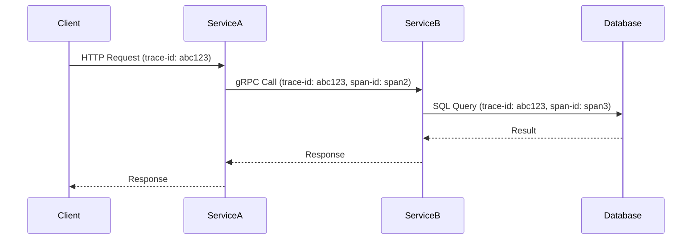

# How to Configure Distributed Tracing in Rancher

Author: [nawazdhandala](https://www.github.com/nawazdhandala)

Tags: Rancher, Distributed Tracing, OpenTelemetry, Jaeger, Kubernetes, Microservice

Description: Configure end-to-end distributed tracing in Rancher by instrumenting applications with OpenTelemetry, deploying collection infrastructure, and visualizing traces.

## Introduction

Distributed tracing tracks requests as they flow through multiple services, providing visibility into latency, errors, and dependencies. This guide covers instrumenting applications, configuring trace collection, and setting up visualization in a Rancher-managed Kubernetes cluster.

## How Distributed Tracing Works



## Step 1: Deploy the Tracing Backend

Use Jaeger or Tempo. For new deployments, Tempo is recommended:

```bash
helm repo add grafana https://grafana.github.io/helm-charts
helm install tempo grafana/tempo \
  --namespace observability \
  --set tempo.storage.trace.backend=local
```

## Step 2: Deploy OpenTelemetry Collector

The collector acts as the central aggregation point for all traces:

```bash
helm repo add open-telemetry https://open-telemetry.github.io/opentelemetry-helm-charts

cat > otel-values.yaml << 'EOF'
mode: deployment
replicaCount: 2
config:
  receivers:
    otlp:
      protocols:
        grpc:
          endpoint: 0.0.0.0:4317
        http:
          endpoint: 0.0.0.0:4318
  exporters:
    otlp/tempo:
      endpoint: tempo.observability.svc.cluster.local:4317
      tls:
        insecure: true
  service:
    pipelines:
      traces:
        receivers: [otlp]
        exporters: [otlp/tempo]
EOF

helm install otel-collector open-telemetry/opentelemetry-collector \
  --namespace observability \
  --values otel-values.yaml
```

## Step 3: Instrument a Node.js Application

```javascript
// tracing.js - Initialize before any other imports
const { NodeSDK } = require('@opentelemetry/sdk-node');
const { OTLPTraceExporter } = require('@opentelemetry/exporter-trace-otlp-grpc');
const { getNodeAutoInstrumentations } = require('@opentelemetry/auto-instrumentations-node');

const sdk = new NodeSDK({
  traceExporter: new OTLPTraceExporter({
    url: process.env.OTEL_EXPORTER_OTLP_ENDPOINT || 'http://otel-collector:4317',
  }),
  // Auto-instrument HTTP, Express, gRPC, database clients
  instrumentations: [getNodeAutoInstrumentations()],
});

sdk.start();
```

## Step 4: Instrument a Python Application

```python
# tracing.py

from opentelemetry import trace
from opentelemetry.sdk.trace import TracerProvider
from opentelemetry.sdk.trace.export import BatchSpanProcessor
from opentelemetry.exporter.otlp.proto.grpc.trace_exporter import OTLPSpanExporter
from opentelemetry.instrumentation.fastapi import FastAPIInstrumentor
from opentelemetry.instrumentation.sqlalchemy import SQLAlchemyInstrumentor

# Configure the exporter
exporter = OTLPSpanExporter(
    endpoint="http://otel-collector.observability.svc.cluster.local:4317",
    insecure=True
)

provider = TracerProvider()
provider.add_span_processor(BatchSpanProcessor(exporter))
trace.set_tracer_provider(provider)

# Auto-instrument FastAPI and SQLAlchemy
FastAPIInstrumentor.instrument()
SQLAlchemyInstrumentor().instrument()
```

## Step 5: Set Pod Environment Variables

```yaml
# Deployment spec
env:
  - name: OTEL_SERVICE_NAME
    value: "order-service"
  - name: OTEL_EXPORTER_OTLP_ENDPOINT
    value: "http://otel-collector.observability.svc.cluster.local:4317"
  - name: OTEL_TRACES_SAMPLER
    value: "parentbased_traceidratio"
  - name: OTEL_TRACES_SAMPLER_ARG
    value: "0.1"    # Sample 10% of traces in production
```

## Conclusion

Distributed tracing in Rancher requires three components working together: application instrumentation (OpenTelemetry SDKs), collection infrastructure (OTel Collector), and storage/visualization (Tempo + Grafana). Auto-instrumentation libraries reduce the code changes needed while still providing rich trace data.
