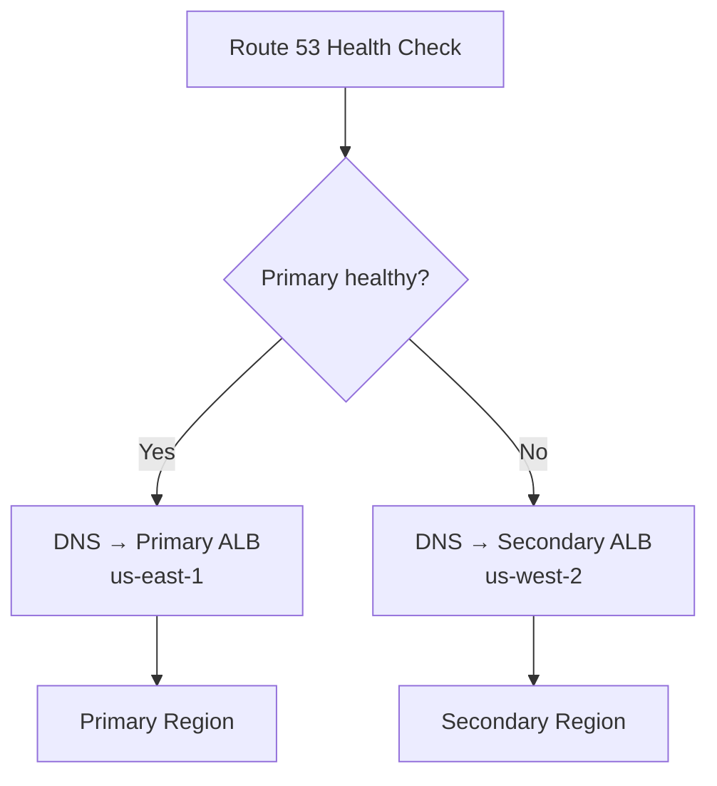

# How to Set Up DNS Failover with OpenTofu

Author: [nawazdhandala](https://www.github.com/nawazdhandala)

Tags: OpenTofu, DNS, Failover, Route53, High Availability, Health Checks, Infrastructure as Code

Description: Learn how to implement DNS-based failover using Route 53 health checks and failover routing policies with OpenTofu for automatic traffic routing to a secondary region when primary fails.

---

DNS failover routes traffic to a secondary endpoint when the primary becomes unhealthy. Route 53 health checks monitor the primary endpoint and automatically update DNS to point to the secondary within the TTL window.

## DNS Failover Architecture



## Active-Passive Failover

```hcl
# failover.tf

# Health check on primary endpoint
resource "aws_route53_health_check" "primary" {
  fqdn              = "primary.${var.domain_name}"
  port              = 443
  type              = "HTTPS"
  resource_path     = "/health"
  failure_threshold = 3
  request_interval  = 30

  tags = {
    Name = "primary-health-check"
  }
}

# Primary failover record
resource "aws_route53_record" "primary" {
  zone_id        = aws_route53_zone.main.zone_id
  name           = "api.${var.domain_name}"
  type           = "A"
  set_identifier = "primary"

  failover_routing_policy {
    type = "PRIMARY"
  }

  health_check_id = aws_route53_health_check.primary.id

  alias {
    name                   = aws_lb.primary.dns_name
    zone_id                = aws_lb.primary.zone_id
    evaluate_target_health = true
  }
}

# Secondary failover record — no health check needed
resource "aws_route53_record" "secondary" {
  provider = aws.secondary_region

  zone_id        = aws_route53_zone.main.zone_id
  name           = "api.${var.domain_name}"
  type           = "A"
  set_identifier = "secondary"

  failover_routing_policy {
    type = "SECONDARY"
  }

  alias {
    name                   = aws_lb.secondary.dns_name
    zone_id                = aws_lb.secondary.zone_id
    evaluate_target_health = true
  }
}
```

## Multi-Region Active-Active with Latency Routing

```hcl
# Latency-based routing sends users to the closest region
resource "aws_route53_record" "us_east" {
  zone_id        = aws_route53_zone.main.zone_id
  name           = "api.${var.domain_name}"
  type           = "A"
  set_identifier = "us-east-1"

  latency_routing_policy {
    region = "us-east-1"
  }

  health_check_id = aws_route53_health_check.us_east.id

  alias {
    name                   = aws_lb.us_east.dns_name
    zone_id                = aws_lb.us_east.zone_id
    evaluate_target_health = true
  }
}

resource "aws_route53_record" "eu_west" {
  zone_id        = aws_route53_zone.main.zone_id
  name           = "api.${var.domain_name}"
  type           = "A"
  set_identifier = "eu-west-1"

  latency_routing_policy {
    region = "eu-west-1"
  }

  health_check_id = aws_route53_health_check.eu_west.id

  alias {
    name                   = aws_lb.eu_west.dns_name
    zone_id                = aws_lb.eu_west.zone_id
    evaluate_target_health = true
  }
}
```

## Failover Alarm

```hcl
# Alert when failover occurs
resource "aws_cloudwatch_metric_alarm" "failover_triggered" {
  alarm_name          = "dns-failover-triggered"
  comparison_operator = "LessThanThreshold"
  evaluation_periods  = 1
  metric_name         = "HealthCheckStatus"
  namespace           = "AWS/Route53"
  period              = 60
  statistic           = "Minimum"
  threshold           = 1

  dimensions = {
    HealthCheckId = aws_route53_health_check.primary.id
  }

  alarm_description = "Primary endpoint is unhealthy — DNS failover active"
  alarm_actions     = [aws_sns_topic.incidents.arn]
}
```

## Best Practices

- Set health check `failure_threshold = 3` and `request_interval = 30` — this gives a 90-second failover window, balancing speed and false positives.
- Use `evaluate_target_health = true` on alias records — Route 53 won't return an unhealthy target group.
- Set DNS TTL to 60 seconds for failover records — lower TTL means faster client-side failover.
- Configure CloudWatch alarms on health check status — you want to know when failover activates.
- Test failover regularly by temporarily blocking the health check endpoint — don't wait for a real outage to discover issues.
