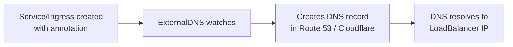

# How to Create DNS Records for Kubernetes Services with OpenTofu

Author: [nawazdhandala](https://www.github.com/nawazdhandala)

Tags: OpenTofu, Kubernetes, DNS, Route53, External-DNS, ExternalDNS, Infrastructure as Code

Description: Learn how to automatically create DNS records for Kubernetes services using ExternalDNS deployed with OpenTofu, enabling Kubernetes to manage its own DNS entries in Route 53, Azure DNS, or Cloudflare.

---

ExternalDNS is a Kubernetes add-on that automatically creates DNS records when services or Ingress resources are created. Deploying ExternalDNS with OpenTofu and the right IAM permissions means Kubernetes manages its own DNS entries.

## ExternalDNS Architecture



## IAM Role for ExternalDNS on EKS

```hcl
# externaldns_iam.tf

resource "aws_iam_policy" "externaldns" {
  name = "${var.cluster_name}-externaldns"

  policy = jsonencode({
    Version = "2012-10-17"
    Statement = [
      {
        Effect   = "Allow"
        Action   = ["route53:ChangeResourceRecordSets"]
        Resource = "arn:aws:route53:::hostedzone/*"
      },
      {
        Effect   = "Allow"
        Action   = ["route53:ListHostedZones", "route53:ListResourceRecordSets", "route53:ListTagsForResource"]
        Resource = "*"
      }
    ]
  })
}

resource "aws_iam_role" "externaldns" {
  name = "${var.cluster_name}-externaldns"

  assume_role_policy = jsonencode({
    Version = "2012-10-17"
    Statement = [{
      Effect = "Allow"
      Principal = {
        Federated = var.oidc_provider_arn
      }
      Action = "sts:AssumeRoleWithWebIdentity"
      Condition = {
        StringEquals = {
          "${var.oidc_provider_url}:sub" = "system:serviceaccount:kube-system:external-dns"
          "${var.oidc_provider_url}:aud" = "sts.amazonaws.com"
        }
      }
    }]
  })
}

resource "aws_iam_role_policy_attachment" "externaldns" {
  role       = aws_iam_role.externaldns.name
  policy_arn = aws_iam_policy.externaldns.arn
}
```

## ExternalDNS Helm Deployment

```hcl
# externaldns.tf
resource "helm_release" "external_dns" {
  name       = "external-dns"
  repository = "https://kubernetes-sigs.github.io/external-dns/"
  chart      = "external-dns"
  version    = "1.14.3"
  namespace  = "kube-system"

  values = [
    yamlencode({
      provider = "aws"

      aws = {
        region       = var.aws_region
        zoneType     = "public"  # or "private"
        preferCNAME  = false
      }

      # Only manage records for specified domain
      domainFilters = [var.domain_name]

      # Use this annotation on services/ingresses to trigger DNS creation
      annotationFilter = "external-dns.alpha.kubernetes.io/hostname"

      # Sync interval
      interval = "1m"

      # Use UPSERT to allow other tools to also manage DNS
      policy = "upsert-only"

      # TXT records to identify ownership
      txtOwnerId = var.cluster_name

      serviceAccount = {
        annotations = {
          "eks.amazonaws.com/role-arn" = aws_iam_role.externaldns.arn
        }
      }

      resources = {
        requests = { cpu = "25m", memory = "32Mi" }
        limits   = { cpu = "100m", memory = "128Mi" }
      }
    })
  ]
}
```

## Service with DNS Annotation

```hcl
# Example: Kubernetes service that auto-creates DNS
resource "kubernetes_service" "api" {
  metadata {
    name      = "api"
    namespace = "apps"
    annotations = {
      "external-dns.alpha.kubernetes.io/hostname" = "api.${var.domain_name}"
      "external-dns.alpha.kubernetes.io/ttl"      = "60"
    }
  }

  spec {
    type = "LoadBalancer"
    selector = { app = "api" }

    port {
      port        = 443
      target_port = 8080
    }
  }
}

# Ingress with DNS annotation
resource "kubernetes_ingress_v1" "app" {
  metadata {
    name      = "app"
    namespace = "apps"
    annotations = {
      "external-dns.alpha.kubernetes.io/hostname" = "app.${var.domain_name}"
      "kubernetes.io/ingress.class"               = "nginx"
    }
  }
  # ...
}
```

## Best Practices

- Use `policy = "upsert-only"` to prevent ExternalDNS from deleting records it didn't create - `sync` mode can delete manually-managed records.
- Set `txtOwnerId` to the cluster name - ExternalDNS uses TXT records to track ownership, preventing multi-cluster conflicts.
- Use `domainFilters` to restrict ExternalDNS to specific zones - without this, it will try to manage all Route 53 zones in your account.
- Set appropriate TTLs via annotation (`external-dns.alpha.kubernetes.io/ttl`) - lower TTLs for frequently-changing services, higher for stable ones.
- Grant ExternalDNS IRSA permissions scoped to specific hosted zones in production rather than `arn:aws:route53:::hostedzone/*`.
