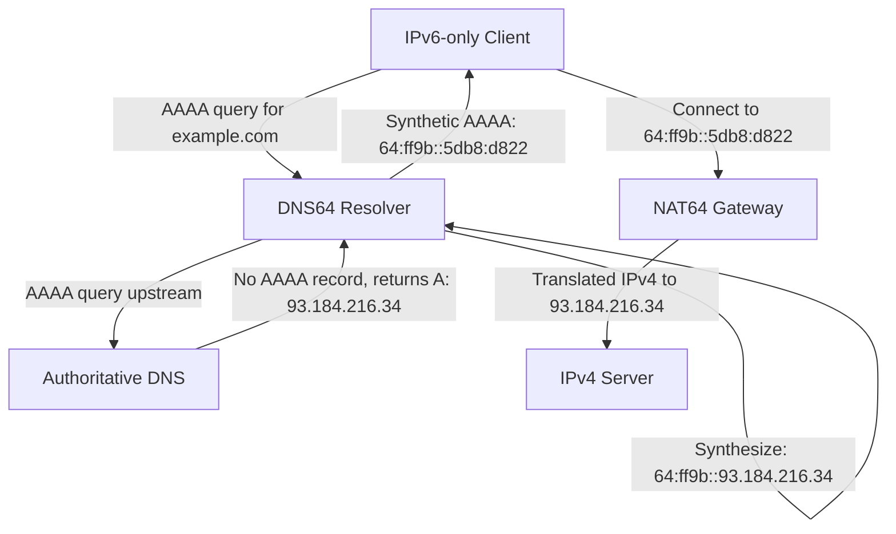

# How to Understand DNS64 and How It Synthesizes AAAA Records

Author: [nawazdhandala](https://www.github.com/nawazdhandala)

Tags: IPv6, DNS64, AAAA Records, NAT64, DNS

Description: A detailed explanation of how DNS64 works to synthesize IPv6 AAAA records for IPv4-only destinations, enabling IPv6-only clients to connect through NAT64 gateways.

## The Problem DNS64 Solves

When you have an IPv6-only client that needs to connect to an IPv4-only server (like `example.com` which only has an A record), the client cannot make a TCP or UDP connection because it has no IPv4 address. NAT64 can translate the traffic, but the client first needs an IPv6 address to connect to. This is where DNS64 comes in.

DNS64 is a DNS server behavior defined in RFC 6147 that automatically synthesizes AAAA records for IPv4-only domains by embedding their IPv4 addresses into a NAT64 prefix.

## How DNS64 Synthesis Works



## The Synthesis Algorithm

Given:
- NAT64 prefix: `64:ff9b::/96`
- IPv4 address from A record: `93.184.216.34`

The synthesized AAAA is constructed by:
1. Taking the 96-bit NAT64 prefix: `64:ff9b:0000:0000:0000:0000`
2. Appending the 32-bit IPv4 address in hex: `5db8:d822` (93=0x5d, 184=0xb8, 216=0xd8, 34=0x22)
3. Result: `64:ff9b::5db8:d822`

## When Does DNS64 Synthesize?

DNS64 only synthesizes a AAAA record when ALL of the following are true:

1. The client requested a AAAA record (query type AAAA)
2. The domain has **no** real AAAA record (no native IPv6)
3. The domain **does** have at least one A record

If a real AAAA record exists, DNS64 returns it unchanged - it does **not** override native IPv6 records.

## When Does DNS64 NOT Synthesize?

- Domains with real AAAA records: DNS64 returns the native records as-is
- DNSSEC-validated responses: DNS64 cannot synthesize without breaking DNSSEC signatures (see RFC 6147 section 5.5)
- Queries for `PTR` records: reverse DNS synthesis is not performed
- Special-use addresses (RFC 5735): `127.0.0.0/8`, `10.0.0.0/8`, etc. are excluded by default

## Example: Comparing Normal vs DNS64 Resolution

Normal DNS resolution (IPv4-capable client):
```text
; Query: AAAA example.com
;; ANSWER SECTION:
; (empty - no AAAA record)

; Query: A example.com
;; ANSWER SECTION:
example.com. 3600 IN A 93.184.216.34
```

DNS64 resolution (IPv6-only client using DNS64 server):
```text
; Query: AAAA example.com → DNS64 synthesizes
;; ANSWER SECTION:
example.com. 60 IN AAAA 64:ff9b::5db8:d822
```

Note: DNS64 typically uses a short TTL (60 seconds) for synthetic records to prevent stale entries from causing issues when native AAAA records are later added.

## Custom Prefix Support

DNS64 supports custom NAT64 prefixes, not just the well-known `64:ff9b::/96`. Your DNS64 server must be configured with the same prefix as your NAT64 gateway. The synthesis algorithm adapts based on prefix length:

- `/96` prefix: IPv4 address occupies bits 96–127
- `/64` prefix: bits 64–71 are zero (reserved), IPv4 is at bits 72–103
- `/48`, `/40`, `/32` prefixes: similar bit-shifting applies (RFC 6052)

## DNS64 and DNSSEC Compatibility

DNS64 breaks DNSSEC validation for synthesized records because the synthetic AAAA record was not signed by the authoritative server. The recommended approach:

- DNSSEC validation happens **upstream** of the DNS64 resolver
- The DNS64 resolver itself does not validate; it trusts upstream responses
- Clients should not perform local DNSSEC validation when using DNS64

## Summary

DNS64 is the DNS companion to NAT64. It intercepts AAAA queries, checks for native IPv6, and synthesizes AAAA records from A records using the NAT64 prefix when no native IPv6 exists. This gives IPv6-only clients an IPv6 address to connect to, which the NAT64 gateway then translates to the real IPv4 destination. Together, NAT64 and DNS64 provide seamless IPv4 internet access for IPv6-only networks.
