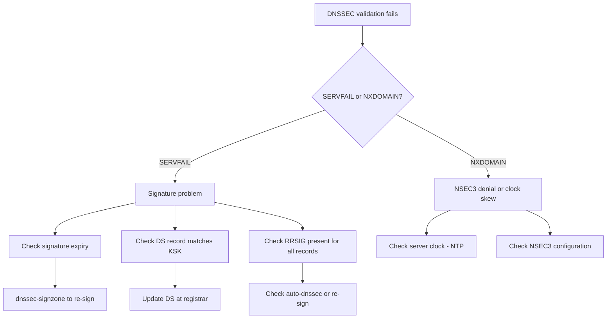

# How to Troubleshoot DNSSEC for IPv6 Zones

Author: [nawazdhandala](https://www.github.com/nawazdhandala)

Tags: DNSSEC, Troubleshooting, DNS, IPv6, Debugging, BIND, Validation

Description: Diagnose and fix common DNSSEC problems including SERVFAIL responses, signature expiry, DS mismatches, and validation failures for IPv6 zones.

## Common DNSSEC Problems

| Symptom | Likely Cause |
|---|---|
| SERVFAIL for valid name | Signature expired or invalid |
| SERVFAIL after zone update | Unsigned zone pushed over signed |
| SERVFAIL after nameserver change | DS record not updated |
| SERVFAIL for AAAA only | Missing RRSIG for AAAA records |
| NXDOMAIN for existing name | Clock skew — future signature not yet valid |
| Works without validation (+cd) | Bogus/expired signatures |

## Diagnostic Flowchart



## Step 1: Identify the Problem with dig

```bash
#!/bin/bash
# diagnose-dnssec.sh — DNSSEC diagnostic

ZONE=${1:-"example.com"}
RECORD_TYPE=${2:-"AAAA"}
NAME=${3:-"www.${ZONE}"}
RESOLVER=${4:-"8.8.8.8"}

echo "=== DNSSEC Diagnostic: ${NAME} (${RECORD_TYPE}) ==="
echo ""

# 1. Check with validation
echo "1. Query WITH validation:"
RESULT=$(dig +dnssec +short +comments "${RECORD_TYPE}" "${NAME}" @"${RESOLVER}" 2>&1)
echo "${RESULT}" | grep -E "status:|flags:|RRSIG|AAAA|A\b" | head -10

# 2. Check without validation (bypass)
echo ""
echo "2. Query WITHOUT validation (+cd):"
BYPASS=$(dig +dnssec +cd +short "${RECORD_TYPE}" "${NAME}" @"${RESOLVER}" 2>&1)
echo "${BYPASS}" | grep -E "status:|flags:|RRSIG|AAAA|A\b" | head -10

# 3. Check signatures at authoritative server
echo ""
echo "3. Query authoritative server directly:"
AUTH_NS=$(dig +short NS "${ZONE}" | head -1)
if [ -n "${AUTH_NS}" ]; then
    dig +dnssec "${RECORD_TYPE}" "${NAME}" @"${AUTH_NS}" | \
        grep -E "status:|RRSIG|NSEC|flags:" | head -5
fi
```

## Step 2: Check Signature Expiry

```bash
# Check if signatures are expired or about to expire
dnssec-checkzone -o "${ZONE}" /var/named/"${ZONE}".zone.signed 2>&1 | \
    grep -i "expired\|expir\|warning"

# Show expiration dates of all RRSIGs
dig +dnssec +multiline DNSKEY "${ZONE}" @localhost | \
    grep "RRSIG\|expires"

# Parse RRSIG expiration from zone file
grep " RRSIG " /var/named/example.com.zone.signed | \
    awk '{print $5, $7}' | \
    while read rtype expiry; do
        # Convert YYYYMMDDHHMMSS to readable
        DATE=$(date -d "${expiry:0:8} ${expiry:8:6}" "+%Y-%m-%d %H:%M" 2>/dev/null || echo "${expiry}")
        echo "${rtype}: expires ${DATE}"
    done | sort -u

# Quick check: find signatures expiring in next 7 days
CUTOFF=$(date -d "+7 days" +%Y%m%d%H%M%S)
grep " RRSIG " /var/named/example.com.zone.signed | \
    awk '{print $7, $5}' | \
    awk -v cutoff="${CUTOFF}" '$1 < cutoff {print "EXPIRING SOON: " $2 " expires " $1}'
```

## Step 3: Check DS Record Matches

```bash
# Compare DS record at parent with local KSK
ZONE="example.com"
KEY_DIR="/var/named/keys/${ZONE}"

# Get published DS
PUBLISHED_DS=$(dig +short DS "${ZONE}" @a.gtld-servers.net 2>/dev/null)
echo "Published DS at parent:"
echo "${PUBLISHED_DS}"
echo ""

# Get local DS from KSK
echo "Local KSK DS records:"
for keyfile in ${KEY_DIR}/K${ZONE}.+*.key; do
    # Only KSK (flag 257)
    if grep -q "257" "${keyfile}"; then
        dnssec-dsfromkey -2 "${keyfile}"
    fi
done

# Compare
if [ -z "${PUBLISHED_DS}" ]; then
    echo "ERROR: No DS record published at parent!"
    echo "ACTION: Submit DS record to registrar"
elif ! echo "${PUBLISHED_DS}" | grep -qF "$(dnssec-dsfromkey -2 ${KEY_DIR}/K${ZONE}.+013+*.key 2>/dev/null | awk '{print $8}')"; then
    echo "ERROR: Published DS does not match local KSK!"
    echo "ACTION: Update DS record at registrar"
else
    echo "OK: DS record matches local KSK"
fi
```

## Step 4: Re-Sign an Expired Zone

```bash
#!/bin/bash
# re-sign-zone.sh — Emergency re-signing

ZONE="example.com"
ZONE_FILE="/var/named/${ZONE}.zone"
KEY_DIR="/var/named/keys/${ZONE}"

# Find ZSK and KSK
ZSK=$(ls ${KEY_DIR}/K${ZONE}.+013+*.key | xargs -I {} bash -c 'grep -l "256 3" {}' | head -1 | sed 's/\.key//')
KSK=$(ls ${KEY_DIR}/K${ZONE}.+013+*.key | xargs -I {} bash -c 'grep -l "257 3" {}' | head -1 | sed 's/\.key//')

echo "ZSK: ${ZSK}"
echo "KSK: ${KSK}"

# Increment serial
sed -i "s/; serial.*/$(date +%Y%m%d01) ; serial/" "${ZONE_FILE}"

# Re-sign with 30-day validity window
dnssec-signzone \
    -3 - \
    -H 0 \
    -e +2592000 \   # 30-day validity
    -s $(date +%s) \
    -A -N INCREMENT \
    -o "${ZONE}" \
    -k "${KSK}" \
    "${ZONE_FILE}" \
    "${ZSK}"

# Verify
dnssec-verify -o "${ZONE}" "${ZONE_FILE}.signed" && echo "Zone verified OK"

# Reload BIND
rndc reload "${ZONE}"
```

## Step 5: Common Fixes

```bash
# Fix 1: Zone file was replaced without re-signing
# Symptom: Queries return data but without RRSIG
# Fix: Re-sign the zone
dnssec-signzone -3 - -H 0 -A -N INCREMENT -o example.com \
    -k Kexample.com.+013+KSK /var/named/example.com.zone \
    Kexample.com.+013+ZSK

# Fix 2: Clock skew — signatures not yet valid
# Symptom: SERVFAIL but zone looks fine
# Check server time
timedatectl status | grep "Local time\|NTP"
# Fix: sync NTP
chronyc makestep

# Fix 3: AAAA record not signed (only A is)
# Symptom: AAAA queries SERVFAIL, A queries work
dig +dnssec AAAA www.example.com @localhost | grep RRSIG
# If no RRSIG for AAAA — zone was partially signed
# Fix: re-sign with all record types

# Fix 4: BIND not using signed zone
# Symptom: Queries don't have signatures
grep "file" /etc/named.conf | grep example.com
# Should point to .zone.signed, not .zone

# Fix 5: Large DNS response fragmented
# IPv6 + DNSSEC can exceed UDP 1232 bytes (IPv6 safe MTU)
# Test with TCP
dig +tcp +dnssec AAAA www.example.com @localhost
```

## Automated Signature Monitoring

```bash
#!/bin/bash
# check-sig-expiry.sh — Run from cron, alert before expiry

ZONE="example.com"
WARN_DAYS=14  # Alert 14 days before expiry

# Get earliest RRSIG expiry from zone
EARLIEST=$(grep " RRSIG " /var/named/${ZONE}.zone.signed | \
    awk '{print $7}' | sort | head -1)

EARLIEST_EPOCH=$(date -d "${EARLIEST:0:8} ${EARLIEST:8:6}" +%s 2>/dev/null)
NOW_EPOCH=$(date +%s)
DAYS_LEFT=$(( (EARLIEST_EPOCH - NOW_EPOCH) / 86400 ))

if [ "${DAYS_LEFT}" -lt "${WARN_DAYS}" ]; then
    echo "WARNING: ${ZONE} signatures expire in ${DAYS_LEFT} days (${EARLIEST})"
    logger -p local0.warning "DNSSEC: ${ZONE} signatures expire in ${DAYS_LEFT} days"
    exit 1
fi

echo "OK: ${ZONE} signatures valid for ${DAYS_LEFT} days"
```

## Conclusion

DNSSEC troubleshooting starts with `dig +dnssec` (with validation) vs `dig +dnssec +cd` (without validation). If the +cd query succeeds but normal validation fails, signatures are present but invalid — check expiry dates and DS record matching. If both fail, signatures are missing entirely — zone was likely replaced or re-signed without RRSIG records. Always verify after re-signing with `dnssec-verify`. Monitor signature expiry with a cron job alerting 14 days before expiry. For IPv6 zones, pay special attention to AAAA record signatures — they can be accidentally dropped if zone editing tools don't preserve signed zone format.
