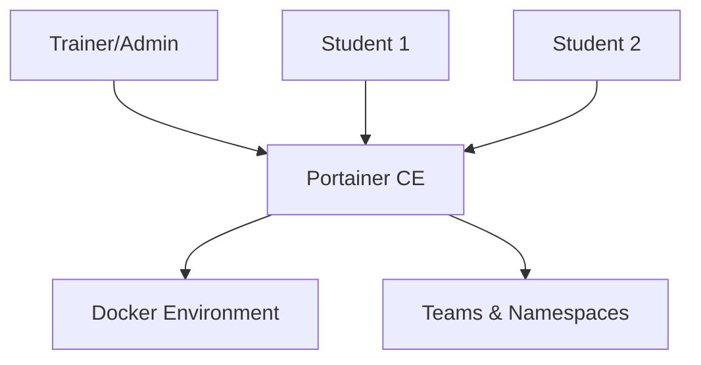

# How to Set Up a Docker Learning Lab with Portainer

Author: [nawazdhandala](https://www.github.com/nawazdhandala)

Tags: Portainer, Docker, Education, Training, DevOps, Container

Description: Configure a Docker learning environment using Portainer to give students and developers a safe, browser-based interface for experimenting with containers, networks, and volumes.

---

Portainer's web UI makes Docker approachable for teams new to containers. A dedicated learning lab on a shared server lets multiple users experiment safely without needing local Docker installations or command-line knowledge. This guide walks through setting up an isolated, multi-user Docker learning lab using Portainer.

## Architecture



## Step 1: Install Portainer for the Lab

Deploy Portainer on a dedicated VM or cloud instance. 4 vCPUs and 8 GB RAM comfortably handles 10-20 concurrent learners.

```bash
# Install Docker Engine

curl -fsSL https://get.docker.com | sh

# Deploy Portainer CE
docker volume create portainer_data
docker run -d \
  --name portainer \
  --restart always \
  -p 9443:9443 \
  -v /var/run/docker.sock:/var/run/docker.sock \
  -v portainer_data:/data \
  portainer/portainer-ce:latest
```

## Step 2: Create Teams for Student Isolation

In Portainer, go to **Settings > Users** and create a team for each class or cohort:

1. Create a team: `docker-101-students`
2. Set resource limits for the team's environment (CPU, memory, image count)
3. Add student accounts to the team

## Step 3: Configure App Templates for Exercises

Pre-load learning templates via Portainer's **App Templates** so students can deploy exercises with one click:

```json
[
  {
    "type": 1,
    "title": "Exercise 1: Hello World Nginx",
    "description": "Deploy your first container - Nginx serving a static page",
    "image": "nginx:alpine",
    "name": "exercise1-nginx",
    "ports": ["8080:80"],
    "volumes": []
  },
  {
    "type": 1,
    "title": "Exercise 2: PostgreSQL Database",
    "description": "Run a PostgreSQL database and connect to it",
    "image": "postgres:16-alpine",
    "name": "exercise2-postgres",
    "env": [
      {"name": "POSTGRES_PASSWORD", "label": "Database Password", "default": "training123"}
    ]
  }
]
```

Save this as a JSON file accessible via URL, then add the URL under **Settings > App Templates**.

## Step 4: Prepare Lab Exercises

Structure exercises so students progress through core Docker concepts:

| Exercise | Topic | Portainer Feature Used |
|----------|-------|----------------------|
| 1 | Run first container | App Templates |
| 2 | Environment variables | Container environment editor |
| 3 | Volume persistence | Volumes UI |
| 4 | Container networking | Networks UI |
| 5 | Multi-container stack | Stacks |
| 6 | Custom Dockerfile build | Images > Build |

## Step 5: Resource Limits and Safety

In Portainer Business Edition, restrict resources per team to prevent runaway containers:

```yaml
# Enforce via Docker resource flags in the deploy form
Memory limit: 512m
CPU limit: 0.5
Maximum containers: 10 per student
```

For Portainer CE, configure Docker daemon-level resource constraints or use cgroups.

## Summary

Portainer turns Docker learning from a CLI-centric experience into an approachable visual workflow. By combining teams, app templates, and pre-structured exercises, instructors can run hands-on Docker workshops with zero local installation requirements for students.
