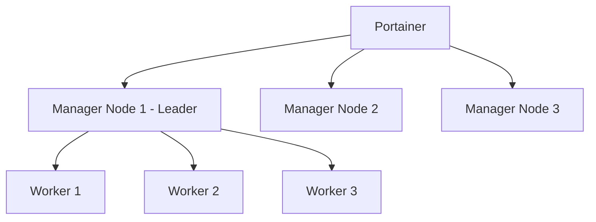

# How to Set Up Docker Swarm High Availability with Portainer

Author: [nawazdhandala](https://www.github.com/nawazdhandala)

Tags: Portainer, Docker Swarm, High Availability, Clustering, DevOps

Description: Configure a Docker Swarm cluster with multiple manager nodes for high availability, using Portainer to manage services, monitor node health, and handle failovers.

---

Docker Swarm high availability requires multiple manager nodes so the cluster survives individual node failures. The Raft consensus algorithm used by Swarm requires a quorum of managers - always use an odd number (3 or 5). Portainer manages the entire HA Swarm from a single web interface.

## Swarm HA Architecture



## Step 1: Initialize the Swarm

On the first manager node:

```bash
docker swarm init --advertise-addr <manager1-ip>
```

Save the join tokens:

```bash
# Get manager join token

docker swarm join-token manager

# Get worker join token
docker swarm join-token worker
```

## Step 2: Add Manager Nodes

On the second and third manager nodes:

```bash
docker swarm join \
  --token <manager-join-token> \
  <manager1-ip>:2377
```

## Step 3: Connect Portainer to the Swarm

Deploy Portainer on one manager node and connect it via the Docker socket. Portainer automatically detects the Swarm and shows all nodes.

## Step 4: Monitor Node Availability in Portainer

Navigate to **Swarm > Nodes** to see:

- Node role (Manager/Worker)
- Availability (Active/Pause/Drain)
- Reachability status
- Engine version

## Step 5: Deploy HA Services

Services deployed with multiple replicas automatically distribute across worker nodes:

```yaml
version: "3.8"
services:
  api:
    image: my-api:latest
    deploy:
      replicas: 6        # Spread across 3 workers = 2 per node
      restart_policy:
        condition: on-failure
      update_config:
        parallelism: 2
        delay: 10s
      placement:
        constraints:
          - node.role == worker
```

## Step 6: Test Failover

Simulate a node failure by setting a manager to drain:

1. In Portainer > Swarm > Nodes, select a node
2. Set Availability to **Drain**
3. Watch Portainer reschedule replicas to remaining nodes

The cluster remains operational as long as the majority of managers are reachable (2 of 3).

## Summary

Docker Swarm HA with 3+ manager nodes tolerates single-node failures without service interruption. Portainer's Swarm node view gives operators real-time visibility into cluster health, making it easy to identify and respond to node failures before they cascade.
