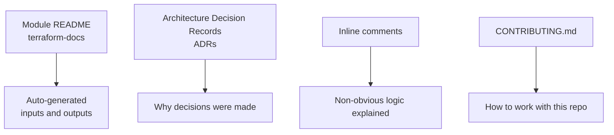

# How to Document OpenTofu Infrastructure for Team Knowledge Sharing

Author: [nawazdhandala](https://www.github.com/nawazdhandala)

Tags: OpenTofu, Documentation, terraform-docs, ADRs, Knowledge Sharing, Team Workflows, Infrastructure as Code

Description: Learn how to document OpenTofu infrastructure using terraform-docs for module documentation, Architecture Decision Records for key choices, and inline comments for maintainability.

---

Infrastructure code is documentation debt waiting to happen. Without clear documentation, teams waste hours reverse-engineering decisions, fear making changes to unfamiliar modules, and repeat mistakes that were already solved. The goal is documentation that lives with the code and updates automatically.

## Documentation Strategy



## Auto-Generated Module Docs with terraform-docs

```yaml
# .terraform-docs.yml

formatter: "markdown table"

output:
  file: README.md
  mode: inject
  template: |-
    <!-- BEGIN_TF_DOCS -->
    {{ .Content }}
    <!-- END_TF_DOCS -->

sections:
  show:
    - inputs
    - outputs
    - providers
    - requirements

sort:
  enabled: true
  by: required
```

```bash
# Generate docs for all modules
find modules -type d | xargs -I{} terraform-docs markdown table --output-file README.md {}

# Or use pre-commit hooks to keep docs in sync
# .pre-commit-config.yaml
repos:
  - repo: https://github.com/antonbabenko/pre-commit-terraform
    rev: v1.86.0
    hooks:
      - id: terraform_docs
        args:
          - --args=--config=.terraform-docs.yml
```

## Variable Descriptions

```hcl
# Every variable must have a description
variable "database_instance_class" {
  type        = string
  description = "RDS instance class. Use db.t3.micro for dev, db.m5.large for production. See https://aws.amazon.com/rds/instance-types/"
  default     = "db.t3.micro"

  validation {
    condition     = can(regex("^db\\.", var.database_instance_class))
    error_message = "instance_class must start with 'db.' (e.g., db.t3.micro)"
  }
}

variable "backup_retention_days" {
  type        = number
  description = "Number of days to retain automated backups. 0 disables backups. Minimum 7 for production."
  default     = 7
}
```

## Architecture Decision Records

```markdown
# ADR-001: Use S3 + DynamoDB for Remote State

## Status
Accepted

## Context
Our team is growing and multiple developers need to work on the same infrastructure.
Local state files cause conflicts and are not sharable.

## Decision
Use S3 for state storage with DynamoDB for state locking.
State files are organized by environment: `environments/{env}/{module}/terraform.tfstate`.

## Consequences
- All team members need IAM permissions to the state bucket
- CI/CD pipelines need an IAM role with state access
- We must bootstrap the state infrastructure before other infrastructure can be managed
```

## Inline Comments for Non-Obvious Logic

```hcl
# lifecycle.tf
resource "aws_db_instance" "main" {
  # skip_final_snapshot = false is intentional for production.
  # A final snapshot is taken before deletion to prevent data loss.
  # Cost: ~$0.023/GB/month - worth the protection.
  skip_final_snapshot = var.environment != "production"

  # deletion_protection prevents accidental destroy via tofu destroy.
  # To delete this DB you must first set deletion_protection = false and apply,
  # then run tofu destroy.
  deletion_protection = var.environment == "production"
}
```

## CONTRIBUTING.md Template

```markdown
# Contributing to Infrastructure

## Prerequisites
- OpenTofu >= 1.6.0 - install via `mise install` (see .tool-versions)
- AWS credentials configured for dev account

## Workflow
1. Create a branch: `infra/TICKET-description`
2. Make changes and run `make validate`
3. Open a PR - CI runs fmt, validate, and plan automatically
4. Request review from @infrastructure-team
5. After approval, merge to main - CI applies automatically

## Module Development
- Add a `README.md` to every module (auto-generated by terraform-docs)
- Write tests in `test/` using tofu test or Terratest
- Pin provider versions in `versions.tf`
```

## Best Practices

- Use `terraform-docs` with pre-commit hooks to keep module READMEs in sync automatically - never write input/output tables by hand.
- Write variable descriptions as if explaining to someone who has never seen the codebase before.
- Document the "why" in comments, not the "what" - the code shows what; comments should explain why a non-obvious choice was made.
- Maintain ADRs for significant architecture decisions in a `docs/decisions/` folder - they save hours when onboarding new team members.
- A `CONTRIBUTING.md` that answers "how do I run this locally?" eliminates repetitive onboarding conversations.
