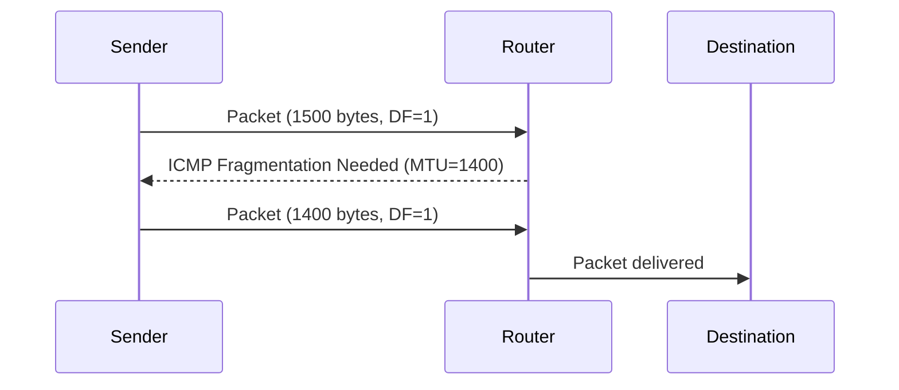

# How to Use the Don't Fragment Flag in IPv4

Author: [nawazdhandala](https://www.github.com/nawazdhandala)

Tags: IPv4, Networking, MTU, Fragmentation, TCP/IP, Path MTU Discovery

Description: The Don't Fragment (DF) flag in the IPv4 header instructs routers not to fragment a packet, enabling path MTU discovery and preventing fragmentation-related performance issues.

## What Is the Don't Fragment Flag?

The IPv4 header contains a 3-bit Flags field. The Don't Fragment (DF) bit is bit 1 of that field. When set to 1, it instructs every router along the path not to fragment the packet. If the packet is larger than the next-hop MTU and the DF bit is set, the router discards the packet and sends an ICMP "Fragmentation Needed" message back to the sender.

## Flags Field Layout

```text
Bit 0: Reserved (must be 0)
Bit 1: DF - Don't Fragment
Bit 2: MF - More Fragments
```

In the raw header bytes, the Flags field occupies the top 3 bits of byte offset 6.

## Setting the DF Bit with Python (Scapy)

The following script sends a packet with the DF flag set and a payload large enough to trigger an ICMP Fragmentation Needed response on many paths:

```python
from scapy.all import IP, ICMP, Raw, sr1

# 'DF' = 2 in Scapy's flags field

pkt = IP(dst="8.8.8.8", flags="DF") / ICMP() / Raw(b"A" * 1400)

# Send and wait for a response
reply = sr1(pkt, timeout=2, verbose=False)

if reply:
    # ICMP type 3, code 4 = Fragmentation Needed
    print(f"Reply type={reply[ICMP].type} code={reply[ICMP].code}")
else:
    print("No reply received")
```

## Path MTU Discovery (PMTUD)

PMTUD relies on the DF flag to determine the smallest MTU along a network path:

1. The sender sets DF=1 on all outgoing packets.
2. If a router cannot forward the packet without fragmentation, it drops it and returns ICMP type 3 code 4, including the next-hop MTU.
3. The sender reduces its packet size and retries.
4. This continues until packets traverse the path without triggering ICMP responses.



## Checking DF on Linux

You can observe PMTUD in action and view the path MTU cache:

```bash
# View cached path MTU entries
ip route get 8.8.8.8

# Force PMTUD with ping (Linux)
ping -M do -s 1400 8.8.8.8
# -M do sets DF bit; if ICMP Fragmentation Needed is received,
# ping reports "Frag needed and DF set"
```

## Common Issues with DF

- **ICMP blocking**: Firewalls that block ICMP break PMTUD, causing "black hole" connections where large packets silently disappear.
- **VPN and tunnels**: Tunneling adds overhead (e.g., IPsec headers), reducing effective MTU. Always account for tunnel overhead when setting MSS clamp values.

Fix ICMP black holes on Linux by clamping TCP MSS:

```bash
# Clamp MSS to PMTU on the outgoing interface (replace eth0 with your interface)
iptables -t mangle -A FORWARD -p tcp --tcp-flags SYN,RST SYN \
  -j TCPMSS --clamp-mss-to-pmtu
```

## Key Takeaways

- The DF flag prevents routers from fragmenting a packet.
- It is the foundation of Path MTU Discovery.
- Blocking ICMP Fragmentation Needed messages causes silent connectivity failures.
- Always clamp TCP MSS on VPN gateways to avoid oversized packets.
