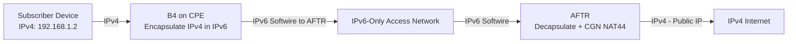

# How to Understand DS-Lite (Dual-Stack Lite)

Author: [nawazdhandala](https://www.github.com/nawazdhandala)

Tags: IPv6, DS-Lite, IPv6 Transition, AFTR, B4, ISP

Description: An explanation of DS-Lite (Dual-Stack Lite), an ISP transition technology that tunnels IPv4 traffic over IPv6 networks to eliminate the need for public IPv4 addresses on subscriber connections.

## What Is DS-Lite?

DS-Lite (Dual-Stack Lite), defined in RFC 6333, is an IPv6 transition technology designed for ISPs. It allows carriers to deploy IPv6-only infrastructure in the access network while still providing subscribers with IPv4 internet connectivity - without assigning each subscriber a public IPv4 address.

DS-Lite achieves this by:
1. Tunneling subscriber IPv4 traffic over IPv6 (using a Softwire tunnel)
2. Performing centralized CGN (Carrier-Grade NAT) at an AFTR device in the ISP network

## DS-Lite Components

**B4 (Basic Bridging Broadband element)**: The CPE (home router) component. Encapsulates IPv4 packets in IPv6 and sends them to the AFTR.

**AFTR (Address Family Transition Router)**: The ISP-side component. Decapsulates IPv4 from IPv6, performs NAT44 to map subscriber traffic to a shared public IPv4 address pool, and forwards to the internet.

## DS-Lite Architecture



## Packet Flow in DS-Lite

1. Subscriber's device sends IPv4 packet to `8.8.8.8`
2. B4 (CPE) encapsulates the IPv4 packet inside an IPv6 packet:
   - Outer IPv6 src: B4's IPv6 address
   - Outer IPv6 dst: AFTR's IPv6 address (learned via DHCPv6 option or DNS)
   - Inner: original IPv4 packet
3. IPv6 packet travels over the ISP's IPv6-only network
4. AFTR decapsulates the IPv6 tunnel and extracts the inner IPv4 packet
5. AFTR performs NAT44: maps subscriber's private IP + port to a public IP + port
6. IPv4 packet is forwarded to the internet
7. Response travels back: AFTR re-encapsulates in IPv6, sends to B4

## DS-Lite vs NAT64

| Aspect | DS-Lite | NAT64 |
|---|---|---|
| Client IPv4 | Yes (private, behind B4) | No (IPv6-only) |
| Translation | NAT44 at AFTR | NAT64 at gateway |
| Tunnel | IPv4-in-IPv6 Softwire | None (native IPv6) |
| DNS changes | None (normal DNS works) | DNS64 required |
| Application compat | High (transparent IPv4) | May need adjustments |
| IPv6-only network? | Yes (access network) | Yes (client network) |

## AFTR Address Discovery

The B4 needs to know the AFTR's IPv6 address. This is typically provided via:

1. **DHCPv6 option 64** (AFTR-Name): ISP sends the AFTR's fully qualified domain name
2. **Hardcoded in CPE firmware**: Some ISPs configure the AFTR address statically

## MTU Considerations in DS-Lite

DS-Lite adds a 40-byte IPv6 tunnel header to every IPv4 packet. This reduces the effective MTU for IPv4 traffic:

```text
Physical link MTU: 1500 bytes
IPv6 tunnel header: 40 bytes
Effective IPv4 MTU: 1460 bytes
```

The B4 must set the IPv4 MTU to 1460 and signal this to clients via DHCP or TCP MSS clamping.

## Advantages of DS-Lite

- **No public IPv4 per subscriber**: ISPs save IPv4 addresses dramatically
- **Transparent to applications**: Subscribers get normal IPv4 connectivity
- **IPv6-only core network**: ISPs can simplify infrastructure
- **Centralized NAT**: Easier management and logging at AFTR

## Limitations of DS-Lite

- **CGN issues**: Shared public IPv4 means per-subscriber port limitations
- **Performance**: Double encapsulation adds latency and CPU overhead
- **ALG requirements**: FTP, SIP, and similar protocols need Application Layer Gateways at the AFTR
- **No static IPv4**: Subscribers cannot get a fixed public IPv4 address
- **Logging complexity**: NAT logging at AFTR scale is challenging for abuse investigation

## DS-Lite in Practice

DS-Lite is deployed by many European and Asian ISPs including Deutsche Telekom (Germany), Swisscom, and various Japanese operators. It was one of the first widely deployed IPv6 transition technologies in broadband networks.

The typical deployment serves millions of subscribers where each B4 gets a unique IPv6 /56 or /64 prefix, and all IPv4 traffic from that subscriber flows through a single Softwire to the AFTR.

## Summary

DS-Lite solves the IPv4 address exhaustion problem for ISPs by tunneling subscriber IPv4 traffic over IPv6 to a centralized AFTR for NAT44. It requires only IPv6 addressing in the access network while providing full IPv4 internet access to subscribers. DS-Lite sacrifices per-subscriber public IPv4 addresses in exchange for massive IPv4 address pool savings at the ISP.
