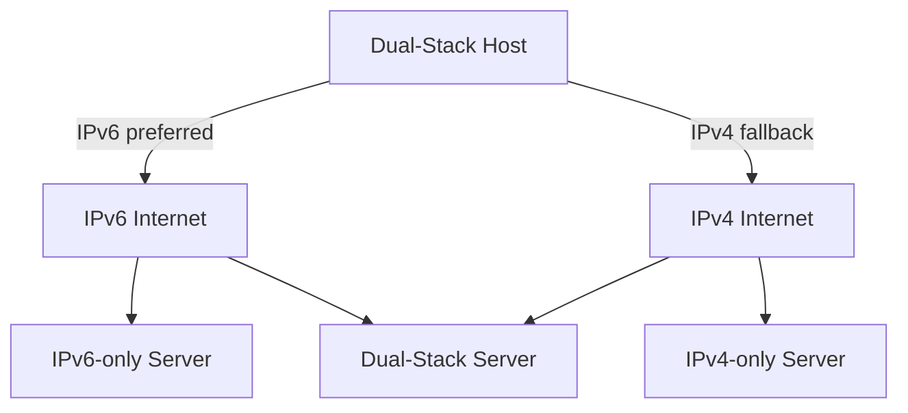

# How to Understand Dual-Stack IPv4/IPv6 Deployment

Author: [nawazdhandala](https://www.github.com/nawazdhandala)

Tags: IPv6, IPv4, Dual-Stack, Networking, Deployment

Description: Learn what dual-stack IPv4/IPv6 deployment means, how both protocols coexist on the same infrastructure, and the key considerations for operating a dual-stack network.

## Overview

Dual-stack is the simplest and most recommended approach to IPv6 adoption. Every device, link, and application supports both IPv4 and IPv6 simultaneously. There are no tunnels, no translation, and no protocol dependency — each protocol is routed natively end to end.

```
┌─────────────────────────────────────────────────┐
│              Dual-Stack Host                    │
│                                                 │
│  Application Layer                              │
│  ┌──────────────────────────────────────────┐   │
│  │  Socket API (getaddrinfo, connect, bind) │   │
│  └──────────────────────────────────────────┘   │
│           │ IPv4          │ IPv6                 │
│  ┌────────┴────┐  ┌───────┴──────┐             │
│  │  TCP/UDP    │  │  TCP/UDP     │             │
│  │  over IPv4  │  │  over IPv6   │             │
│  └────────┬────┘  └───────┬──────┘             │
│           │               │                     │
│  ┌────────┴───────────────┴──────┐             │
│  │     Network Interface         │             │
│  │  192.0.2.1  + 2001:db8::1    │             │
│  └───────────────────────────────┘             │
└─────────────────────────────────────────────────┘
```

## How Address Selection Works

When a client connects to a hostname, the OS resolves both A (IPv4) and AAAA (IPv6) records. RFC 6724 defines the default address selection algorithm — IPv6 global unicast addresses are preferred over IPv4.

```
Client resolves example.com:
  A     → 203.0.113.10
  AAAA  → 2001:db8::10

RFC 6724 preference order (simplified):
  1. ::1/128         (loopback)
  2. ::/0            (global IPv6) ← preferred
  3. 2002::/16       (6to4 — lower preference)
  4. ::ffff:0:0/96   (IPv4-mapped)

Result: client connects via IPv6
```

Happy Eyeballs (RFC 8305) further improves this by racing IPv4 and IPv6 connections in parallel with a 250 ms delay before starting IPv4. The first to complete wins — ensuring fast failover if IPv6 is broken.

## Architecture: Protocol Flow



## What Dual-Stack Requires

| Layer | Requirement |
|---|---|
| Physical/L2 | No changes — Ethernet carries both |
| Router | Two routing tables (IPv4 RIB, IPv6 RIB) |
| DNS | A records + AAAA records for all services |
| Firewall | Rules for both address families |
| DHCP | DHCPv4 + DHCPv6 or SLAAC |
| BGP | Two AFI/SAFI: IPv4 unicast + IPv6 unicast |
| Monitoring | Alerts and dashboards for both families |
| ACLs/Prefix lists | Maintained for both families separately |

## Prefix Allocation Planning

Before deploying, allocate a coherent IPv6 prefix hierarchy:

```
ISP assignment:  2001:db8::/32  (your PA or PI block)

Site allocation (suggest /48 per site):
  HQ:           2001:db8:0001::/48
  Branch-A:     2001:db8:0002::/48
  DC:           2001:db8:0010::/48

Per site — VLAN /64s:
  HQ servers:   2001:db8:0001:0010::/64
  HQ users:     2001:db8:0001:0020::/64
  HQ mgmt:      2001:db8:0001:0ffe::/64
  loopbacks:    2001:db8:0001:0fff::1/128
```

Keep the parallel IPv4 plan visible for correlation:
```
  HQ servers:   10.1.16.0/24  ↔  2001:db8:0001:0010::/64
  HQ users:     10.1.32.0/24  ↔  2001:db8:0001:0020::/64
```

## DNS for Dual-Stack

Every service needs both A and AAAA records:

```bash
# Zone file additions
www   IN  A     203.0.113.10
www   IN  AAAA  2001:db8::10

mail  IN  A     203.0.113.20
mail  IN  AAAA  2001:db8::20

# MX record — hostname in MX resolves to both
# No separate MX for IPv6 — RFC 5321 uses whichever address the sending
# MTA selects based on address preference
```

Reverse DNS (PTR) for IPv6 uses ip6.arpa:

```bash
# Delegation for 2001:db8::/32 → 0.8.b.d.1.0.0.2.ip6.arpa
1.0.0.0.0.0.0.0.0.0.0.0.0.0.0.0.0.0.0.0.0.0.0.0.8.b.d.1.0.0.2.ip6.arpa.
  IN PTR www.example.com.
```

## Firewall Considerations

Dual-stack doubles the firewall work. Never assume IPv4 rules protect IPv6 traffic:

```bash
# Common mistake: rules only on iptables, not ip6tables
# An attacker can bypass IPv4 ACLs entirely by using IPv6

# Correct: mirror rules to both families
# iptables  -A INPUT -p tcp --dport 22 -j ACCEPT
# ip6tables -A INPUT -p tcp --dport 22 -j ACCEPT

# Or use nftables inet family (handles both):
nft add rule inet filter input tcp dport 22 accept
```

## Routing Protocol Configuration

Both protocols need independent routing configuration:

```
# OSPF: run OSPFv2 (IPv4) AND OSPFv3 (IPv6) in parallel
# BGP: enable both IPv4 and IPv6 address families on sessions

# Modern approach — mp-BGP with dual AFI/SAFI on a single session:
neighbor 192.0.2.1 activate  # IPv4 AFI
address-family ipv6 unicast
  neighbor 192.0.2.1 activate  # same peer, IPv6 AFI
```

## Operational Checklist

- Both A and AAAA DNS records published for all public services
- IPv6 firewall rules created (not just IPv4)
- Monitoring covers both families (SNMP, ICMP probes, flow data)
- Security tools (IDS, SIEM) process IPv6 traffic
- NOC team trained on IPv6 troubleshooting commands
- BGP prefix filters and route policy updated for IPv6
- NTP synchronized (critical for RA/DHCPv6 leases and IPsec)

## Summary

Dual-stack runs IPv4 and IPv6 on the same infrastructure without translation or tunneling. Both protocols are native citizens on every device. RFC 6724 address selection prefers IPv6 globally; Happy Eyeballs (RFC 8305) provides seamless failover. Plan prefix allocation before deploying, publish AAAA records for all services, and ensure firewall rules, monitoring, and routing cover both address families.
