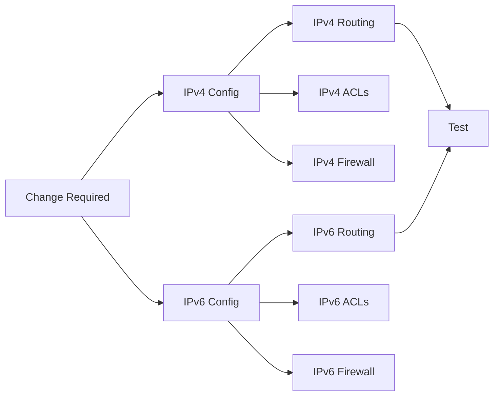

# How to Understand Dual-Stack Operational Complexity

Author: [nawazdhandala](https://www.github.com/nawazdhandala)

Tags: IPv6, IPv4, Dual-Stack, Operations, Network Management

Description: Learn the operational challenges of running dual-stack networks, including double the configuration surface, asymmetric routing risks, security policy gaps, and monitoring requirements.

## Overview

Dual-stack is the correct long-term IPv6 strategy, but it doubles operational complexity: two routing tables, two sets of ACLs, two sets of firewall rules, two sets of BGP prefix lists, and two address spaces to monitor. Understanding these complexities upfront prevents operational incidents.

## The Double-Everything Problem



Every network change must be applied twice, tested twice, and monitored twice. A firewall update that adds a rule for IPv4 but not IPv6 creates a security gap that attackers can exploit.

## Asymmetric Routing Risks

Different paths for IPv4 and IPv6 traffic create troubleshooting challenges:

```
Source: user laptop (dual-stack)
Destination: example.com (dual-stack)

IPv6 path:
  Laptop → ISP-A → Transit-A → Server   (low latency)

IPv4 path:
  Laptop → ISP-A → Transit-B → Server   (higher latency)

Result:
  - TCP connections via IPv6 succeed (preferred by RFC 6724)
  - Intermittent timeout appears on "slow" IPv4 fallback
  - User reports: "website loads slowly sometimes"
  - Root cause: asymmetric path quality, not a bug
```

## Firewall and ACL Complexity

| Item | IPv4 | IPv6 | Notes |
|---|---|---|---|
| Default route ACL | 0.0.0.0/0 | ::/0 | Both need explicit block-then-permit |
| Bogon prefixes | RFC 1918, 127.x, etc. | ::/8, fc00::/7, 2001:db8::/32 | Different bogon lists |
| ICMP filtering | ICMP types 3,11,12 | ICMPv6 types 1,2,3,4,133-137 | IPv6 has more required types |
| Fragment handling | Fragment offset | Extension headers | Different mechanisms |
| Loopback | 127.0.0.1/8 | ::1/128 | Both must be allowed on lo |

## BGP Prefix Lists

Every BGP prefix filter must exist in two versions:

```
# IPv4 prefix list
ip prefix-list CUSTOMER-PREFIXES seq 5 permit 203.0.113.0/24

# IPv6 prefix list — separate list, must be maintained in parallel
ipv6 prefix-list CUSTOMER-PREFIXES-V6 seq 5 permit 2001:db8::/32

# Missing the IPv6 version → customer's IPv6 prefixes leak or are dropped
```

## Configuration Drift

The most common dual-stack operational failure is IPv4 and IPv6 configs diverging over time:

```
Incident example:
1. Team adds new VLAN 100 with IPv4 10.1.100.0/24
2. IPv4 firewall rules updated: permit 10.1.100.0/24 → server
3. IPv6 prefix 2001:db8:0:100::/64 forgotten
4. IPv6 firewall NOT updated
5. Hosts on VLAN 100 reach server via IPv4 ✓
6. Hosts on VLAN 100 cannot reach server via IPv6 ✗
7. Ticket opened 3 weeks later when first IPv6-only service tested
```

Prevention:
- Template-based configuration management (Ansible, Salt, Terraform)
- Change management process requires IPv6 section for every network change
- Automated compliance checks comparing IPv4 and IPv6 rule counts per interface

## DNS Complexity

```bash
# Dual-stack DNS requires:
# 1. Both A and AAAA records for all services
# 2. PTR records in both in-addr.arpa and ip6.arpa
# 3. Split-horizon DNS must cover both families
# 4. Internal resolvers must forward both record types

# Common mistake: only A records in internal DNS
# Effect: internal hosts resolve AAAA for external sites
#         but get no AAAA for internal services
#         → internal traffic stays on IPv4 while external uses IPv6
#         → inconsistent behavior, security policy bypass

# Audit: find services with A but no AAAA
dig A internal-app.corp.example
dig AAAA internal-app.corp.example  # Should also return a record
```

## Monitoring Double the Traffic

SNMP, NetFlow/IPFIX, and syslog must all capture both families:

```bash
# NetFlow: many older exporters only export IPv4 flows
# Check if IPv6 flows appear in your collector:
nfdump -r /var/cache/nfdump/nfcapd.current -s record/bytes -n 10 -o "fmt:%sa %da %pr %byt" | grep ":"

# SNMP: ifInOctets counts all traffic regardless of IP version
# But per-protocol counters need IPv6 MIBs (IP-MIB, IPV6-MIB)
snmpwalk -v2c -c public router 1.3.6.1.2.1.55   # IPv6 MIB

# Monitoring alert: if IPv6 traffic drops to zero on a dual-stack link
# while IPv4 traffic continues → likely an IPv6 configuration event
```

## Skill Gap

Operations teams need to be trained on IPv6 equivalents of every IPv4 tool:

| IPv4 Command | IPv6 Equivalent |
|---|---|
| `ping`        | `ping6` / `ping -6` |
| `traceroute`  | `traceroute6` / `traceroute -6` |
| `arp -n`      | `ip -6 neigh` / NDP |
| `netstat -rn` | `netstat -rn -f inet6` |
| `tcpdump host x.x.x.x` | `tcpdump ip6 and host 2001:db8::1` |
| `nmap 10.0.0.0/24` | `nmap -6 2001:db8::/64` |

## Checklist for Managing Dual-Stack Complexity

- [ ] Infrastructure-as-code templates include IPv6 sections
- [ ] Change management tickets have IPv6 checkbox
- [ ] Firewall rule review process compares IPv4 and IPv6 sections
- [ ] BGP prefix lists maintained in pairs (IPv4 + IPv6)
- [ ] DNS automation publishes both A and AAAA records from IPAM
- [ ] Monitoring coverage verified for both families
- [ ] Security tools (IDS/SIEM) ingest IPv6 traffic and logs
- [ ] NOC runbooks have IPv6 troubleshooting steps

## Summary

Dual-stack doubles configuration and operational overhead. The most critical risks are: security policy gaps when IPv4 rules are updated without equivalent IPv6 rules; asymmetric routing causing hard-to-diagnose performance issues; BGP prefix lists that only cover one address family; and DNS with A records but no AAAA records for internal services. Automation (Ansible, Terraform) that generates both IPv4 and IPv6 configurations together is the most effective mitigation against configuration drift.
